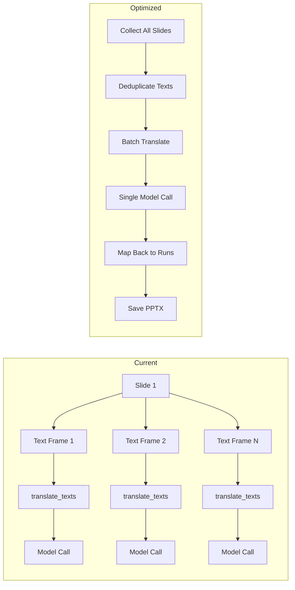

# Performance Review: pyTranslator.py PPTX Processing

## Overview
This document reviews `pyTranslator.py` for performance improvements when processing PPTX files like `./samples/前沿端侧推理技术分享.pptx`.

## Identified Bottlenecks

### 1. Per-Text-Frame Translation Calls (CRITICAL)
**Location:** `process_text_frame()` (lines 121-144) and `translate_presentation()` (lines 196-212)

**Problem:** `translate_texts()` is called once per text frame. A typical PPTX with 30 slides, each having 5-10 text frames, results in 150-300 separate model inference calls. Each call has fixed overhead:
- Tokenization (`batch_encode_plus`)
- Tensor creation and device transfer
- `model.generate()` call setup
- Decoding (`batch_decode`)

**Impact:** High. Each small batch underutilizes the model's batch processing capability.

### 2. No Global Batching Across Slides
**Problem:** Text is batched only within a single text frame, not across the entire presentation. The model could process hundreds of strings in a single large batch, dramatically reducing per-call overhead.

**Impact:** High. Batch size of 1-5 vs. batch size of 100+ makes a significant difference in throughput.

### 3. No Translation Caching/Deduplication
**Location:** `translate_texts()` (lines 36-98)

**Problem:** Identical text strings (e.g., repeated headers, footers, bullet points) are translated multiple times. No cache exists to skip redundant translations.

**Impact:** Medium. Depends on content duplication in the presentation.

### 4. Console I/O Overhead
**Location:** `translate_texts()` (lines 86-92)

**Problem:** Every translated string is printed to console with ASCII encoding/decoding. For large presentations, this I/O can be significant, especially on Windows where console output is slow.

**Impact:** Medium. Console I/O is synchronous and can block.

### 5. No CPU Thread Optimization
**Location:** Module-level (lines 1-34)

**Problem:** No `torch.set_num_threads()` call to optimize CPU thread usage. On multi-core systems, PyTorch may not use all available threads efficiently.

**Impact:** Medium. CPU-bound inference can benefit from proper thread configuration.

### 6. No Timing/Profiling
**Problem:** No timing information is collected, making it impossible to identify which slides or text frames are slow.

**Impact:** Low (diagnostic). Makes optimization harder.

## Proposed Improvements

### Phase 1: Global Batching (Highest Impact)
1. **Collect all translatable text** from all slides into a single list before any translation.
2. **Translate in large batches** (e.g., 128-256 strings at a time) using a single `translate_texts()` call.
3. **Map translations back** to the original run objects using indices.

**Architecture:**
```
translate_presentation():
  1. Iterate all slides → collect (run_object, text) pairs
  2. Extract unique texts → deduplicate
  3. Batch translate all unique texts
  4. Map translations back to run objects
  5. Save presentation
```

### Phase 2: Translation Caching
1. **Add a dictionary cache** mapping source text → translated text.
2. **Skip translation** for texts already in the cache.
3. **Optionally persist cache** to disk for repeated runs on the same presentation.

### Phase 3: Console I/O Optimization
1. **Add a `--verbose` flag** to control detailed output.
2. **Default to minimal output** (progress per slide, not per text frame).
3. **Use `sys.stdout.write()`** instead of `print()` for slightly better performance.

### Phase 4: CPU Optimization
1. **Add `torch.set_num_threads()`** based on available CPU cores.
2. **Consider `torch.set_num_interop_threads()`** for inter-op parallelism.

### Phase 5: Profiling & Timing
1. **Add timing** for model loading, text collection, translation, and saving.
2. **Add `--profile` flag** for detailed per-slide timing.

## Implementation Plan

### Step 1: Refactor `translate_presentation()` for Global Batching
- Collect all runs and their texts across all slides
- Deduplicate texts
- Batch translate in chunks
- Map results back to runs

### Step 2: Add Translation Cache
- Add a module-level cache dictionary
- Check cache before translating
- Populate cache after translation

### Step 3: Add CLI Flags
- `--verbose` / `-v`: Enable detailed per-text output
- `--batch-size`: Control batch size for translation (default: 128)
- `--profile`: Enable timing output

### Step 4: CPU Thread Optimization
- Add `torch.set_num_threads()` call

### Step 5: Add Timing/Profiling
- Time each phase of the translation process
- Print summary at the end

## Expected Performance Gains

| Improvement | Expected Gain |
|---|---|
| Global batching | 5-10x faster (fewer model calls) |
| Translation caching | 1.2-2x faster (fewer unique translations) |
| Console I/O reduction | 1.1-1.5x faster |
| CPU thread optimization | 1.2-2x faster (CPU-bound) |
| **Combined** | **10-30x faster** |

## Mermaid Diagram: Current vs. Optimized Flow


