# Architecture

<!-- Keep all architecture descriptions, component details and Mermaid diagrams in this file.
Link to headings rather than creating separate component or diagram documents.
Accepted ADRs retain decision history; plans retain proposed contracts and implementation steps. -->

## Overview

Implemented unified foundation (2026-09-30): `core.policy.AutomaticTranslationPolicy`
defines the common ordered candidates. Davy/HY-MT prompts are target-only; detection
is metadata, and standard native fitting is the only executable fit policy. Production
preview/rasterization/LibreOffice paths are removed.

The existing database queue now has owner-neutral `shared_work` jobs and private
`waiter` jobs. `SharedSlot` holds one current source-hash/target result and generation;
`HistoryGrant` stores verified private authorization and filenames. The worker pins
candidate identities, persists exhausted rungs, starts each candidate from the immutable
input, and publishes only under its live lease and slot generation. Downloads resolve
the current slot after authorization and pin immutable bytes for the response.

`jobs.capacity` accounts for global blob/staging and workspace reservations; shared
outputs expire after 30 idle days and grants after 90 days since the owner's submission.
Staged uploads expire without becoming inference jobs. Shared work owns originals only
until terminal completion. Backup snapshots exclude transient cached originals and mark
interrupted restored work as requiring re-upload. Internal explicit saved/temporary
requests remain separate from cached website semantics.

Desktop adds an authenticated per-user loopback profile to the existing executable,
plus native shell and runtime packaging under `apps/desktop`. It uses fresh temporary
jobs and direct Davy/device inference, without website cache or History synchronization.
Implementation evidence and outstanding release checks are tracked in
[the execution checklist](plans/unified-execution.md) and component evidence reports.
The sections below describe these current boundaries. Accepted ADRs and older plans retain decision history; they are not executable alternatives to the unified contract.

Locked batch interaction: file drop begins website uploads immediately; clicking a target submits the batch even while upload/detection runs. Each validated file proceeds independently under bounded admission. Desktop target click also submits while folder enumeration continues. Batch target/root membership is fixed; later drops create a new draft. Configurable Explorer target-language subcommands (English by default, add/remove/reorder) live under one Translate menu and directly submit into the same desktop queue. See the unified specification for staging cleanup, idempotency and acceptance.

Latest language contract: both website and desktop require only the target language. Best-effort detection during initial ingestion is optional display/History metadata; unknown, mixed, failed or same-as-target detection does not block translation. Davy/HY-MT prompts use target only, with required formatting/schema preservation. Source-dependent prompt branches and blocking detection validation are removed; detector metadata/version does not affect result compatibility or cache identity. See the [unified target-only contract](plans/unified-translator-design.md#20-target-only-language-contract). The owner also authorizes resetting app-managed development data rather than preserving obsolete records; the unified clean-slate authorization supersedes older migration requirements below.

Current consolidated delivery contract: [Unified translator design](plans/unified-translator-design.md). Latest owner instruction removes desktop mode controls and provisions the website deployment's Davy inference key in the installer. Both products use Gemma -> Nemotron 3 Ultra -> Nemotron 3 Super -> GPT-OSS Thinking -> GPT-OSS -> Laguna -> available HY-MT. Website shared cache/private History remain separate from direct-Davy desktop exports. The key is recoverable by installer recipients; shared-key rotation affects both products. This is explicit design, not a production credential change.

[ADR-027](decisions/ADR-027-automatic-website-translation.md) and [ADR-028](decisions/ADR-028-website-cache-and-retention.md) are implemented through automatic routing, one shared standard output per source/target, private History and current-result downloads. Website personal translation controls and permanent source-library behavior are removed. Explicit internal API saved/temporary requests retain their separate owner-scoped, exact-result contracts.

Document Translator is an internal document-processing system. A user submits files through the web UI, installed desktop app, CLI/API or later MCP; internal applications use the same versioned REST backend. The server creates a persistent job, reuses a compatible completed translation when possible, or dispatches the job to a worker. The worker runs one shared core pipeline: read the document through its format adapter, translate its text through the automatic Davy/HY-MT ladder or an explicitly configured internal-API translator, fit translated text against the original layout, and write a translated file in the original format. The server stores the result and makes it available to the submitting user.

The CLI has two paths: local `translate` runs the core without a database or job queue; service commands submit through REST and share persistent jobs, cache and owned results with API/UI users ([ADR-010](decisions/ADR-010-shared-service-cli.md)). The evaluation app exercises the same translation engines on benchmark text. Translation, formatting and fit behavior belong to the core, never to the UI, CLI, REST routes or MCP tools.

**Status:** document translation, standard fit, automatic routing, shared website storage and the integrated website are implemented. Deployment diagrams describe accepted responsibilities and target flows, not proof of a shipped service or desktop installer. The roadmap owns phase status; accepted ADRs take precedence over summaries here. ADR-009/011/012/013 record the accepted document, fit and deployment decisions.

This single-file layout follows the sibling `Agentic_Project_Scaffold`. The [P2-P6 delivery handoff](archive/plans/P2-P6-delivery-handoff.md) specifies the implementation sequence and release tests. The owner has approved the shared-service CLI, preserved XLSX sheet names, user-owned translation history and integration of the existing mock UI. Evidence-dependent technical decisions remain gated in the phase plans.

### Reading Guide

- [Deployment profiles](#deployment-profiles): desktop installation, models, local/hosted runtimes and internal apps.
- [Main translation flow](#main-translation-flow): the user-facing path, including cache hits.
- [Major components](#major-components): responsibilities and process boundaries.
- [Users, batches and owned results](#users-batches-and-owned-results): authenticated submission, history, shared bytes and private access.
- [Jobs, reuse and storage](#jobs-reuse-and-storage): durable work, lookup rules and result ownership.
- [Core document pipeline](#core-document-pipeline): adapters, models and fit checking.
- [File-specific flows](#file-specific-flows): TXT, PPTX, DOCX, XLSX and PDF.
- [MCP visual review](#mcp-visual-review): deferred integration boundaries; no production renderer.
- [Design review and open decisions](#design-review-and-open-decisions): what is sound and what still needs resolution.
- [Core API reference](#core-api-reference) and [evaluation reference](#evaluation-reference): the detailed implemented P1 contracts, consolidated from the former component files.

## Design Goals

- One translation implementation for all surfaces, with import boundaries enforced in CI.
- Preserve the source document, formatting and structure; expose failures rather than silently discard content.
- Avoid unnecessary model work while ensuring that reuse reflects the requested languages, engine and output behavior.
- Keep requests responsive and jobs recoverable when a worker or web process stops.
- Keep document text on the user's device or approved company infrastructure; local processing must not silently become a remote upload.
- Support a per-user laptop app and a hosted multi-user service using the same core/job implementation, with no automatic transfer between their stores.

## System Context

People use the web UI, desktop app or CLI; internal applications use REST. A later MCP integration is intended to act for users through Streamable HTTP. Davy models use the company OpenAI-compatible endpoint; HY-MT uses a configured server runtime or the managed desktop runtime. The explicit CLI/API MT adapter retains SMALL-100 through CTranslate2. Engines receive extracted text, not Office files. MCP remains a later integration rather than a deployed surface.

### Main Translation Flow

This diagram intentionally focuses on submission, reuse, translation and delivery. The worker's translation stages execute inside the shared core. Authentication and file-transfer contracts are explained below rather than expanded into additional boxes here.

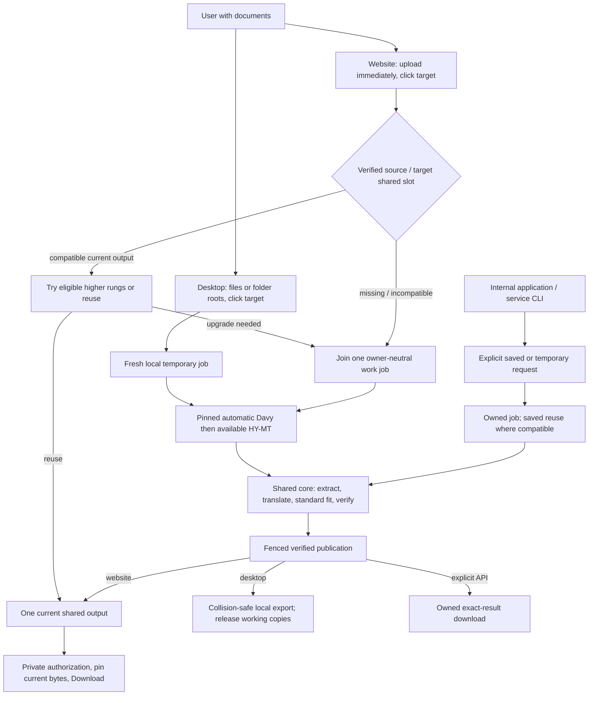

Important qualifications:

- Reuse requires verified input bytes and compatible output behavior, not a filename or matching text. Website compatibility uses the common profile separately from producer/rank; explicit saved requests use their selected-translator output fingerprint. Reusing a stored result repeats no fit or inference.
- Website misses and upgrades join one fenced shared work item per source/target slot. Website and desktop expose no force control. Explicit internal saved requests can bypass owner-scoped reuse with `force_retranslate`; desktop explicit runs always create fresh exports.
- The database stores job/cache metadata and blob references. Original documents, outputs and reports are files in blob storage, not database payloads.
- A format adapter is a reader/writer with preserved document state. There is no universal conversion to DOCX, PDF or plain text. PDF uses targeted text replacement in the PDF itself ([ADR-018](decisions/ADR-018-pdf-strategy.md)).
- The original text, styles and layout measurements must remain available throughout fitting. Fit never compares the translation with a source layout that has already been overwritten.
- TXT bypasses fit because it has no fixed-size text containers. PPTX, DOCX and XLSX fit through the shared estimator (P3); PDF fits while its writer places each translation (ADR-018).
- The MCP upload/download mechanism still needs a wire contract. The arrow above is a logical submission, not a claim that every MCP client can stream a file identically.

## Deployment Profiles

[ADR-013](decisions/ADR-013-deployment-profiles.md) extends the accepted deployment direction. These are targets, not claims that a desktop installer or hosted service is already shipping. The implementation plan retains phase status and the desktop technical gate.

### Shared runtime, separate installations

The desktop is an installed application with file/folder drag/drop, not merely a browser shortcut. It launches a per-user local host/worker using the same job implementation as the company service, with a local-export storage profile and no persistent translation cache. The desktop calls REST and may launch packaged executables; it does not import server internals or build a second queue. Translation stays in the Python core. The approved language boundary is a native desktop shell around the Python backend, with inference replaceable independently. The repository contains a Tauri shell, authenticated local-service bootstrap, Explorer adapter and installer sources. Compilation and fixture checks do not certify signed clean-machine installation; [the execution checklist](plans/unified-execution.md) records remaining D0 acceptance.

The main desktop UI displays selected roots before submission, native drag feedback, a resettable destination row and compact per-file activity. The read-only `inspect_paths` native command checks filesystem metadata off the UI thread in bounded groups of at most 256 roots; it distinguishes files/folders and access errors without enumeration or content extraction. The frontend rejects unsupported direct-file extensions, while the existing service remains authoritative for discovery and validation. Clicking a target pins the accepted selection and destination. Per the owner amendment of 2026-09-30, native `default_export_directory` resolves the Windows Downloads known folder; both main-window and Explorer submissions send an explicit absolute destination. The main window can override/reset it. New exports go directly into the chosen folder, independent of source folders. Accepted input is snapshotted; successful export clears the original path from its journal and export retries do not accept or require a source path. Activity consumes the existing `JobOut.progress` snapshot: translation-phase counts are labeled text units, with indeterminate activity in other running/saving phases. The desktop design and acceptance contract is [desktop UI design](plans/desktop-ui-design.md); no website mascot or saved-target behavior is introduced.

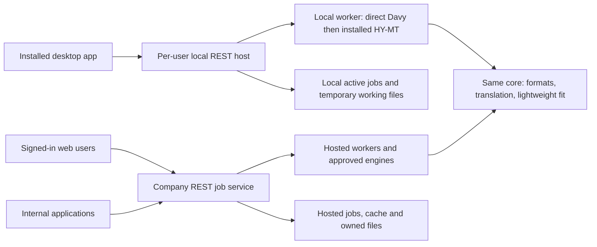

Local and hosted stores are independent; desktop does not connect to the website for translation or synchronize its cache/History. Within either host, credentials resolve a stable owner before data access. Local bootstrap derives an owner from the OS user without web sign-in, protects loopback requests from other users/unrelated web origins and does not open a LAN listener by default. The implemented bootstrap uses inherited stdin, a fresh native-memory token and PID/version/loopback readiness validation; signed clean-machine acceptance remains a separate gate. Hosted sessions/credentials remain required for uploaded work. Machine clients use dedicated service identities; human delegation is explicit and verified, never a client-supplied owner override.

The local runtime runs on demand, owns model/process lifecycle and maintains durable jobs across UI/host restarts. Closing the main window must clearly distinguish background work from quitting. Tray progress and completion notifications can expose that queue, but users can always operate through the window. No work or model loading runs inside an Explorer extension.

### Configured translators

This catalog supports administrators and explicit internal API/CLI selection. Website and desktop use the [automatic policy](#automatic-website-translation-adr-027), with no model picker.

[ADR-024](decisions/ADR-024-translator-availability.md) governs backend-specific availability. Local MT choices require installed model artifacts, checked without loading weights. Davy choices require configured credentials and an approved model ID returned by authenticated `GET /models`, cached for 60 seconds. No inference probes run. Capabilities report safe Davy connection status to authorized API clients. Explicit selection preserves its requested identity; automatic requests use the approved fallback policy. New submissions check availability, while accepted jobs retain pinned identities and idempotent replay is independent of discovery. Other generic LLM configurations retain ADR-019's static configuration contract.

[ADR-019](decisions/ADR-019-configured-translators.md) replaces the one-model-per-mode installation assumption. Supported adapters/catalog entries describe what can run; enabled configured translators describe what this installation offers. The hosted admin chooses the enabled list and default. Desktop setup chooses whether to install the single approved offline bundle; add/remove/repair changes capability, not a model preference. LLM support ships with the application, but an unconfigured or unavailable backend is not a working translator; explicit requests do not silently switch translators; website and desktop automatic routing is declared at admission.

Compatible SMALL-100 decoding presets share one loaded model and tokenizer per worker. Each job uses an immutable decoding binding that passes beam size and inference batch size into each native inference call. The runtime cache groups by model path/artifact, family, resolved device, precision and CPU threads; decoding settings remain part of the output fingerprint. The local-model limit and LRU eviction apply to whole runtime groups, closing all of their preset bindings. Worker caches remain independent.

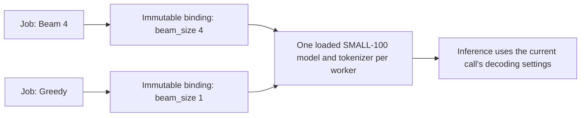

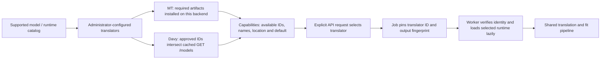

API selection uses `translator_id`; legacy mode clients resolve deterministically. Multiple IDs can use the same engine category. Capabilities distinguish server and remote execution; neither means the website runs a model on the user's device. Connection secrets and model paths are absent from capabilities. Selected model revision, prompt and relevant settings remain part of cache identity. A changed/missing job configuration fails explicitly. Retained loaded local models are bounded per worker rather than loading every installed model; desktop has managed idle unloading, with hardware and installer acceptance tracked under D0/D1. No new inference family is certified by adding a selector.

### Automatic website translation (ADR-027)

Website requests use one administrator-owned standard profile and ordered routing policy. Neither website nor desktop exposes model, decoding, terminology, dictionary, fit, skip or force controls. Inputs are files and target; best-effort source detection is informational metadata and can be unknown or mixed.

The configured ladder begins with Gemma, continues through the five approved Davy alternatives and ends with HY-MT1.5-1.8B Q8_0 via one administrator-managed llama.cpp Vulkan server, four generation/prompt threads and four active server slots. Existing per-worker HY-MT request concurrency is at most four; the external server owns the four active slots across clients. Its lifecycle is outside the in-process MT cache. Record GGUF/runtime/settings revision; no implicit CPU or SMALL-100 substitution.

Service admission verifies uploaded bytes and creates a private history grant, then consults the shared source/target slot. A compatible current result sets a stopping rung: try only eligible higher-priority models, replace on complete validated success, otherwise reuse it. No equal/lower recomputation; no compatible result uses the full ladder. Shared 15-minute failure cooldowns bound repeated failed upgrades. Core owns translation/format/fit logic, typed failure categories and the shared automatic-policy value object; server jobs own persistent ladder execution, routing state and ownership.

History downloads never probe availability or infer; new verified uploads trigger ranked upgrades. Common-profile compatibility is separate from policy order and actual producer identity. Reordering alone changes ranking, not bytes. Safe shared work publication records actual producer, never labels HY-MT as Gemma. Details are in [routing](plans/unified-translator-design.md).

### Bounded website cache and retention (ADR-028)

The website uses a shared company output cache with private user History, one current output per source/target, and current-result downloads. New cached website jobs have no seven-day/exact-version holds. Explicit API saved/temporary contracts remain separate. Existing filesystem/blob/GC boundaries remain; no new service or segment cache.

| Component | Responsibility |
|---|---|
| Settings/catalog | One standard output profile and approved ranked policy; no personal settings merge. |
| Service/auth | Verify input, grant private history access, resolve shared slot; reject custom website/shared-cache overrides. |
| DB/repositories/queue | Shared slots and owner-neutral work/attempts; private jobs/waiters; unique active slot, fenced generations and transactional reservations. |
| Worker/core | Serial ranked candidate execution, active source/workspace lifetime, validated atomic publication; no per-waiter inference. |
| Storage/retention | One current payload, stream/publication pins, physical byte accounting, terminal source cleanup, bounded LRU and existing safe GC. |
| Backup | Exclude transient cached originals; enforce finite backup lifecycle and restore revocation reconciliation. Interrupted restored work requires original re-upload. |
| REST/web | Private History names/languages/status, current-slot availability and owned download URLs; presentation preferences only. |

Data invariants:

- Shared source metadata stores deployment namespace, verified SHA-256, format, size and canonical detected language. Source blobs are nullable active-work references, not history retention. Clear cached source/workspace references at terminal completion; exclude transient originals from backups. Independent legacy/output references may keep identical physical bytes alive legitimately.
- SharedSlot is unique on deployment/source_sha256/target; user, filename, model and profile variants never create extra slots. Fields include current result reference, common-profile identity, actual producer/revision, fit state, last successful use/idle expiry and generation. Index identity uniquely and idle/LRU fields for cleanup.
- SharedWork and its attempts hold active source, pinned profile/order/candidate identities, lease/fence, rung/retry state and capacity reservations. At most one active work per slot. Private jobs attach as waiters and keep their own IDs/status. Cancel one waiter without cancelling others; last waiter cancels work. Shared execution never depends on the first uploader staying enabled.
- `HistoryGrant` is unique per owner/shared slot, with that owner's filename, languages, submission dates and historical provenance. It authorizes current-slot access but pins no blob. Private job/history deletion revokes that owner's grant; neither deletes the shared slot. No grant can be inferred from knowing a hash.
- `JobResult` backing a shared slot contains owner-neutral minimal report/provenance and current output references, without preview payloads. Historical request snapshots can retain metadata after replacement, but old blob references must be detached. Origin-job links cannot force retention or expose another user's identity. No automatic promotion of old personalized output into a shared slot.
- New cached job/file endpoints explicitly declare current_shared semantics. Authorize history/job, then atomically resolve and pin one immutable current output. After replacement, new downloads use new bytes; in-progress streams finish against their pinned original. Old saved/temporary jobs retain exact-result semantics separately. A dangling DB reference is not availability.
- Reservation rows are authoritative and fenced; reserve shared processing once, per-upload staging separately. Account for old pinned output plus new candidate during replacement. Delete old bytes after transient pins release, except independently protected legacy/API data or finite backups. No new per-user version holds.

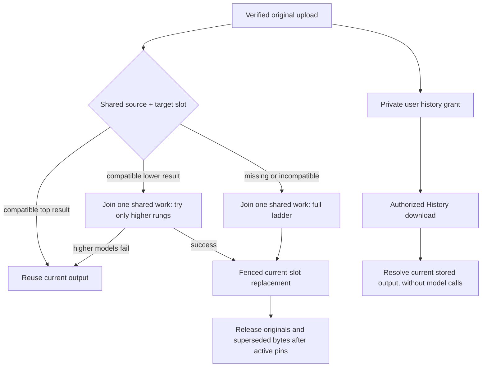

Shared output idle expiry defaults to 30 days since successful reuse/download, with earlier unpinned pressure eviction. Private history expires 90 days after that user's last submission; another user's activity does not renew it. History deletion leaves shared bytes; operator purge revokes the shared slot. Old grants can download a later regenerated output while their history remains.

A common-profile change can make a result ineligible for new request reuse while still downloadable from history with correct provenance. Administrative revocation blocks both. The one-slot invariant survives replacement/profile changes; no variants are archived. See [storage specification](plans/unified-translator-design.md) for budgets, grants, migration, backup and acceptance. Filesystem/SQLite remains the initial single-host deployment; multi-host migration is separate.

### Standard fit and direct downloads (ADR-029)

Production thorough fit and preview/comparison paths are removed across core, server, CLI and desktop. ADR-026 standard structure-aware fitting, required saved-file/content verification and safe PDF placement remain. No LibreOffice or replacement renderer is needed in the shipped runtime. PyMuPDF/font measurement dependencies remain where used by actual translation.

The worker publishes verified output and a minimal report. There is no preview packaging, page work, preview polling or preview storage reservation. Core rendered-repair, Office conversion and page-image implementations are removed. New thorough requests fail validation rather than silently becoming standard. Historical report diagnostics remain readable metadata.

Web bubbles and large-batch rows are status groups with explicit direct Download, active Cancel and terminal Dismiss controls. Orb/body click has no navigation behavior. Errors and optional metadata are inline; no Preview screen, page images, text preview or comparison slider. History resolves the current shared output under ADR-028. Dismiss affects workspace presentation only. Download requires a deliberate click; completion/polling does not auto-download. Active streams still pin immutable bytes through shared replacement.

Website progress maps internal fit to Translating, with activity instead of a completed percentage. No Checking layout label or accessibility announcement. Actual persistence may show Saving; only verified publication enables Ready to download. Keep raw fit phases/timings for backend diagnostics and preserve cancellation. This mapping does not assume fit always takes a second or hide failures.

Preview endpoints and render configuration/process supervision/install requirements are removed; existing blob GC handles unreferenced data. Explicit saved/temporary output/report access remains. The owner-authorized clean slate does not require an executable legacy preview compatibility path; unrelated user software and model assets remain outside cleanup scope. Optional external/native visual QA is not a runtime dependency. See [the removal plan](plans/unified-translator-design.md) for inventory, compatibility and acceptance.

### Installer and model readiness

The [unified specification](plans/unified-translator-design.md#6-desktop-installer-runtime-and-application) supersedes older model-picker, explicit hosted-connection and operating-mode requirements. Setup offers Online only or Online and offline (recommended); these select installed capability. There is one HY-MT Q8_0 bundle, no runtime model/mode selector. Install/remove/repair later uses the same verified asset manager.

The native shell and Explorer activation feed the existing per-user job interface. The shell owns packaged Python and llama.cpp via authenticated loopback and a Windows Job Object. The desktop runtime parses, fits and writes locally, calling Davy directly with the same inference key as the website deployment, injected by restricted release packaging. No website dependency for startup, credentials, discovery, execution or cache. No user key entry. Shared client credentials are extractable and require coordinated rotation; protect at rest and omit from source/logs/arguments without claiming this prevents extraction.

Both execution routes create fresh user-controlled exports, with bounded local recent activity and active-work-only temporary copies. No website History/cache sync or permanent local result cache. The desktop exposes no personal translation settings that bypass the automatic ladder or restore removed rendering features. Full offline installation includes validated assets; normal installation can download them. Verify integrity, licensing, disk, supported hardware and a real model load before Ready. Failed downloads resume/retry safely; active assets remain pinned.

Signed Windows x64 packaging, native Explorer identity, managed HY-MT readiness and immediate direct-Davy translation with the website stopped are D0 gates. Tauri remains a candidate, not a proven installer. Keep the per-user SID/loopback token/bootstrap/version/Origin/Host contract. No end-user development tools or LibreOffice. Five-minute idle model unloading is an initial measured default. Pilot Vulkan/four-thread/four-slot tuning requires supported-hardware acceptance.

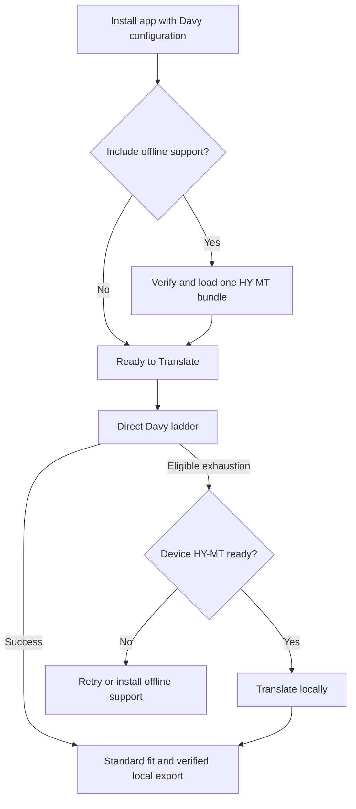

### File and folder ingestion

The desktop enumerates folders incrementally, accounts for unsupported/unreadable files, deduplicates selected source paths and submits bounded per-file requests. It does not follow reparse points or ingest its generated output tree by default. Preserve relative paths beneath distinct input roots; export into a selected destination with explicit collision handling and no overwrite. Source bytes remain unchanged. Each accepted file has an independent job/outcome; one corrupt file does not cancel siblings. The local runtime reads paths on its own device and sends extracted text directly to Davy; it does not upload full source documents to the website.

### Internal applications and later native integration

Versioned REST is the default integration: submit with idempotency, inspect status/cancel, download owned output/report. Reuse its auth, limits and retention; no bespoke queue or direct database access. Public-core Python embedding remains available for callers deliberately providing their own file/lifecycle management, without implied service persistence.

Explorer right-click translation is a release requirement using the same per-user queue and compact progress with explicit Open file/Show in folder. The thin IExplorerCommand/app-identity adapter only activates the application. Modern menu placement and signed registration are clean-machine proof requirements, not inferred from a CLI packaging probe.

Lenovo managed rollout and eventual OEM preload follow a working installer app. Distribution agreements, model/font licensing, signed updates/rollback, resource/battery behavior and target hardware need separate validation. No mandatory NPU, ARM support or general consumer cloud service is assumed. The [desktop/internal-app plan](archive/plans/Desktop-and-internal-app-delivery.md) owns gates and acceptance.

## Implementation Boundary

| Area | Implemented | Planned |
|------|-------------|---------|
| Core | Text API and configured MT/LLM adapters; `Translator.translate_document`, output identity and inspection; target-only automatic policy; protection and formatting recovery; TXT/PPTX/DOCX/XLSX/PDF writeback; standard native fit and saved-output verification | Further corpus/native-file acceptance; no production rendering path |
| Eval | Dataset loaders, run recording, COMET/chrF, comparison and baseline commands | Full committed baselines before the first prompt/model change |
| CLI | Local `doctranslator translate`; service commands `whoami`, `submit` (files or manifest, resume state, wait, download), `batches`, `jobs`, `download` over REST | - |
| Server | Authentication, saved/temporary API jobs, cached automatic work and private History, attempt/generation fencing, SQLite/Alembic, blob pins/GC/reservations, retention/backup, authenticated desktop profile and export journal | MCP; PostgreSQL/multi-host; deployment-specific real-engine acceptance |
| Web | React/TypeScript SPA: sessions, immediate staged uploads, pinned target batches, per-file actions, direct downloads, private History and appearance settings | Deployment acceptance; real-model quality is separate from deterministic browser checks |
| Desktop | Native shell, authenticated bootstrap, Explorer activity and activation, incremental ingestion, fresh collision-safe exports, offline asset management and installer sources | Signed identity/install/upgrade/uninstall and clean-machine/hardware acceptance; see unified execution evidence |

[Unified execution evidence](plans/unified-execution.md) records current verification and release blockers. Historical P2-P6 evidence remains useful for individual format tests. Unit/fixture tests, real inference, native-file acceptance and signed installer checks prove different things and are not interchangeable.

## Major Components

### Users, Batches and Owned Results

Human and application service accounts are stable owners. API keys or browser sessions authenticate them; external case/user IDs are correlation metadata, not permission. Desktop derives its owner from the Windows SID through authenticated loopback. Internal applications enforce their own end-user authorization and never obtain access by supplying an owner ID.

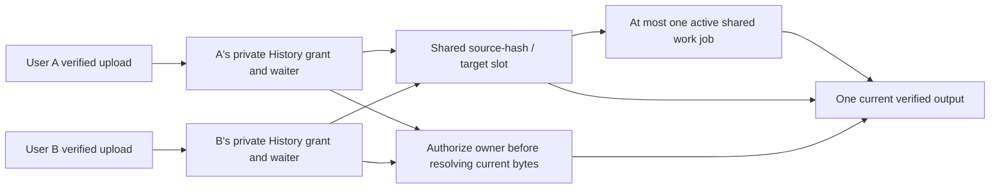

A content hash deduplicates work/storage but grants no access. Website History stores each owner's filename and submission metadata. Deleting that grant revokes only that owner's current-result access; dismissing a job changes workspace presentation only. A higher-ranked successful result can replace the shared slot, so a later website download can receive different bytes. Active streams pin the exact bytes selected at authorization.

Explicit internal saved/temporary requests remain distinct: saved documents own current translations, while each job's exact immutable result remains available until its advertised expiry. Deleting a saved document revokes its job access. Desktop exports are user-owned local files, never website History entries.

### Core

`packages/core` owns translated-document behavior: target language, engine calls, formatting preservation, adapter orchestration and standard fit decisions. Optional source metadata is not an automatic-routing prerequisite. It accepts typed configuration and file inputs and returns results/reports. It does not load app settings, own users/jobs, query a database, maintain a persistent cache or configure logging handlers.

The format-specific code describes and edits a document; the generic pipeline chooses the processing order; the generic fitter decides which size changes are needed. These responsibilities remain separate even though all execute in one worker process.

| Module | Responsibility |
|--------|----------------|
| `translator.py`, `engines/` | Implemented text invariants, engine selection and model interaction |
| `types.py`, `config.py` | Public types and validated configuration; no environment reads |
| `document.py` | Neutral segments, inline structure, container descriptions and stable locations |
| `pipeline.py` | Extract, deduplicate, translate, apply, standard fit, verify and write |
| `formats/<format>/` | File-specific reading, writing, geometry and native placement |
| `formats/_ooxml/` | Shared low-level OOXML/package helpers; no generic translation policy |
| `fit/` | Format-neutral measurement, font lookup and fit policy |
| `policy.py` | Common ordered automatic-candidate policy and target-only routing contract |

`DocumentAdapter`, `LayoutSupport`, `LayoutRepairSupport` and `PlacementFit` are separate capabilities, implemented only where applicable (`PlacementFit` replaces `LayoutSupport` for PDF, whose writer lays out and fits text itself; ADR-018). Engines and formats never import one another. The [core API reference](#core-api-reference) retains the complete implemented text contract. Current document signatures live in the public core types and `Translator.translate_document`; the P2 plan records their design history.

### Server

`apps/server` owns persistent jobs, authenticated document ownership, storage, reuse and the REST/MCP protocols. A FastAPI web process serves REST and the built web UI. Separate worker processes execute translation. MCP remains unimplemented. The web process does not run translation or load the MT model for a request.

| Server module | Owns | Does not own |
|---------------|------|--------------|
| `app.py` | Composition, REST/SPA routes and database-session wiring | Translation and job execution |
| `settings.py` | App configuration and public core config construction | Model inference |
| `api/` | REST request validation and response adaptation over `jobs/`; future MCP must reuse this service boundary | Direct database access or their own translation pipeline |
| `auth/` | API keys, users and authentication (ADR-015) | Formatting or fit behavior |
| `jobs/` | Submission, lookup, queue transitions, workers, progress, immutable job-result/current-pointer publication and storage coordination | File-format internals |
| `db/` | SQLAlchemy models, sessions and repositories; Alembic owns schema changes | Document file contents |

Only `jobs` calls the core pipeline; `settings` may construct public core configuration. Only `jobs`, `auth` and the composition root import `db`. REST and MCP never import each other. ORM objects stay behind job/auth boundaries; wire schemas are distinct from core and database models.

### Web UI

`apps/web` is a React/TypeScript SPA using authenticated REST only. File selection immediately starts bounded staged uploads. Target selection synchronously pins draft membership and target; each ready file submits independently, and later drops create a new draft. Retry, Cancel, Dismiss and Download are per-file actions. History is private and resolves the current shared output. The UI maps internal fit to Translating, has one meaningful live status region and preserves Lenny, the meadow and appearance controls. It has no source/model/settings/preview translation controls and never calls engines or storage directly. [Website evidence](verification/web.md) records unit, browser, responsive and accessibility checks.

### CLI

`apps/cli` has local `translate`, which calls the public core synchronously without persistent history/cache, and service commands, which submit/poll/download through REST using the user's credential. The service path shares durable jobs, batch history, cache and owned documents with API/UI users. It never imports server modules or accesses their database directly, and never silently falls back to local translation. Both paths own terminal progress, exit codes and output-path presentation; the core owns translation/fit. See [ADR-010](decisions/ADR-010-shared-service-cli.md) and [P5](archive/plans/P5-server-and-service-cli.md).

### Evaluation

`apps/eval` owns benchmark datasets, scoring, statistical comparison and run/baseline records. It uses only the core's public text API and does not implement translation. COMET executes in an isolated environment so PyTorch and its older Python dependency do not enter the application runtime. See the [evaluation reference](#evaluation-reference) for its commands, settings, data formats and scoring contract.

## Component Interactions

### Runtime Boundaries

Arrows below denote calls or data access, not permission for new Python imports. The accepted import rules remain in [ADR-003](decisions/ADR-003-source-structure.md) and `.importlinter`.

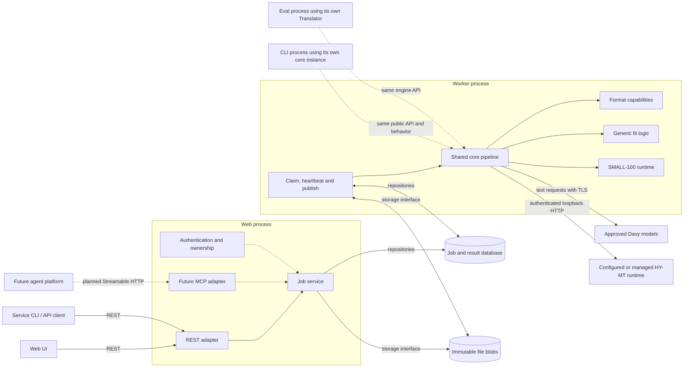

The dotted CLI/eval arrows indicate code reuse, not RPC to the worker. There is no message broker: the database jobs table is the durable queue. Workers poll and claim jobs through repositories. On the laptop, SQLite and local blobs are shared by the web/worker processes. Multiple hosts require PostgreSQL and shared blob storage first.

### Submission and Cache Lookup

Website upload validates bytes and creates bounded staging. A target action submits each available file with `selection_policy=website_auto`, `retention=cached` and `download_semantics=current_shared`; stable batch/item identities make uncertain retries idempotent. A private waiter/grant is attached to the source/target slot. No source-language value or personal translation settings are needed.

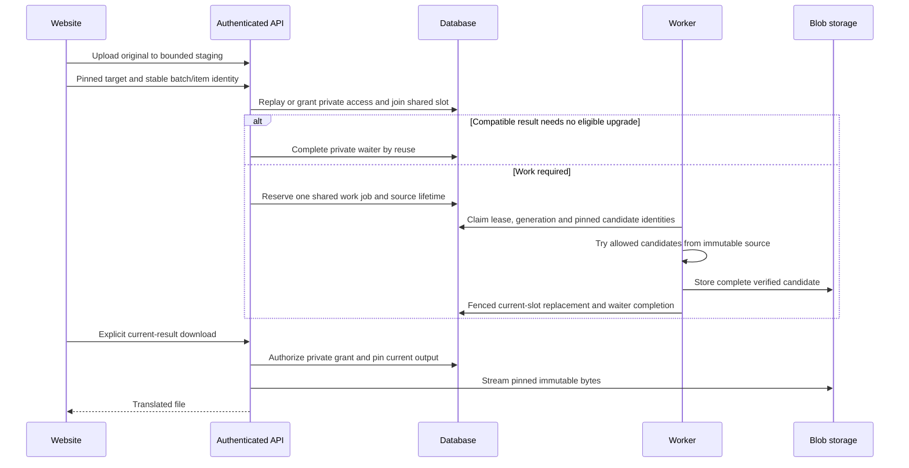

A compatible lower-ranked result bounds an upgrade to eligible higher rungs; failed upgrades preserve it. Shared cooldowns and per-slot work coalescing prevent repeated duplicate inference. Internal saved requests instead use owner-scoped exact-fingerprint reuse and may explicitly force new work; temporary API and desktop explicit runs do not reuse a persistent document-result cache. Worker lease/control checks remain independent of progress writes.

## Jobs, Reuse and Storage

### Reuse Rules

| Scope | Behavior |
|---|---|
| Within a translation run | Deduplicate repeated engine inputs including inline-format distinctions |
| Website cached | One shared source/target slot; reuse compatible current output or try only eligible higher-ranked candidates; private grants authorize access |
| Desktop local export | Fresh work for every explicit run; no permanent document-result cache |
| Explicit API temporary | Fresh work and exact job result until advertised expiry |
| Explicit API saved | Reuse that owner's current result when source bytes and output fingerprint match; explicit force bypasses reuse |
| Persistent cross-document segment cache | Not implemented |

Output identity covers target, model/deployment revision, prompt, effective protection, standard fit/fonts and core behavior. Best-effort detection and requested source metadata are excluded from automatic result compatibility. Website common-profile identity is separate from candidate ordering and actual producer identity; merely reordering candidates does not change stored bytes.

Only complete verified outputs are publishable. Failed or cancelled replacements leave the prior current output intact. Standard unresolved fit remains an honest, scoped outcome where required content/geometry verification succeeds. There is no thorough mode or website/desktop skip-fit control. Deliberate public-core callers retain the cooperative fit callback described below.

### Job Lifecycle

Jobs expose stored progress snapshots. Website presentation maps internal fit to Translating without a misleading completed percentage; backend phases remain diagnostic. The state machine below applies to individual jobs and fenced shared work, with private waiters tracking shared outcomes.

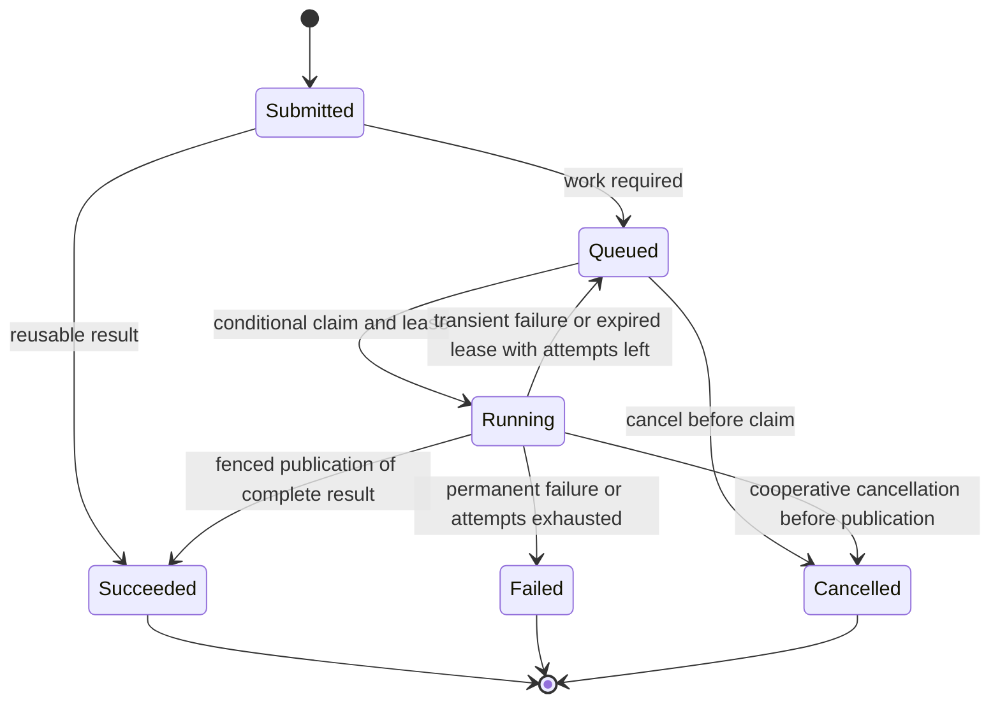

`Submitted` is a conceptual entry point, not an additional persisted status. The accepted job statuses are queued/running/succeeded/failed/cancelled. Attempts are counted at claim time. Workers heartbeat their leases independently of progress reports so a slow model batch cannot accidentally expire a healthy job. Cancellation is cooperative at pipeline batch boundaries; in-flight model requests can finish first. A worker that loses ownership must not publish a result. A process crash leaves unreferenced blobs eligible for cleanup, not a successful partial job.

[ADR-008](decisions/ADR-008-job-execution-model.md) defines these rules; [ADR-016](decisions/ADR-016-service-execution-and-operations.md) amends its fence with a per-attempt claim token and gives the exact transaction predicates, cancellation ordering, retry classes and defaults. See the [server reference](#server-reference).

### Storage and Document Ownership

Use the existing SQLite/SQLAlchemy/repository and immutable-file storage boundaries. The hosted database stores references and metadata, not document payloads. Files use SHA-256 content addresses; authorization follows private owners/grants. Website originals live only for staging/active work and are excluded from durable History retention. The following diagram describes the separate explicit saved API contract.

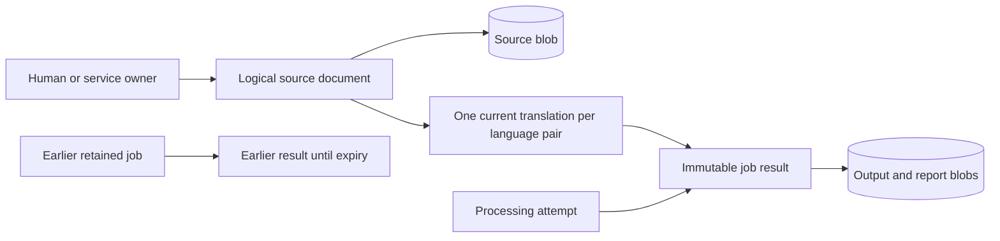

Explicit saved API originals/current translations remain until deletion within quota, and exact job downloads retain their own result until expiry. Website grants instead resolve the current shared slot and do not retain superseded bytes. Cleanup removes only unreferenced/unpinned blobs under publication-safe transactions; active streams keep their bytes. Backups preserve consistent metadata and durable references while excluding transient cached originals.

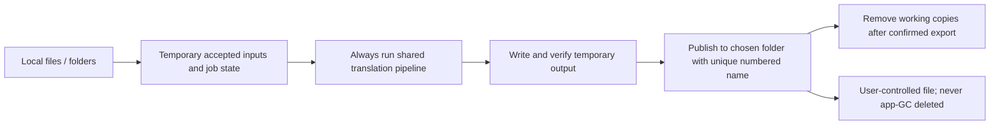

Local export preserves relative folders and reserves collision-safe names, never overwrites existing files, and reconciles destination/digest on restart. It retains no hidden source/result library. Temporary snapshots and bounded job metadata support active work/recovery. Explorer activation uses this same path; signed native integration acceptance remains separate. See [ADR-014](decisions/ADR-014-storage-ownership-and-retranslation.md) and the [storage transition plan](archive/plans/P5-D2-storage-and-ownership.md) for deletion, identity, API and acceptance details.

## Core Document Pipeline

### Format Adapter, Not Universal Converter

Select a format package once after validating the input. It retains the original document/package state and maps between file structures and format-neutral text/container descriptions. It exposes separate capabilities for extraction/writeback, layout and supported native repair. The engine sees only text; it neither understands ZIP parts nor writes the final file.

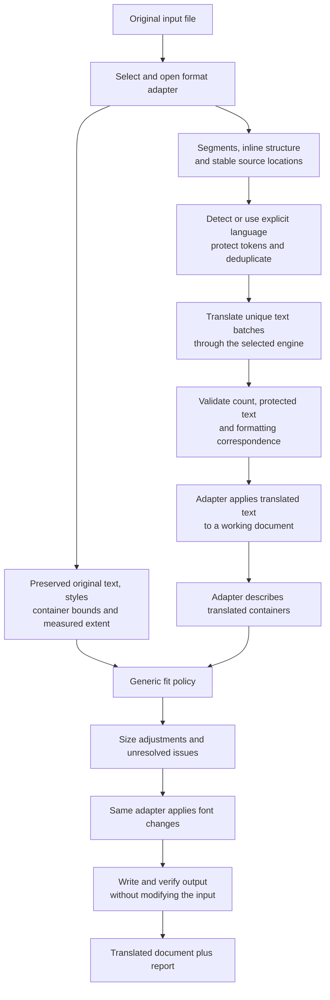

TXT takes the same extraction/translation/writeback path but has no layout capability and bypasses the fit nodes. No post-fit redetection or generic second conversion is necessary. Format-specific serialization stays inside its capability implementation. PDF uses targeted native placement and verification, without a generic conversion or production page-rendering pass.

The implemented neutral schema, segmentation, inline tokens, best-effort detection and atomic publication retain preservation and explicit-failure requirements. Progress callbacks can abort by raising. Formatting correspondence uses validated tags with projection/per-span recovery; merely retaining tags is not evidence that emphasis landed correctly, and first-run flattening is not an allowed shortcut.

### Fit Check

[ADR-026](decisions/ADR-026-offline-fit-v2.md) is accepted and implemented, amending ADR-012, ADR-018 and ADR-023. The [offline fit v2 contract](archive/plans/offline-fit-v2.md) defines acceptance cases and bounded implementation tasks. Repository validation and scoped native-document evidence are recorded in that contract; broader corpus acceptance is not implied.

Standard fit preserves structure before measurement, resolves source and target fonts independently, and verifies the serialized output. An unknown source measurement cannot suppress target fitting: a measurable target uses nominal bounds and neighbour clearance, retaining source uncertainty in the report. Target font substitutions are deterministic provisioned faces written into the document, with script slots and style preserved. Unknown source fallback never claims native parity. Generic fit takes neutral containers and callbacks, never format adapters or XML.

PPTX permits only eligible, unrotated standalone box growth, preserving anchors, limited to 20% per dimension and obstacle-free space. Candidate profiles retain original geometry or add bounded growth and paragraph spacing at 75% or 50%; each profile has at most 40 proportional-size candidates. Floors remain 70%/8 pt with per-run half-point quantization. Tables, inherited placeholders, groups and unsupported transforms retain existing supported shrink only. No neighbour movement, line-height compression, content changes, automatic slides or removed hard breaks. DOCX body and unconstrained tables reflow naturally; fixed cells/boxes receive independent measurement and supported shrinking, with CJK uncertainty reported rather than empirical multipliers.

PDF retains MuPDF placement. Unit reconstruction preserves heading/row boundaries, repeated right-column anchors and baseline-aware neighbours. Trial placements reserve shared free space before final redaction and remain above the floor. If all translated content cannot be legally placed, `LayoutUnresolvableError` (`layout_unresolvable`) prevents publication. No extension through neighbours or below-floor rescue is permitted.

The pipeline snapshots source layout, applies translations, resolves target fonts and repairs, saves a private candidate, reopens to verify content/effective sizes/fonts/geometry, then atomically publishes that exact file and report. LayoutRepairSupport extends existing LayoutSupport through neutral layout_context/apply_layout_patch operations with expected base properties. LayoutContainer carries stable identity, page-local bounds, anchor and supported operation metadata. Patches change only fonts, explicit sizes, supported geometry or paragraph spacing. PDF retains PlacementFit.

`FitOptions.mode` accepts only `standard`. The fit path uses native structure, font measurement and saved-file verification; it does not convert Office files or rasterize pages. New thorough requests fail explicitly. Required content integrity and legal PDF placement are mandatory regardless of fit uncertainty.

Reports retain scoped fit status, performed operations, uncertainty and timings without full text. Historical diagnostics remain readable metadata, but no renderer is invoked to interpret them. Unsupported layout coverage is reported honestly rather than guessed to pass. Published files are immutable; the website may later replace the shared slot with a different immutable result.

The normal website shows Translating during internal fit and may show Saving during persistence. Only verified publication with an available result enables Ready to download. There is no Skip layout check control or preview work. Cancellation remains available until terminal publication. No external-font fetch, OCR or model-driven redesign is introduced.

## File-Specific Flows

### TXT

Plain text has structure but no font sizes or geometry. Preserve encoding policy, newline sequences, blank lines and whitespace while translating text units. The adapter uses strict UTF-8 by default unless an explicit caller supplies an encoding, while retaining the original line structure.

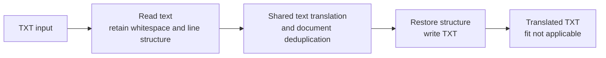

No layout, render or edit capability is required for TXT. Do not claim a visual fit pass merely because no fit work applies. Numbers/URLs/protected text still follow the common translation rules.

### PPTX

Translate paragraphs in text boxes, placeholders, shapes, tables, nested groups and speaker notes. Preserve slide layout, run formatting and relationships. Paragraphs within a text frame are not individual formatting runs; splitting every run into an isolated translation can break sentence meaning. Candidate integration is python-pptx plus shared OOXML helpers where required, with the serializer decision gated on evidence.

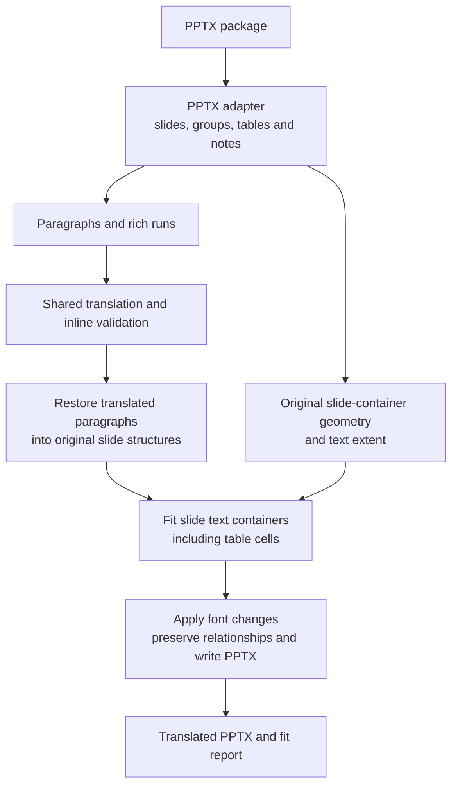

Fit covers the slide's fixed-size text containers; speaker-note translation does not justify inventing slide geometry for notes. Resolve inherited fonts, margins, paragraph spacing, bullets and wrapping before measuring. Group coordinates, table cells and placeholders must map back to stable locations. Native open and preservation tests provide external acceptance evidence; production rendering and visual-edit APIs are absent.

### DOCX

Translate body paragraphs, tables (including nested tables), headers, footers and footnotes. Preserve paragraph styles, runs, numbering, relationships and inline structure. Shared/linked header/footer parts must not be translated repeatedly. Candidate integration is python-docx with OOXML access for content its object model does not expose.

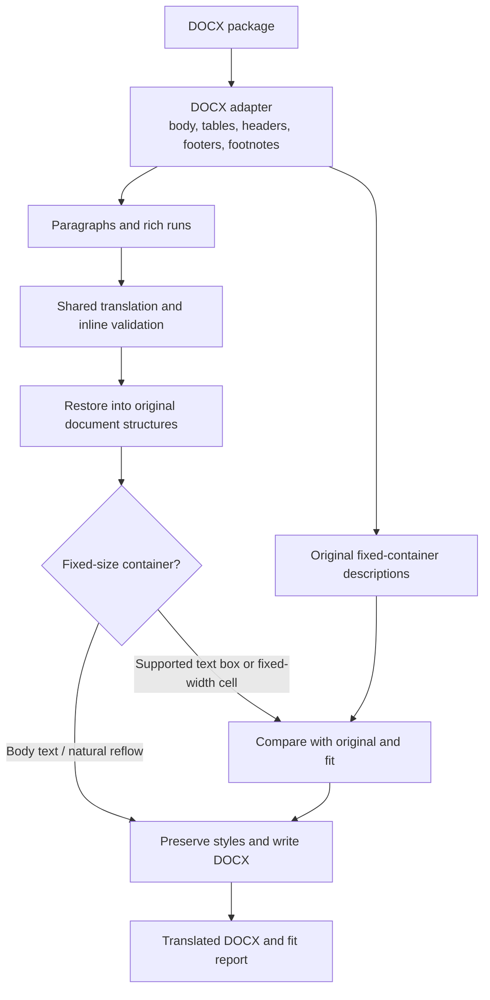

Body text reflows naturally and is not globally shrunk to match the source pagination. The README limits fit to fixed elements such as text boxes and fixed-width table cells. Exact textbox extraction coverage, fields, tracked changes and unsupported text-bearing constructs must be settled in P2.0; they must not be silently lost or counted as translated. Footnote separators and generated fields are structural content, not ordinary prose.

### XLSX

Translate literal cell text while preserving formulas, numbers, dates, styles, relationships and workbook structure. The completed [XLSX experiment](experiments/xlsx-roundtrip/README.md) found that full openpyxl save removed a text-box shape and cleared formula caches in its fixtures. Targeted OOXML writes preserved those features. [ADR-009](decisions/ADR-009-xlsx-preservation.md) proposes the targeted writer; it is not yet accepted.

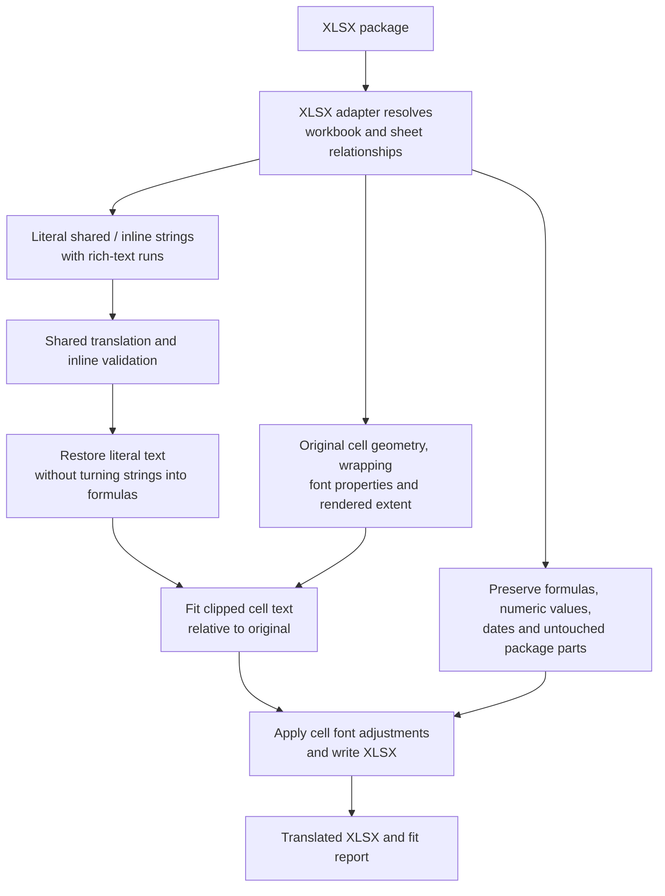

Shared strings may be referenced by many cells; retain their locations and rich formatting. A formula's string cache is not a literal text cell to translate. P3 must interpret row heights, column widths, merged cells, wrap settings and inherited fonts without unintentionally changing other cells that share a style.

**Sheet names are preserved:** the owner explicitly chose cell-text translation with unchanged sheet names for this release. Renaming can break formulas, named ranges, charts and internal links. There is no rename option in this release; the README and ADR-009 record the amended requirement. The targeted writer still requires its native-open/recalculation validation.

**Formula caches are a separate issue:** preserving cache bytes does not prove they remain correct when formulas depend on translated labels. The native recalculation policy still needs a decision. The experiment demonstrates structural preservation, not Excel rendering/recalculation correctness. Do not infer support for pivots, slicers, encrypted/signed workbooks or macros from those fixtures.

### PDF

Produce a translated PDF with page layout preserved as closely as practical. OCR is out of scope: text inside scanned images is not made translatable by this flow. [ADR-018](decisions/ADR-018-pdf-strategy.md) selects targeted replacement in the PDF with PyMuPDF: remove only the translated characters (artwork, images, links and untranslated text stay) and place each translation with MuPDF's HTML layout, which also performs the ADR-012 fit.

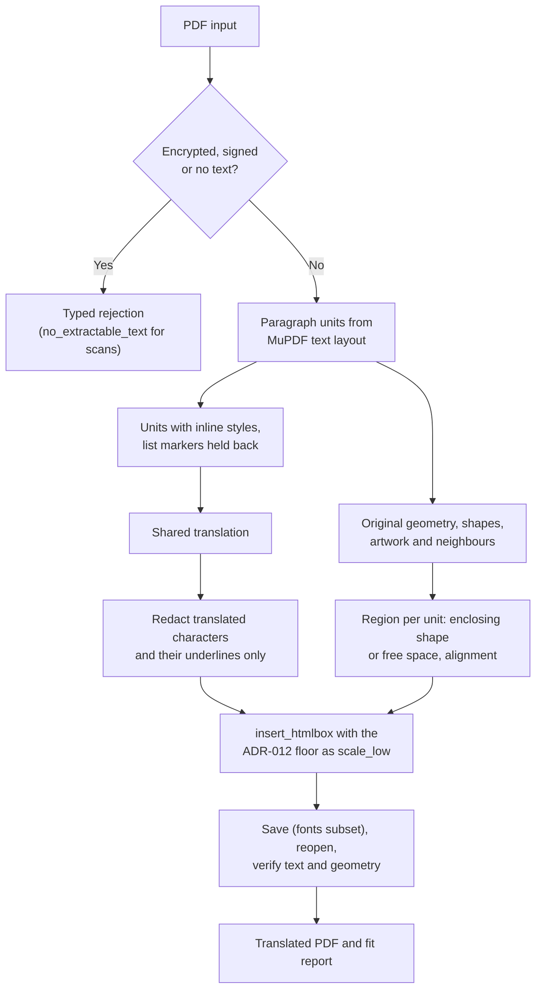

Units, fonts, removal, placement, fit outcomes, kept/reported content (rotated, unmapped, image-heavy pages) and verification are specified in ADR-018; supported cases and evidence are in the [PDF strategy experiment](experiments/pdf-strategy/README.md). PyMuPDF (AGPL, accepted by the owner for the internal service; revisit before any distribution) is confined to the PDF format implementation; production rendering is removed.

## MCP Visual Review

MCP remains later work over the existing authenticated job service. It must not create another queue, import private core modules or restore removed production rendering/preview paths. File transfer, delegation and supported tools require a separate accepted contract before implementation. Native/external visual QA remains acceptance tooling, not a shipped rendering service or an implied private version editor.

## External Dependencies and Deployment

- Internal LLM endpoint: OpenAI-compatible chat completions with Bearer authentication and TLS verified through the host trust store. Gemma is the current configured model, not a hard-coded engine dependency.
- Local MT: SMALL-100 converted to CTranslate2 with SentencePiece; no PyTorch or transformers in the runtime. Models are loaded by worker/CLI processes and reused.
- Server: accepted FastAPI, SQLAlchemy, Alembic, SQLite/local blobs initially; PostgreSQL/shared blobs before multiple-host operation.
- Office/PDF: dependencies remain inside the relevant format packages; there is no shared runtime renderer.
- Initial hosting: one developer laptop on the internal network. Availability and worker capacity depend on that machine. `serve --workers N` supervises the implemented worker processes.
- Enterprise platforms: require a reachable HTTPS host and decisions about authentication and Microsoft-tenant confidentiality. They cannot simply reach a private laptop because the protocol is MCP.
- Eval-only external downloads: FLORES+ and COMET/model packages; no document content is sent to public translation services.

See [Deployment](Deployment.md) for current local operation and future deployment work. No production service is presently deployed by this repository.

## Cross-Cutting Concerns

| Concern | Contract and ownership |
|---------|------------------------|
| Authentication / authorization | API keys and browser sessions identify owners; private jobs/documents/History grants authorize status and downloads; hashes alone never authorize access |
| Configuration | Apps read arguments/environment/files/vault; core validates typed values and never reads app configuration itself |
| Confidentiality | Text only reaches the configured internal model or local MT; logs omit source text, request bodies and credentials |
| Observability | Core logs phase timing/counts without configuring handlers; workers persist progress; apps own logging setup |
| Failure | Text errors use the core engine error types; document partial failure must be explicit; only complete output is publishable/cacheable |
| Cancellation | Callback can abort between batches; clean up temporary output, and do not publish after cancellation or loss of job ownership |
| Versioning | Common-profile and actual producer identities govern shared reuse; immutable outputs are pinned during downloads; no website version archive |
| Verification | Unit/fake-engine tests, real-backend integration tests, native-file preservation checks and visual QA have distinct purposes |

All six repository checks remain required. Unit tests do not need VPN/models. Real-backend tests are explicitly marked and skips do not prove availability. The XLSX experiment's eight passing cases do not establish full Office compatibility. Visual/render acceptance is still required for format and fit work. Changes to prompts/models require the deferred [P1.1 baselines](plans/quality-baselines.md) first.

## Architectural Constraints and Known Tradeoffs

1. The core remains independent of all surfaces, database access and app configuration. Apps import only `doctranslator_core` and its public `types`; format/engine internals stay private.
2. Format packages do not import one another; shared OOXML operations are below them. Generic fit code does not import formats. Add library containment checks when those imports actually enter production code.
3. The database queue avoids a broker and duplicate job-state systems. It requires correctly implemented claims, leases, recovery and fencing, which must be tested rather than assumed.
4. Website work is coalesced per shared source/target slot with private waiter authorization and generation fencing. Explicit saved API reuse remains owner-scoped and fingerprint-based. Persistent cross-document segment caching is not implemented.
5. The core release version invalidates reuse broadly. Immutable blobs share bytes efficiently while keeping logical ownership separate; edit history is deferred.
6. Best-effort geometric fit mitigates overflow but does not guarantee visual quality. Shrinking has a readability floor and does not fix all layout problems; unresolved findings are part of a successful result, not hidden errors.
7. Models translate text, not native document structure. Formatting alignment and safe writeback are first-class requirements, especially for MT and rich text.

## Design Review and Open Decisions

The upload -> authenticated admission -> fenced worker -> shared core -> verified publication -> authorized download/export flow is implemented without a second queue or generic conversion service. Metadata-only fingerprints, formatting correspondence and standard native fit are implemented contracts; their quality and deployment coverage still require scoped evidence rather than blanket claims.

| Decision / gap | Why it matters | Required evidence |
|---|---|---|
| Signed desktop delivery | Compiled shell/Explorer sources do not establish trusted installation, menu placement or upgrade/uninstall behavior | D0 clean-machine Windows x64 and signed identity/installer checks |
| Direct Davy and managed HY-MT | Fixture tests cannot prove actual credentials, VPN access, inference quality or target hardware readiness | Provisioned direct-Davy and real managed-model acceptance |
| XLSX recalculation and format coverage | Structural/cache-byte preservation does not prove native recalculation or every Office feature | Format-specific native corpus checks |
| Font/layout fidelity | Bounded supported measurements report uncertainty and do not promise native visual parity | Native-document and visual evidence for supported layouts/fonts |
| MCP and multi-host operation | Neither transfer/delegation nor distributed storage follows automatically from REST support | Separate accepted contracts and network/storage validation |

[Unified execution evidence](plans/unified-execution.md) records achieved checks and exact remaining blockers. Existing phase plans retain design history, not an alternative executable preview or thorough-fit mode.

## Server Reference

Implemented in `apps/server`. ADR-014/015/016/017 govern explicit saved/temporary ownership, authentication, queue fencing and browser sessions. ADR-027/028/029 plus the unified specification govern automatic policy, shared website cache/private History and standard-fit direct downloads. Operations are documented in [Deployment](Deployment.md). Desktop adds an authenticated per-user profile over this same service and queue.

### REST `/v1`

API keys or `dt_session` authenticate protected routes; state-changing cookie requests also need `X-CSRF-Token`. Health, session creation and deployment-enabled registration have their explicit public entry points. Desktop additionally requires its ephemeral bearer token on all routes, exact loopback Host and absence of browser Origin. Errors use `{code, message, request_id, retryable, details}`. Owner-protected missing/foreign resources return 404; conflicting idempotency and active work use 409; invalid options use 422; queue pressure uses 429. Paginated service lists use opaque cursors and bounded limits. The generated OpenAPI schema is the complete wire reference.

| Route | Contract |
|---|---|
| `POST /accounts`, `POST /sessions`, `GET/DELETE /sessions/current` | Deployment-enabled registration, key or email/password sessions, session/CSRF retrieval and sign-out |
| `GET /me`, `GET /capabilities` | Owner identity/quotas and safe configured capability metadata |
| `GET/PUT /me/translation-settings` | Explicit internal-API account terms/default-dictionary settings; automatic website/desktop requests bypass them |
| `POST /documents?staging=true` multipart `file` | Website staging upload with best-effort informational detection; no inference until target submission |
| `POST /documents`, `GET /documents`, `GET/DELETE /documents/{id}`, `GET .../original` | Separate owned saved-document API; deletion also supports removing unsubmitted staged sources |
| `POST /documents/{id}/translations` | Translate an uploaded source with stable submission or batch/item identity; website sends automatic cached/current-shared fields |
| `GET /documents/{id}/translations`, `DELETE .../{tid}`, `GET .../{tid}/file`, `GET .../{tid}/fit-report` | Explicit saved-document current translations and authorized output/report access |
| `GET /history`, `GET /history/{id}/file`, `DELETE /history/{id}` | Paginated private website History, authorized current-slot download and private-grant deletion; no inference on download |
| `POST /batches`, `GET /batches`, `GET /batches/{id}`, `POST .../seal`, `POST .../cancel` | Owned idempotent batch membership, counts, sealing and cancellation |
| `POST /batches/{id}/items`, `GET /batches/{id}/items` | Per-file upload/admission with stable client item identity; rejected members do not prevent siblings |
| `POST /jobs`, `GET /jobs`, `GET /jobs/{id}` | Standalone submission and private status/progress, safe fallback/error and current availability |
| `POST /jobs/{id}/cancel`, `/dismiss`, `/restore` | Cancel active work or change workspace visibility; Dismiss does not delete History |
| `GET /jobs/{id}/file`, `/fit-report` | Current shared bytes for cached website jobs; exact immutable result for explicit saved/temporary jobs until expiry |

Website options are target plus `selection_policy=website_auto`, `retention=cached`, `download_semantics=current_shared` and idempotent batch/item fields. Desktop uses `desktop_auto` with temporary local-export work. Explicit internal API requests can choose configured translators and saved/temporary retention. Source is optional compatibility metadata; fit accepts only standard. Preview and skip-fit routes are absent; unknown/removed options are not silently converted into supported behavior.

### Schema

Alembic revisions under `apps/server/migrations` own the schema. The current logical structures are:

| Table | Purpose and key constraints |
|---|---|
| `users`, `api_keys`, `sessions` | Stable owners, hashed/revocable credentials and bounded browser sessions |
| `blobs`, `blob_pins` | Content-addressed bytes and publication/download pins |
| `documents` | Owner-scoped saved sources or bounded unsubmitted staging; cached active-work source references are releasable |
| `document_translations` | Explicit saved API current-language results |
| `jobs` | Private jobs/waiters or owner-neutral shared work, attempt lease/fence, pinned options/policy/candidate state, progress and dismissal |
| `job_results` | Verified immutable output/report references and producer/fit provenance; no preview payload |
| `shared_slots` | Unique deployment/source-hash/target slot with one current output and generation fence |
| `history_grants` | Private owner/slot grant, original filename and submission/expiry metadata; no blob/version hold |
| `storage_reservations` | Transactional fenced capacity reservations for staging/work/publication |
| `batches`, `batch_items` | Owned idempotent batches and per-file membership/outcomes |
| `audit_events`, `locks` | Audit metadata and coordinated GC/backup locking |

The owner-authorized development clean slate supersedes obsolete-data migration promises. Explicit current API saved/temporary behavior remains separate; no old personalized output is silently promoted into shared website cache.

### Process model

`doctranslator-server serve` runs uvicorn and supervises workers. Workers retain bounded configured runtime groups, heartbeat independently, store throttled progress and publish under attempt/generation fences. Submission builds identity from metadata/font manifests without loading inference weights. Automatic attempts restart each candidate from immutable source, persist exhausted rungs and never publish after cancellation or lease loss. Website private waiters share one work job and do not each run inference.

Cached output idle expiry is 30 days and private History expiry is 90 days after that owner's submission; pressure eviction can remove unpinned shared output earlier. Cached originals and workspaces are released at terminal completion. Explicit API temporary results and superseded saved results retain their advertised exact-result periods separately. Desktop's local exporter publishes collision-safe user files and keeps only bounded recovery/activity metadata; signed deployment acceptance is tracked independently.

## Core API Reference

The public text and document APIs below describe the implemented core, amended by the target-only and standard-fit contracts. The [implementation boundary](#implementation-boundary) separates executable behavior from release acceptance. Production rendering and visual-edit APIs are absent.

### Purpose

`doctranslator_core` (`packages/core`) owns everything that determines what a translation looks like. Every surface (CLI, server, eval) calls it through one public API, so the same input and options produce the same output everywhere ([ADR-003](decisions/ADR-003-source-structure.md)).

### Responsibilities

- Translate text between Chinese (Simplified), English, Japanese, and Spanish in all 12 directions.
- Provide two translation modes behind one interface: LLM (internal LLM server) and MT (local machine translation model).
- Guarantee text-level invariants shared by every surface: consistent translation of repeated strings, whitespace preservation, and pass-through of empty text.
- Document formats, standard fit and saved-file verification through the same public core; no production rendering or visual-edit API.

### Boundaries

This component owns:
- Language and mode definitions, engine configuration types and their validation.
- The engine interface and both engine implementations, including prompts and model-specific conventions.
- Retries, batching, and concurrency toward the LLM server; model loading and inference for MT.

This component does NOT own:
- Reading configuration from anywhere (environment, `.env`, files, OS vault, arguments). Apps load values and pass typed config in.
- Logging setup, progress display, or command-line handling.
- Benchmark datasets, scoring, or evaluation (that is `apps/eval`).
- Persistence of any kind.

### Interfaces

#### Public API

Everything below is importable from `doctranslator_core` (the only module apps may import besides `doctranslator_core.types`).

```python
from doctranslator_core import Translator, LlmEngineConfig, MtEngineConfig
from doctranslator_core.types import Language

config = LlmEngineConfig(base_url=..., api_key=..., model="gemma-4-31b-it")
with Translator(config) as translator:
    out: list[str] = translator.translate_texts(
        ["你好，世界"], source=Language.ZH, target=Language.EN
    )
```

`Translator(config: EngineConfig)`
: Creates the engine for `config.mode`. Construction is cheap for LLM mode; for MT mode it loads the model, which can take seconds, so a `Translator` is meant to be created once and reused for many calls. It is a context manager; `close()` releases the HTTP client or model. Not thread-safe; use one `Translator` per thread.

`Translator.with_mt_decoding(*, beam_size: int, max_batch_size: int) -> Translator`
: Creates an independently closable, immutable decoding binding over the same loaded MT model/tokenizer. It does not reload weights or mutate the original binding. The configured beam and batch size are passed to each native inference call and remain part of that binding's output identity. Rejects non-MT or closed translators and invalid decoding values. Worker caches use these bindings for compatible presets; callers still follow the one-document-per-worker/thread contract.

`Translator.translate_texts(texts: Sequence[str], *, target: Language, source: Language | None = None) -> list[str]`
: Returns one translation per input, in input order. Guarantees:
  - `len(result) == len(texts)`.
  - Inputs that are empty or whitespace-only are returned unchanged and never sent to the engine.
  - Leading and trailing whitespace of each input is removed before translation and re-applied to its output unchanged.
  - Identical inputs (after stripping) are translated once and receive identical outputs within a call.
  - Source is optional; same-language input is not rejected or bypassed by the generic text API.
  - Any failure raises a `TranslationError` subclass; partial results are never returned.

`Translator.engine_info -> EngineInfo`
: Identifies what produced the translations, for recording alongside results: mode, model identifier, prompt version (LLM) or model family and compute settings (MT).

#### Types (`doctranslator_core.types`)

| Type | Definition |
|------|------------|
| `Language` | `StrEnum`: `ZH = "zh"` (Simplified Chinese), `EN = "en"`, `JA = "ja"`, `ES = "es"`. |
| `TranslationMode` | `StrEnum`: `LLM = "llm"`, `MT = "mt"`. |
| `EngineInfo` | Frozen Pydantic model: `mode: TranslationMode`, `model: str`, `details: dict[str, str]` (e.g. `prompt_version`, `model_family`, `device`, `compute_type`). |
| `TranslationError` | Base exception for all translation failures. |
| `EngineUnavailableError(TranslationError)` | The engine cannot be reached or loaded: connection failure, DNS failure, timeout after retries, model directory missing. |
| `EngineAuthenticationError(TranslationError)` | The LLM server rejected the credentials (HTTP 401/403). Never retried. |
| `EngineResponseError(TranslationError)` | The engine answered but the answer is unusable: malformed output that still fails after the recovery strategy, or a non-retryable HTTP error. |

Error messages never include API keys or full request bodies.

#### Configuration (`doctranslator_core.config`, re-exported from `doctranslator_core`)

Frozen Pydantic models. Apps construct them from their own configuration sources. `EngineConfig = LlmEngineConfig | MtEngineConfig`, discriminated by `mode`.

`LlmEngineConfig`

| Field | Type | Default | Meaning |
|-------|------|---------|---------|
| `mode` | `Literal[TranslationMode.LLM]` | `LLM` | Discriminator. |
| `base_url` | `HttpUrl` | required | OpenAI-compatible API root, e.g. `https://host:port/v1`. |
| `api_key` | `SecretStr` | required | Bearer token. Never logged or included in errors. |
| `model` | `str` | required | Model name on the server. |
| `timeout_s` | `float` | `120.0` | Per-request timeout. |
| `max_retries` | `int` | `3` | Retries for retryable failures (see Error Handling). |
| `batch_size` | `int` | `16` | Segments per request. |
| `max_concurrency` | `int` | `4` | Concurrent requests per `translate_texts` call. |
| `temperature` | `float` | `0.0` | Sampling temperature; `0.0` for reproducible output. |
| `json_mode` | `bool` | `True` | Send `response_format: {"type": "json_object"}`. Disable for servers that reject it. The internal server accepts it (verified 2026-09-27). |

`MtEngineConfig`

| Field | Type | Default | Meaning |
|-------|------|---------|---------|
| `mode` | `Literal[TranslationMode.MT]` | `MT` | Discriminator. |
| `model_dir` | `Path` | required | Directory of a CTranslate2-converted model, including its tokenizer files. |
| `model_family` | `Literal["small100"]` | required | Selects tokenizer and language-token conventions (see MT engine). The only family is SMALL-100 ([ADR-006](decisions/ADR-006-mt-model-selection.md)); another model is added as a new family. |
| `device` | `Literal["cpu", "cuda", "auto"]` | `"auto"` | `auto` uses CUDA when available. |
| `compute_type` | `str` | `"default"` | CTranslate2 compute type (e.g. `int8`, `int8_float16`); `default` keeps the converted precision. |
| `beam_size` | `int` | `4` | Beam search width. Decoding is deterministic. |
| `max_batch_size` | `int` | `32` | Segments per inference batch. |
| `cpu_threads` | `int` | `0` | CPU threads; `0` lets CTranslate2 decide. |

`LlmEngineConfig.deployment_revision: str = ""` is the operator's declared revision of the model served under `model`; change it when the server's model changes under an unchanged name. It is part of the output identity, never sent to the server.

`DocumentLimits` (frozen, re-exported): `max_package_bytes` 1 GiB (uncompressed Office package), `max_entry_bytes` 128 MiB, `max_entries` 20,000, `max_compression_ratio` 1,000, `max_text_bytes` 100 MiB (TXT and PDF input size), `max_segments` 200,000. Exceeding one raises `DocumentLimitError` before any engine call.

#### Document API

Accepted 2026-09-28 ([ADR-011](decisions/ADR-011-document-translation-contract.md)). All names are importable from `doctranslator_core` (functions, `Translator`, configuration) and `doctranslator_core.types` (types, errors).

```python
from doctranslator_core import Translator, prepare_identity, output_fingerprint, inspect_document
from doctranslator_core.types import DocumentTranslationOptions, Language

identity = prepare_identity(config)                 # no model load, no network
options = DocumentTranslationOptions(source="auto", target=Language.EN)
fingerprint = output_fingerprint(identity, options, fonts)   # server cache key part
fmt = inspect_document(path)                          # sniff + validate without translating

with Translator(config, fonts=fonts) as translator:
    if translator.identity != identity:
        raise IdentityMismatchError(...)              # worker check (ADR-011 section 6)
    result = translator.translate_document(path, out_path, options=options, on_progress=callback)
```

`Translator(config, *, fonts: FontManifest | None = None)`
: `fonts` is the provisioned font manifest used by fit measurement (build it with `build_font_manifest(directories)`; apps choose the directories). The Translator keeps one font library for its lifetime, so loaded fonts are reused across documents. Without a manifest, changed containers are reported unresolved (`font_manifest_missing`).

`Translator.identity -> TranslationIdentity`
: The loaded engine's output identity; equal to `prepare_identity(config)` for the same configuration.

`Translator.translate_document(input_path: Path, output_path: Path, *, options: DocumentTranslationOptions, on_progress: Callable[[TranslationProgress], None] | None = None, should_skip_fit: Callable[[], bool] | None = None, detection_metadata: DocumentDetection | None = None) -> DocumentTranslationResult`
: Translates one file into a new file of the same format. Guarantees:
  - The input is never modified. `output_path` must not exist, must not be the input (also via links) and its directory must exist; otherwise `OutputPathError` before any work.
  - The whole document is extracted before translation; each unique engine input (ADR-011 section 1) reaches the engine once, however the work is batched (64 unique inputs per progress step).
  - `on_progress` is called after extraction, after every translation batch, before fitting and before writing. If it raises, the run stops, temporary files are removed and the exception propagates unchanged; nothing is published.
  - Output is written to a temporary file beside `output_path`, reopened and structurally verified, then published atomically without overwriting. A failure never leaves a partial output.
  - Engine and document failures use typed exceptions with safe messages. Detection failures become informational unknown-source metadata and do not reject automatic translation.
  - Same-as-target detection never bypasses translation. Entirely protected/empty segments preserve content without an engine call. Supplied ingestion detection metadata is reused without another detection pass.
  - Public-core callers deliberately owning lifecycle retain the cooperative `should_skip_fit` callback. Website/desktop expose no user skip control; required output construction, content integrity and legal PDF placement remain mandatory.

`prepare_identity(config: EngineConfig) -> TranslationIdentity`
: Metadata-only identity. LLM details: `base_url`, `deployment_revision`, `prompt_version`, `temperature`, `json_mode`, `batch_size`. MT details: `model_family`, `artifact_sha256` (SHA-256 over the sorted names and contents of every regular file in `model_dir`), resolved `device`, `compute_type`, `beam_size`, `max_batch_size`. Hashing the MT model takes about a second; callers prepare an identity once per configuration, not per request. Raises `EngineUnavailableError` if the MT model directory is missing.

`output_fingerprint(identity: TranslationIdentity, options: DocumentTranslationOptions, fonts: FontManifest | None = None) -> str`
: SHA-256 hex of canonical JSON (schema 2): core version, output-affecting strategy versions, engine identity, effective target/protection/encoding/standard-fit options, font-manifest digest and enabled default-dictionary digest. Requested source and detector strategy are excluded. Credentials, paths and callbacks are excluded.

`inspect_document(path: Path, *, limits: DocumentLimits | None = None) -> DocumentFormat`
: Identifies the format from content and extension (they must agree) and applies the package/size limits and protection checks, without parsing text. Raises the same `DocumentError` subclasses as translation. Used by the server to reject files at submission.

Document types (`doctranslator_core.types`, all frozen Pydantic models):

| Type | Fields |
|------|--------|
| `DocumentFormat` | `txt`, `pptx`, `docx`, `xlsx`, `pdf` |
| `DocumentTranslationOptions` | `source: Language \| "auto"` (default `auto`), `target: Language`, `protected_terms: tuple[str, ...]`, `use_default_dictionary: bool` (default true), `txt_encoding: str \| None`, `fit: FitOptions` |
| `FitOptions` | `mode: "standard"`, `min_scale` 0.7 (0.3-1.0), `min_size_pt` 8.0 (1-72) |
| `TranslationProgress` | `phase: extract \| translate \| fit \| write`, `done`, `total` |
| `DocumentDiagnostic` | `code`, `severity: info \| warning`, `message`, `location`, `count` |
| `SegmentCounts` | `segments`, `passed_through`, `unique_inputs`, `formatting_fallbacks` |
| `DocumentTranslationResult` | `output_path`, `format`, `source_requested`, `source_resolved`, `target`, `engine: EngineInfo`, `fingerprint`, `counts`, `diagnostics`, `fit_report: FitReport`, `timings_s` (extract/translate/fit/write seconds, not part of the cached report); property `fit_status` |
| `TranslationIdentity` | `mode`, `model`, `details: dict[str, str]`; property `digest` |
| `FitReport`, `FitEntry`, `FitStatus`, `Extent` | See [Fit Check](#fit-check). `FitStatus`: `not_applicable` (TXT, or no applicable containers), `passed`, `adjusted`, `unresolved` (including a required format without layout support: entry reason `fit_unsupported_for_format`) |
| `FontManifest`, `FontFace` | Provisioned font faces with family/full names (every language), typographic names, style, weight and content hash; `digest` ignores paths |

Stable locations are strings built from part and structure, never Python object identities: `slide 3 / shape "Title 1" (id 2) / paragraph 1`, `document body / table 1 / row 2 / cell 1 / paragraph 1`, `sheet "数据" / A1`, `line 12`. Sheet names appear as they are (they are preserved, not translated).

#### Document pipeline internals

| Module | Role |
|--------|------|
| `inline.py` | `Text`/`Keep`/`Obj`/`Wrap` nodes, `encode`, `validate`, `decode`, whitespace normalization, `project`, `segmented_pieces`/`join_segmented` (ADR-011 sections 1-2) |
| `protect.py` | URL/email/path/protected-term/tag-like `Keep` spans and segment pass-through rules (ADR-011 section 3) |
| `detect.py` | Source detection `detect-v1` with lingua 2.2.0 (ADR-011 section 4) |
| `identity.py` | `prepare_identity`, `output_fingerprint`, strategy version constants |
| `document.py` | `Paragraph(id, location, nodes)` and the layout container types used by fit (P3) |
| `pipeline.py` | Extract, detect, protect/encode, deduplicate, translate in batches with validation/projection/fallback, apply, fit, write-verify-publish |
| `formats/base.py` | `DocumentAdapter` ABC: `paragraphs()`, `apply(paragraph_id, nodes, target)`, `save(path)`, `verify_output(reopened)` (format checks on the written file, default none), `diagnostics`, `close()`; `LayoutSupport` ABC (P3); `PlacementFit` ABC: `place(options, fonts)` returns one `FitEntry` or `None` (fit at original sizes) per changed unit (PDF) |
| `formats/__init__.py` | `detect_format(path)`, `open_adapter(format, path, limits)` |
| `formats/_ooxml/` | Safe ZIP reading with limits, secure lxml parsing, relationship resolution, targeted part writer |
| `formats/<format>/` | Format adapters (TXT, PPTX, DOCX, XLSX, PDF); `layout.py` implements `LayoutSupport` for PPTX, DOCX and XLSX; `formats/pdf/layout.py` holds PDF regions, alignment, font choice and placement |
| `fit/fonts.py`, `fit/measure.py`, `fit/fitter.py` | Font manifest and resolution; HarfBuzz estimator; ADR-012 policy. Supported cases and limits: [fit experiment report](experiments/fit-measurement/README.md) |

An adapter reads the file once and keeps its own parsed state. `paragraphs()` returns every translatable paragraph in document order with inline nodes whose style ids and object keys only the adapter interprets. `apply` replaces a paragraph's content: the adapter writes one run per `Text`/`Keep` with the style's saved properties, re-inserts the original object elements by identity and rebuilds wrappers. `save` writes the package, changing only parts that were modified.

### Dependencies

Depends on:
- `pydantic` (types and config), `httpx` (LLM client), `truststore` (OS certificate store, so the internal CA is trusted without disabling verification).
- Optional extra `[mt]`: `ctranslate2`, `sentencepiece`. No `transformers` or PyTorch at runtime.

Used by: `doctranslator_cli`, `doctranslator_server` (`jobs`, `settings`), `doctranslator_eval`.

### Internal Architecture

| Module | Role |
|--------|------|
| `__init__.py` | Public API: re-exports `Translator`, config types. |
| `types.py` | Public types above. |
| `config.py` | Config models above. |
| `translator.py` | `Translator`: text-level invariants (whitespace, dedupe, pass-through, ordering), delegates to an engine. |
| `engines/base.py` | `TranslationEngine` abstract base class. |
| `engines/__init__.py` | `create_engine(config) -> TranslationEngine`, mapping `TranslationMode` to an engine class. |
| `engines/llm.py` | `LlmEngine`. |
| `engines/llm_prompts.py` | Versioned prompt templates. |
| `engines/hy_mt.py` | HY-MT plain-text prompt/response adapter using the existing LLM HTTP transport; protocol-specific output identity. |
| `engines/mt.py` | `MtEngine`, the SMALL-100 conventions, and `MtRuntime` (the loaded model and tokenizer, injectable for tests). |

#### Engine interface

```python
class TranslationEngine(ABC):
    @property
    @abstractmethod
    def info(self) -> EngineInfo: ...

    @abstractmethod
    def translate_batch(
        self, texts: Sequence[str], source: Language | None = None, target: Language | None = None
    ) -> list[str]:
        """Translate non-empty, stripped, unique texts. Same length and order as input."""

    def close(self) -> None:
        """Release resources. Default: nothing to release."""
```

`Translator` guarantees engines only ever receive non-empty, stripped, deduplicated text, so engines don't re-implement those rules.

#### LLM engine

- One `httpx.Client` per engine, with `verify=truststore.SSLContext(ssl.PROTOCOL_TLS_CLIENT)` and `Authorization: Bearer <key>`.
- Splits input into chunks of `batch_size` and sends up to `max_concurrency` chunks at a time (thread pool), reassembling in order.
- Each chunk is one `POST {base_url}/chat/completions` with a system prompt and a user message containing `{"segments": [...]}`; the model must answer `{"translations": [...]}` with the same count.
- Response parsing tolerates Markdown code fences around the JSON. If the JSON is invalid or the count differs, the chunk is split in half and each half retried, recursively, down to single segments. A single segment that still fails raises `EngineResponseError`.
- `PROMPT_VERSION` in `llm_prompts.py` identifies the prompt. Any change to prompt wording or structure bumps it, because translation quality baselines are tied to it (ADR-005).

#### HY-MT protocol and local acceleration

[ADR-025](decisions/ADR-025-local-hy-mt.md) adds `protocol="hy-mt"` to the LLM
configuration. The default `json-batch` protocol retains the behavior above. HY-MT sends one
segment per request using its versioned plain-text translation prompt, without a system message
or JSON response format. Bounded concurrent requests preserve input ordering; malformed or
output-limited responses fail explicitly. The existing pipeline preserves inline objects and
formatting through validation and fallback.

`execution_location="server"` requires a loopback endpoint and displays **On server** in
capabilities; the default remains **Remote service**. For website deployment, the administrator owns the external llama.cpp process, thread settings, GPU offload and model loading. Desktop owns its packaged runtime lifecycle and authenticated loopback client through the managed runtime. `max_loaded_local_models` still bounds only in-process MT runtimes.
HY-MT remains independently configured and is the final eligible automatic fallback after the approved Davy ladder. Explicit API clients can also request it directly.
Its nonempty deployment revision pins the administrator-declared weights/runtime configuration;
protocol, prompt version and generation settings are included in output identity.

The [laptop experiment](archive/plans/laptop-mt-performance.md) profiles SMALL-100 CPU/OpenVINO and
HY-MT CPU/Arc separately. OpenVINO remains experimental until performance and compatibility
evidence justify a production adapter. No PyTorch/Transformers dependency is added to production
by the HTTP HY-MT adapter. Per the current owner instruction, this task defers the broad quality
baseline while retaining document and response correctness checks.

#### MT engine

- Loads a `ctranslate2.Translator` from `model_dir` (`model.bin`) and a `sentencepiece.SentencePieceProcessor` from `model_dir/sentencepiece.bpe.model`. SMALL-100's SentencePiece model is identical to M2M100's, so no model-specific tokenizer code is needed, and no code shipped with a model is ever executed ([ADR-006](decisions/ADR-006-mt-model-selection.md)).
- SMALL-100 conditions on the target language only. Each source is `__<target>__`, then the SentencePiece pieces, then `</s>`; there is no target prefix. Language tokens use the `Language` values (`zh`, `en`, `ja`, `es`).
- Output pieces are decoded with SentencePiece after dropping special tokens (`<s>`, `</s>`, `<pad>`, `<unk>`) and language tokens.
- Translates in batches of `max_batch_size` with the configured beam size. `device = "auto"` resolves to `cuda` when CTranslate2 sees a CUDA device, else `cpu`.
- Neither library ships complete type information: the engine declares `Protocol`s for exactly the calls it makes and casts once at load time.

### Error Handling

| Condition | Behavior |
|-----------|----------|
| Connection error, DNS failure, timeout | Retry with exponential backoff (1 s, 2 s, 4 s; ±25% jitter) up to `max_retries`, then `EngineUnavailableError`. |
| HTTP 429, 500, 502, 503, 504 | Retry as above; honor `Retry-After` when present (capped at 30 s). Then `EngineResponseError`. |
| HTTP 401, 403 | `EngineAuthenticationError` immediately. |
| Other HTTP 4xx | `EngineResponseError` immediately (includes status code, not body). |
| Unusable model output | Split-and-retry as described above, then `EngineResponseError`. |
| MT model directory missing or unloadable | `EngineUnavailableError` at `Translator` construction. |
| `[mt]` extra not installed | `EngineUnavailableError` at `Translator` construction, naming the extra to install. |

### Security Considerations

- API keys are `SecretStr` and never appear in logs, exceptions, `EngineInfo`, or reprs.
- TLS verification is always on; trust comes from the OS certificate store.
- The core sends document text only to the configured LLM server.

### Observability

Loggers are named after modules (`doctranslator_core.engines.llm`, ...). The core logs at `DEBUG` per request (chunk size, duration, retry attempts) and at `WARNING` for retries and split-and-retry recoveries. It never logs segment text or credentials. Apps configure handlers and levels.

### Testing Strategy

- `Translator` invariants: tested with a fake engine.
- LLM engine: tested against `httpx.MockTransport` (success, retries, `Retry-After`, auth failure, malformed JSON, count mismatch and splitting, code-fenced JSON). No test contacts a real server.
- MT engine: SMALL-100 conventions tested with a fake CTranslate2 translator and tokenizer injected through `MtRuntime`. Tests that load real models are marked `integration` and skipped by default.

### Known Limitations

- Best-effort document detection is optional metadata. Davy/HY-MT text calls accept target-only translation; explicit MT callers may still provide source language.
- LLM output determinism depends on the server honoring `temperature = 0`.
- Deduplication is scoped to one `translate_texts` call. It is not yet document-wide (ADR-007).
- `EngineInfo` is descriptive metadata, not yet a complete cache fingerprint. LLM endpoint/batching and MT artifact identity need explicit treatment before P2 exposes a fingerprint.
- Formatting tags are not structurally validated by the text API. A saved exploratory run kept all tags in 30/30 Gemma cases and 20/30 SMALL-100 cases; this is feasibility evidence, not a fidelity guarantee. See the [P2 draft](archive/plans/P2-document-translation-and-cli.md).
- Document geometry, format capabilities, diagnostics and progress callbacks have no implemented public API yet. Placeholder files do not provide these capabilities.

## Evaluation Reference

Status: implemented in P1 (2026-09-27). Full baselines have not been committed. The owner deferred them until before the first prompt or model change; [P1.1](plans/quality-baselines.md) describes that work.

### Purpose

`doctranslator_eval` (`apps/eval`) measures translation quality: it translates a fixed set of parallel sentences through the core's public API and scores the output with COMET and chrF against reference translations ([ADR-005](decisions/ADR-005-translation-quality-evaluation.md)). It is a development tool, not a user-facing surface.

### Responsibilities

- Download FLORES+ at a pinned revision and load domain sets.
- Run a benchmark for one engine configuration over any subset of the 12 directions, recording everything needed to reproduce and interpret it.
- Score runs: COMET per segment and chrF per direction.
- Compare two runs or baselines with a paired bootstrap, and flag a zh-en regression.
- Write committed baselines that contain scores and segment ids, never text.

### Boundaries

This component owns:
- Benchmark datasets, run directories, scoring, comparison, and baselines.
- Its own configuration loading (environment, `.env`, OS vault).

This component does NOT own:
- Translation. It calls `Translator` from the core's public API only (ADR-003 rule 2).
- COMET itself, which runs in an isolated environment (below).

### Interfaces

#### Command line

`uv run doctranslator-eval <command>`, from the repository root (paths and `.env` resolve from there).

| Command | Behavior |
|---------|----------|
| `download-flores` | Download FLORES+ devtest for the four languages at the pinned revision; skip files already present. |
| `run --mode llm\|mt [--dataset flores\|domain:<path>] [--directions all\|zh-en,...] [--limit N]` | Run a benchmark and print a summary. MT mode also takes `--mt-model-dir PATH` (required), `--mt-family small100`, `--device`, `--compute-type`, `--beam-size`, `--cpu-threads`. |
| `score <run_dir>` | Score a translated run again, e.g. after a COMET failure, without translating again. |
| `compare <a> <b>` | Compare `b` against `a`; each is a run directory or a baseline file. Exit code 1 on a zh-en regression. |
| `baseline set <run_dir> [--baselines-dir DIR]` | Write `apps/eval/baselines/<mode>.json` from a complete run made from a clean working tree without `--limit`. |

Expected failures (missing settings or data, COMET failure, unsuitable baseline run, engine errors) print one `error:` line and exit with code 2.

#### Configuration

`EvalSettings` (pydantic-settings), prefix `DOCTRANSLATOR_`, reading the environment and then `.env`; empty values count as unset.

| Variable | Use |
|----------|-----|
| `DOCTRANSLATOR_LLM_BASE_URL`, `DOCTRANSLATOR_LLM_MODEL` | LLM mode. |
| `DOCTRANSLATOR_LLM_API_KEY` | LLM mode. Falls back to the OS vault: service `doctranslator`, username `DOCTRANSLATOR_LLM_API_KEY`. |
| `DOCTRANSLATOR_DATA_DIR` | Data directory (default `data`). |
| `HF_TOKEN` | Downloading FLORES+ (gated dataset). |

### Data Model

#### Datasets

- FLORES+ `devtest` at revision `5fec6c13f9e5a4db2f745d4ec0d7c9721ddc4f06`, in `<data_dir>/benchmarks/flores_plus/<revision>/devtest/<code>.jsonl` (`cmn_Hans`, `eng_Latn`, `jpn_Jpan`, `spa_Latn`). Rows are joined across languages by `id`; ids must match exactly.
- Domain sets: JSONL rows `{"id", "source_lang", "target_lang", "source", "reference"}`, filtered by direction; duplicate ids are rejected. Identified in manifests by the file's sha256.

#### Run directory

`<data_dir>/eval/runs/<run_id>/`, with `run_id = <UTC yyyymmddTHHMMSSZ>-<mode>-<model slug>`:

| File | Content |
|------|---------|
| `manifest.json` | Run id, time, status, error, git commit and dirty flag, dataset and revision, `EngineInfo`, engine configuration (never the API key), hardware, directions, limit, COMET settings, chrF signature. |
| `translations/<direction>.jsonl` | `id`, `source`, `reference`, `hypothesis` per segment. |
| `timing.json` | Per direction: seconds, segments, segments per second, peak resident memory (MB). |
| `scores.json` | Per direction: `n`, mean COMET, corpus chrF. |
| `segment_scores/<direction>.json` | `{segment id: COMET}`. |

Status moves `running` -> `translated` -> `complete`. A translation failure sets `failed` and keeps completed directions. A scoring failure leaves the run `translated` with the error recorded; `score` retries it.

#### Baselines

`apps/eval/baselines/<mode>.json` (committed): run id, time, dataset, `EngineInfo`, engine configuration, hardware, COMET settings, chrF signature, per-direction `n`/COMET/chrF, and per-segment COMET keyed by segment id. No source, reference, or hypothesis text (tested).

### Internal Architecture

| Module | Role |
|--------|------|
| `cli.py` | Typer commands; `main()` sets UTF-8 console output and logging, then runs the app. |
| `settings.py` | `EvalSettings` and the vault fallback. |
| `datasets.py` | `Direction`, `ALL_DIRECTIONS` (zh-en first), `Segment`, FLORES+ download and loading, domain sets. |
| `runs.py` | Run directory models and file I/O, run ids, git state. |
| `hardware.py` | `HardwareInfo` (OS, CPU name, cores, RAM, engine device) and `PeakMemory`. |
| `runner.py` | `run_benchmark` (one `Translator` for the whole run), `score_run`, summary table. |
| `scoring.py` | chrF (sacrebleu defaults) and the COMET adapter. |
| `compare.py` | Paired bootstrap comparison and its table. |
| `baselines.py` | Baseline creation, validation, and loading. |

#### COMET isolation

COMET (`unbabel-comet` 2.2.7, model `Unbabel/wmt22-comet-da`) needs PyTorch and an older Python, so it never enters the workspace. `scoring.comet` writes sources, references, and hypotheses to a temporary directory, one segment per line with line breaks inside segments replaced by spaces, and runs `uv tool run --python 3.11 --from unbabel-comet==2.2.7 --with "setuptools<81" comet-score ... --gpus 0 --quiet --only_system --to_json` (COMET 2.2.7's torchmetrics imports `pkg_resources`, which setuptools 81 removed; its pinned `jsonargparse` 3.13.1 calls a private argparse method whose signature changed in recent Python 3.12 patch releases, so it runs on 3.11). All directions of a run are scored in one call, so the model loads once. A count mismatch in the output is an error. The first call downloads PyTorch and the model (about 2.5 GB) into the uv and Hugging Face caches.

#### Comparison

For each direction present in both inputs, over the segment ids they share: `delta = mean(b) - mean(a)` of per-segment COMET, with a 95% percentile interval from 1,000 paired bootstrap resamples (`random.Random(0)`). The verdict is `better` if the interval is above zero, `worse` if below, otherwise no significant difference. chrF deltas are reported without a test. A regression is a `worse` zh-en.

### Dependencies

Depends on:
- `doctranslator-core[mt]` (public API only), `pydantic-settings`, `keyring`, `huggingface-hub`, `sacrebleu`, `psutil`, `typer`.
- `uv` on PATH for COMET; network access for the first COMET run and for FLORES+.

Used by: developers, and the deferred P1 step 11 baseline work tracked by P1.1.

### Security Considerations

- The LLM API key is never written to a run directory or baseline (tested); the manifest stores the engine configuration without it.
- Baselines are committed and contain no dataset text. Run directories contain text and stay in the gitignored data directory, since domain sets may be confidential.

### Observability

Commands log at `INFO` to stderr: run start, and per direction the segment count and time. HTTP request logging from `httpx` is limited to warnings.

### Testing Strategy

All tests run without network, models, or COMET: the runner uses a fake `Translator` and a stubbed COMET, the COMET adapter uses a fake `comet-score` that writes the verified output shape, and settings tests isolate the environment, `.env`, and the OS vault.

### Browser accounts and explicit API presets

[ADR-020](decisions/ADR-020-browser-accounts-and-decoding.md) extends browser authentication with deployment-enabled email/password registration. Password hashes attach to stable human users; password sessions reuse the existing session/CSRF boundary without requiring an API key. Existing API-key users and service accounts keep their authorization behavior. Email entry alone is not verified mailbox ownership.

The website and desktop expose only files and target language for translation. Configured decoding presets remain available to explicit internal API/CLI clients; automatic jobs pin the administrator-owned policy and candidate identities.

### Empty translation answers

[ADR-021](decisions/ADR-021-empty-translation-preservation.md) preserves the original encoded text when a document engine call returns a blank answer for a nonempty input. Valid sibling results continue normally. A counted `empty_translation_preserved` diagnostic and the structured report discloses the retained source text. This applies to main translation and formatting recovery; engine exceptions and output-verification failures remain errors. The current target-only standard pipeline identity includes this preservation behavior.


### Literal protection and account dictionaries

Account translation settings remain an explicit internal API facility. Website/shared-cache and desktop automatic requests never merge account terms, dictionary toggles or private output settings; both use the common maintained profile and expose no personal translation editor.

[ADR-022](decisions/ADR-022-protected-dictionaries.md) extends pre-translation protection. The core recognizes literal syntax and loads a maintained `protected_names.txt` resource. Matching creates `Keep` spans; validated placeholders restore exact original text and formatting after translation. Entirely protected segments bypass the model. Names are case-sensitive with Latin identifier boundaries and longest-match precedence. Adjacent styled text runs are scanned together so formatting alone does not split a name; embedded objects and wrappers are boundaries.

`get_default_protected_terms()` is a public core API returning the packaged names. The protection strategy and default-dictionary content digest participate in output identity alongside the document option `use_default_dictionary` and explicit terms. A data-file edit is therefore a cache-affecting deployment, not an invisible change under old fingerprints.

The shared service persists private account translation settings on `User.translation_settings`. `GET /v1/me/translation-settings` returns personal `protected_terms`, `use_default_dictionary`, and read-only `default_protected_terms`; authenticated `PUT` replaces the personal list and toggle. Browser writes require the existing CSRF token. Each personal list has at most 500 entries of at most 200 characters. Service accounts use the same endpoint and ownership behavior.

Explicit selected-translator API submissions merge personal terms with request terms and snapshot effective options before fingerprinting and enqueueing. Automatic website/desktop submissions bypass this merge. Request terms are additive; an omitted default-dictionary override inherits the account choice. Idempotent retries return their original job even if the account settings have since changed. Workers use the snapshot, never live preferences. New settings do not modify existing output files or queued jobs.

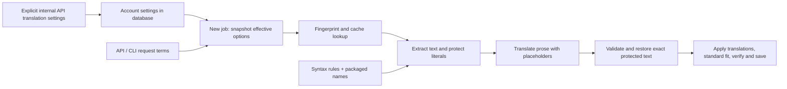

The website and desktop have no dictionary editor. Explicit API dictionary data remains account-owned; browser appearance preferences do not modify it. This mechanism preserves literals; it neither substitutes preferred translated names nor detects arbitrary repetitive model output.
