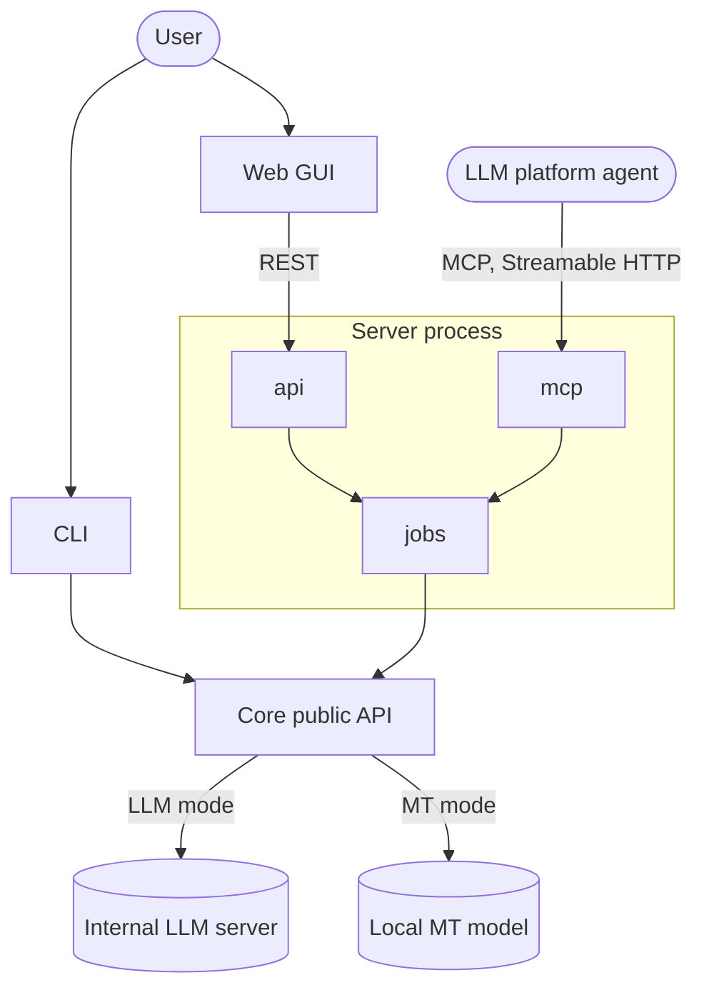

# Architecture

<!--
This document describes the architecture that currently exists or has been explicitly approved - not speculative ideas. Do not turn this into a brainstorming document; use docs/decisions/ for weighing options and docs/plans/ for work not yet done.
-->

## Overview

Document Translator translates PPTX, DOCX, XLSX, PDF, and TXT files between Chinese, English, Japanese, and Spanish while preserving layout, then checks that translated text still fits (see [README](../README.md) for product requirements).

All translation behavior lives in one Python library, the **core**. Three surfaces expose it: a **CLI** that calls the core directly, and a **server** that runs translations as asynchronous jobs and exposes them through a REST API (used by the **web GUI**) and an MCP endpoint (used by agents on LLM platforms). The surfaces contain no translation logic; they only adapt their protocol to the core ([ADR-003](decisions/ADR-003-source-structure.md)).

Status: approved design; not yet implemented.

## Design Goals

- **One source of truth for translation behavior.** Every surface produces identical output for the same document and options.
- **Mechanically enforced boundaries.** Dependency rules are checked in CI, not left to convention.
- **Extensibility by addition.** A new file format or translation mode is one new module in the core.
- **Confidentiality.** Document content never leaves the company network.
- **Portable hosting.** Moving from a laptop to a shared server is a configuration change.

## System Context

- **Users** run the CLI locally or use the web GUI in a browser.
- **LLM platform agents** (Open WebUI now, Copilot later) call the MCP endpoint.
- **Internal LLM server** (OpenAI-compatible, API key auth) serves LLM translation mode.
- **Local MT model** runs in-process on the host for MT translation mode.

## Major Components

### Core (`packages/core`, `doctranslator_core`)

Responsibilities:
- Read and write each document format, preserving formatting. All code specific to one file type lives in that format's package under `formats/` ([ADR-003](decisions/ADR-003-source-structure.md#format-packages)).
- Translate text through a selected engine (LLM or MT mode).
- Run the fit check and produce the fit report.
- Render pages to images and apply document edits for visual review.
- Expose all of the above through a single public API.

### CLI (`apps/cli`, `doctranslator_cli`)

Responsibilities:
- Parse arguments and load configuration.
- Call the core synchronously and report progress and the fit report.

### Server (`apps/server`, `doctranslator_server`)

One FastAPI process ([ADR-001](decisions/ADR-001-mcp-server-deployment.md), [ADR-002](decisions/ADR-002-language-and-stack.md)).

Responsibilities:
- `jobs`: run translations as asynchronous jobs; the only server module that calls the core's pipeline.
- `db`: job persistence in SQLite via SQLAlchemy, with Alembic migrations; used only by `jobs` and `auth`. Document files live on disk, not in the database ([ADR-004](decisions/ADR-004-job-storage.md)).
- `api`: REST routes over `jobs`.
- `mcp`: Streamable HTTP MCP tools over `jobs`.
- `auth`: authentication for REST and MCP.
- Serve the built web GUI.

### Eval (`apps/eval`, `doctranslator_eval`)

Responsibilities:
- Benchmark translation engines on parallel sentences (FLORES+ and a domain set), scoring with COMET and chrF ([ADR-005](decisions/ADR-005-translation-quality-evaluation.md)).
- Compare runs against committed baselines with paired bootstrap significance tests.
- Uses only the core's public API; not a user-facing surface.

### Web GUI (`apps/web`)

Responsibilities:
- React + TypeScript single-page app for uploading documents, choosing options, tracking jobs, and downloading results, using only the REST API.

Per-component detail: [`architecture/components/`](architecture/components/) (not yet written).

## Component Interactions

Dependency rules (enforced by import-linter; full list in [ADR-003](decisions/ADR-003-source-structure.md#dependency-rules)):

- The core depends on no surface and no web, MCP, or CLI framework.
- Surfaces import only the core's public API (`doctranslator_core`, `doctranslator_core.types`), never its internals such as engine or format classes.
- In the server, only `jobs` calls the core's pipeline, only `jobs` and `auth` touch the database, and `api` and `mcp` never import each other.
- The core has no database. Persistence exists only in the server.

## External Dependencies

- APIs: internal LLM server (OpenAI-compatible chat completions, Bearer API key, TLS from the internal CA).
- Infrastructure: initially a single laptop on the company network hosting the server.
- Third-party services: none. External cloud translation or LLM APIs are not permitted.

## Cross-Cutting Concerns

- Authentication: shared by REST and MCP; not yet decided.
- Authorization: not yet decided.
- Observability: the core logs through standard `logging` without configuring handlers; apps configure logging. Jobs log per-phase timing and element counts.
- Error Handling: not yet decided beyond the README requirement that partial failures are reported, never silently dropped.
- Configuration: apps load configuration from their own sources (environment, files, arguments) and pass it to the core. The core never reads environment variables, files, or arguments.
- Security: the LLM API key comes from configuration and is never committed.

## Architectural Constraints

- Open WebUI and Copilot Studio support only Streamable HTTP for MCP.
- Cloud platforms cannot reach the laptop host; Copilot integration requires a server with a stable HTTPS endpoint.
- Text measurement for the fit check requires the documents' fonts or their metrics on the host.

## Known Tradeoffs

- REST and MCP share one process, so they cannot scale or restart independently ([ADR-001](decisions/ADR-001-mcp-server-deployment.md)).
- The workspace layout adds per-package `pyproject.toml` files in exchange for explicit, enforced dependency boundaries ([ADR-003](decisions/ADR-003-source-structure.md)).
