# Architecture

<!-- Keep all architecture descriptions, component details and Mermaid diagrams in this file.
Link to headings rather than creating separate component or diagram documents.
Accepted ADRs retain decision history; plans retain proposed contracts and implementation steps. -->

## Overview

Document Translator is an internal document-processing system. A user submits files through the web UI, installed desktop app, CLI/API or later MCP; internal applications use the same versioned REST backend. The server creates a persistent job, reuses a compatible completed translation when possible, or dispatches the job to a worker. The worker runs one shared core pipeline: read the document through its format adapter, translate its text with SMALL-100 or the internal Gemma server, fit translated text against the original layout, and write a translated file in the original format. The server stores the result and makes it available to the submitting user.

The CLI has two paths: local `translate` runs the core without a database or job queue; service commands submit through REST and share persistent jobs, cache and owned results with API/UI users ([ADR-010](decisions/ADR-010-shared-service-cli.md)). The evaluation app exercises the same translation engines on benchmark text. Translation, formatting and fit behavior belong to the core, never to the UI, CLI, REST routes or MCP tools.

**Status:** text engines and evaluation exist; document and fit implementation is in progress. Deployment diagrams describe accepted responsibilities and target flows, not proof of a shipped service or desktop installer. The roadmap owns phase status; accepted ADRs take precedence over summaries here. ADR-009/011/012/013 record the accepted document, fit and deployment decisions.

This single-file layout follows the sibling `Agentic_Project_Scaffold`. The [P2-P6 delivery handoff](plans/P2-P6-delivery-handoff.md) specifies the implementation sequence and release tests. The owner has approved the shared-service CLI, preserved XLSX sheet names, user-owned translation history and integration of the existing mock UI. Evidence-dependent technical decisions remain gated in the phase plans.

### Reading Guide

- [Deployment profiles](#deployment-profiles): desktop installation, models, local/hosted runtimes and internal apps.
- [Main translation flow](#main-translation-flow): the user-facing path, including cache hits.
- [Major components](#major-components): responsibilities and process boundaries.
- [Users, batches and owned results](#users-batches-and-owned-results): authenticated submission, history, shared bytes and private access.
- [Jobs, reuse and storage](#jobs-reuse-and-storage): durable work, lookup rules and result ownership.
- [Core document pipeline](#core-document-pipeline): adapters, models and fit checking.
- [File-specific flows](#file-specific-flows): TXT, PPTX, DOCX, XLSX and PDF.
- [MCP visual review](#mcp-visual-review): optional review and private output versions.
- [Design review and open decisions](#design-review-and-open-decisions): what is sound and what still needs resolution.
- [Core API reference](#core-api-reference) and [evaluation reference](#evaluation-reference): the detailed implemented P1 contracts, consolidated from the former component files.

## Design Goals

- One translation implementation for all surfaces, with import boundaries enforced in CI.
- Preserve the source document, formatting and structure; expose failures rather than silently discard content.
- Avoid unnecessary model work while ensuring that reuse reflects the requested languages, engine and output behavior.
- Keep requests responsive and jobs recoverable when a worker or web process stops.
- Keep document text on the user's device or approved company infrastructure; local processing must not silently become a remote upload.
- Support a per-user laptop app and a hosted multi-user service using the same core/job implementation, with no automatic transfer between their stores.

## System Context

People use the web UI, desktop app or CLI; internal applications use REST. Agents act for users through standard MCP over Streamable HTTP, initially from Open WebUI. Gemma runs on the company's OpenAI-compatible LLM server. SMALL-100 runs inside the worker or local CLI process through CTranslate2. Neither engine receives an Office file: it receives extracted text segments.

### Main Translation Flow

This diagram intentionally focuses on submission, reuse, translation and delivery. The worker's translation stages execute inside the shared core. Authentication and file-transfer contracts are explained below rather than expanded into additional boxes here.

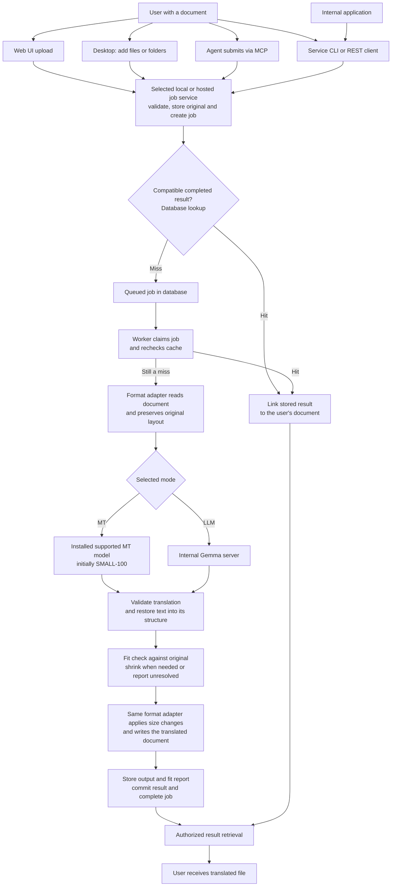

Important qualifications:

- A hit means the **same input bytes and output fingerprint**, not merely the same filename or some matching text. It reuses the already post-processed result and report, so no model or fit work is repeated.
- `force_retranslate` bypasses both lookups. Concurrent misses can still perform duplicate work; the accepted design does not lock identical requests together.
- The database stores job/cache metadata and blob references. Original documents, outputs and reports are files in blob storage, not database payloads.
- A format adapter is a reader/writer with preserved document state. There is no agreed universal conversion to DOCX, PDF or plain text. PDF's strategy is still undecided.
- The original text, styles and layout measurements must remain available throughout fitting. Fit never compares the translation with a source layout that has already been overwritten.
- TXT bypasses fit because it has no fixed-size text containers. Document translation first arrives in P2; automatic fit arrives in P3, and PDF in P4. P2 output must say that fit has not run.
- The MCP upload/download mechanism still needs a wire contract. The arrow above is a logical submission, not a claim that every MCP client can stream a file identically.

## Deployment Profiles

[ADR-013](decisions/ADR-013-deployment-profiles.md) extends the accepted deployment direction. These are targets, not claims that a desktop installer or hosted service is already shipping. The implementation plan retains phase status and the desktop technical gate.

### Shared runtime, separate installations

The desktop is an installed application with file/folder drag/drop, not merely a browser shortcut. It launches a per-user local host/worker using the same job, cache and storage implementation as the company service. The desktop calls REST and may launch packaged executables; it does not import server internals or build a second queue. Translation stays in the Python core. The desktop toolkit/installer remain D0 decisions; existing React UI components may be reused.

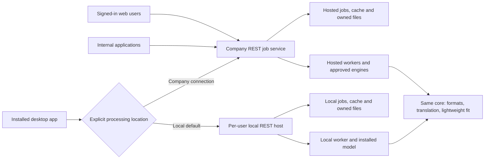

Local and hosted stores are independent; switching hosts is not synchronization. Within either host, credentials resolve a stable owner before data access. Local bootstrap derives an owner from the OS user without web sign-in, protects loopback requests from other users/unrelated web origins and does not open a LAN listener by default. Exact token/bootstrap mechanics require D0 validation. Hosted sessions/credentials remain required for uploaded work. Machine clients use dedicated service identities; human delegation is explicit and verified, never a client-supplied owner override.

The local runtime runs on demand, owns model/process lifecycle and maintains durable jobs across UI/host restarts. Closing the main window must clearly distinguish background work from quitting. Tray progress and completion notifications can expose that queue, but users can always operate through the window. No work or model loading runs inside an Explorer extension.

### Installer and model readiness

The installer or its launched setup wizard lets users select a supported model download, showing languages, compatibility, resource guidance, size and license. Assets come from approved sources/mirrors using a trusted versioned catalog and integrity checks. Installation includes the Python/native runtime: end users do not install development tools. Interrupted downloads can be retried/resumed; activation occurs only after verification and a load check. A failed download leaves setup recoverable, not a false ready state. Settings manage later model changes using the same installation mechanism.

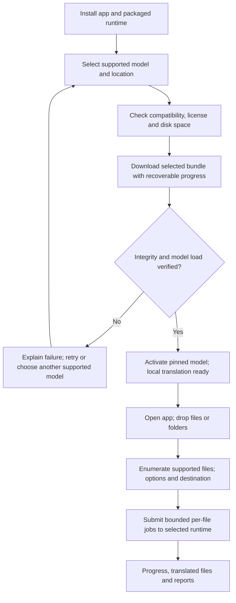

SMALL-100/CTranslate2 is the initial supported local path. More catalog options require model/runtime/quality/redistribution validation; arbitrary repository IDs are not accepted as working model choices. Gemma is presently the internal remote service. Offline means local translation works after installation without inference network calls; model asset downloads are separately visible. Model versions are pinned per job and participate in cache identity. Removing/updating a model must not invalidate active jobs. Fonts continue to follow ADR-012.

### File and folder ingestion

The desktop enumerates folders incrementally, accounts for unsupported/unreadable files, deduplicates selected source paths and submits bounded per-file requests. It does not follow reparse points or ingest its generated output tree by default. Preserve relative paths beneath distinct input roots; export into a selected destination with explicit collision handling and no overwrite. Source bytes remain unchanged. Each accepted file has an independent job/outcome; one corrupt file does not cancel siblings. Remote mode uploads bytes through the same API, not local path strings for a remote server to open.

### Internal applications and later native integration

Versioned REST is the default integration: submit with idempotency, inspect status/cancel, download owned output/report. Reuse its auth, limits and retention; no bespoke queue or direct database access. Public-core Python embedding remains available for callers deliberately providing their own file/lifecycle management, without implied service persistence.

Right-click translation is an optional future adapter, not a desktop release requirement. If pursued, its selected UX is system-tray progress and completion notifications backed by the same queue. Microsoft documents modern Explorer integration through [IExplorerCommand and app identity](https://learn.microsoft.com/en-us/windows/apps/desktop/modernize/integrate-packaged-app-with-file-explorer) and the [notification area](https://learn.microsoft.com/en-us/windows/win32/shell/notification-area); these are later implementation references, not a toolkit selection.

Lenovo managed rollout and eventual OEM preload follow a working installer app. Distribution agreements, model/font licensing, signed updates/rollback, resource/battery behavior and target hardware need separate validation. No mandatory NPU, ARM support or general consumer cloud service is assumed. The [desktop/internal-app plan](plans/Desktop-and-internal-app-delivery.md) owns gates and acceptance.

## Implementation Boundary

| Area | Implemented | Planned |
|------|-------------|---------|
| Core | `Translator.translate_texts`, typed configuration, LLM and SMALL-100 engines, whitespace handling and per-call deduplication | Documents/adapters, document-wide reuse, detection, fingerprint and progress (P2); fit (P3); PDF (P4); rendering/edits (P7) |
| Eval | Dataset loaders, run recording, COMET/chrF, comparison and baseline commands | Full committed baselines before the first prompt/model change |
| CLI | Package scaffold | Document translation command (P2) |
| Server | Module scaffolds | Persistence, jobs/workers, auth and REST (P5); MCP (P7) |
| Web | Design exploration | React application (P6) |

P1 remains in progress pending delivery verification/closure. Its deferred baselines are separate from that closure. Local engine tests and the XLSX serialization experiment are not proof that the full document system is implemented.

## Major Components

### Users, Batches and Owned Results

Every service request resolves an authenticated stable user ID before accessing data. Batches, jobs and documents belong to that user; no client-supplied owner ID can grant access. Multiple credentials or a later browser session can represent the same user. Authentication transport and operational defaults are specified for validation in the P5/P6 plans; they are not implemented yet.


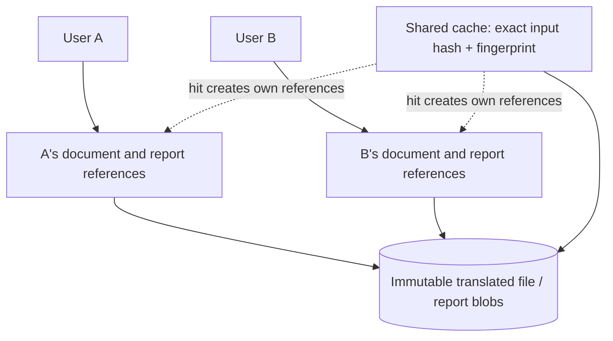

A cache hit never transfers another user's job/document IDs or history. Files may share immutable bytes; authorization always follows the user's document/version references. Reports must remain tied to that version even when a forced translation replaces the cache entry. Disabling a user, revoking credentials, logout, document deletion and retention have explicit lifecycle tests in the service/UI plans.

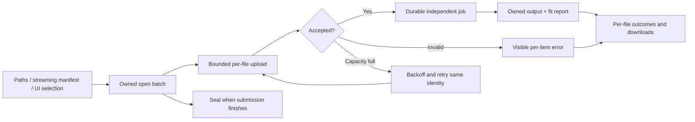

There is no fixed product-level total file-count ceiling. Per-file limits, bounded concurrent uploads, queue admission and storage capacity constrain resource use. A batch is a grouping of independent outcomes, not an all-or-nothing job or a second queue. Accepted jobs run while submission continues. Stable client submission IDs permit retries after an uncertain response without duplicating accepted jobs. One failure does not cancel successful siblings.

### Core

`packages/core` owns everything that determines the translated document: source/target language behavior, engine calls, formatting preservation, adapter orchestration, fit decisions and later rendering/edit operations. It accepts typed configuration and file inputs and returns results/reports. It does not load app settings, own users/jobs, query a database, maintain a persistent cache or configure logging handlers.

The format-specific code describes and edits a document; the generic pipeline chooses the processing order; the generic fitter decides which size changes are needed. These responsibilities remain separate even though all execute in one worker process.

| Module | Responsibility |
|--------|----------------|
| `translator.py`, `engines/` | Implemented text invariants, engine selection and model interaction |
| `types.py`, `config.py` | Public types and validated configuration; no environment reads |
| `document.py` | Planned neutral segments, inline structure, container descriptions and stable locations |
| `pipeline.py` | Planned extract, deduplicate, translate, apply, fit and write sequence |
| `formats/<format>/` | File-specific reading, writing, geometry, rendering and editing |
| `formats/_ooxml/` | Shared low-level OOXML/package helpers; no generic translation policy |
| `fit/` | Format-neutral measurement, font lookup and fit policy |
| `render/` | Shared conversion/rasterization infrastructure used by format packages |

`DocumentAdapter`, `LayoutSupport`, `RenderSupport` and `EditSupport` are separate capabilities, implemented only where applicable. Engines and formats never import one another. The [core API reference](#core-api-reference) retains the complete implemented text contract. Exact document API signatures remain in the [P2 draft](plans/P2-document-translation-and-cli.md) until approved.

### Server

`apps/server` owns persistent jobs, authenticated document ownership, storage, reuse and the REST/MCP protocols. A FastAPI web process serves REST, MCP and eventually the built web UI. Separate worker processes execute translation, and later render/edit jobs. The web process does not run translation or load the MT model for a request.

| Server module | Owns | Does not own |
|---------------|------|--------------|
| `app.py` | Composition, routes, MCP mounting and database-session wiring | Translation and job execution |
| `settings.py` | App configuration and public core config construction | Model inference |
| `api/`, `mcp/` | REST/MCP request validation and response adaptation over `jobs/` | Direct database access or their own translation pipeline |
| `auth/` | Identity and authorization policy, still to be designed | Formatting or fit behavior |
| `jobs/` | Submission, lookup, queue transitions, workers, progress, result/version publication and storage coordination | File-format internals |
| `db/` | SQLAlchemy models, sessions and repositories; Alembic owns schema changes | Document file contents |

Only `jobs` calls the core pipeline; `settings` may construct public core configuration. Only `jobs`, `auth` and the composition root import `db`. REST and MCP never import each other. ORM objects stay behind job/auth boundaries; wire schemas are distinct from core and database models.

### Web UI

`apps/web` is planned as a React/TypeScript SPA using the REST API only. P6 audits the existing agent-built mock and integrates its useful features with real authenticated user history, upload/options/progress/download views and diagnostics/fit reports. Each feature receives a keep/rework/drop/add decision against backend capabilities; fake production data and simulated completion are removed. It does not select adapter internals, call models or access storage directly. The [P6 plan](plans/P6-web-ui-integration.md) covers artifact discovery, browser sessions, API gaps and browser acceptance. P7 rendering/visual edits are not implied by a mock preview/comment control.

### CLI

`apps/cli` has local `translate`, which calls the public core synchronously without persistent history/cache, and service commands, which submit/poll/download through REST using the user's credential. The service path shares durable jobs, batch history, cache and owned documents with API/UI users. It never imports server modules or accesses their database directly, and never silently falls back to local translation. Both paths own terminal progress, exit codes and output-path presentation; the core owns translation/fit. See [ADR-010](decisions/ADR-010-shared-service-cli.md) and [P5](plans/P5-server-and-service-cli.md).

### Evaluation

`apps/eval` owns benchmark datasets, scoring, statistical comparison and run/baseline records. It uses only the core's public text API and does not implement translation. COMET executes in an isolated environment so PyTorch and its older Python dependency do not enter the application runtime. See the [evaluation reference](#evaluation-reference) for its commands, settings, data formats and scoring contract.

## Component Interactions

### Runtime Boundaries

Arrows below denote calls or data access, not permission for new Python imports. The accepted import rules remain in [ADR-003](decisions/ADR-003-source-structure.md) and `.importlinter`.

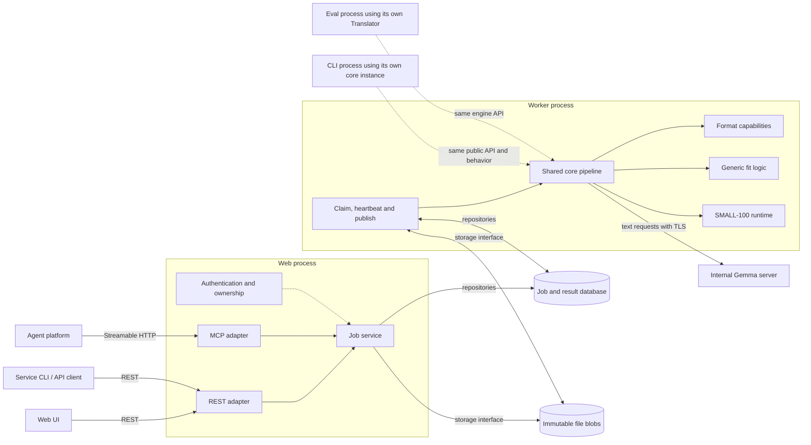

The dotted CLI/eval arrows indicate code reuse, not RPC to the worker. There is no message broker: the database jobs table is the durable queue. Workers poll and claim jobs through repositories. On the laptop, SQLite and local blobs are shared by the web/worker processes. Multiple hosts require PostgreSQL and shared blob storage first.

### Submission and Cache Lookup

The following sequence expands the two cache checks. It omits transient-error and cancellation branches, which are shown in the job lifecycle below.

```mermaid
sequenceDiagram
    participant C as UI or MCP client
    participant J as Job service
    participant B as Blob storage
    participant D as Database
    participant W as Worker
    participant P as Core pipeline
    C->>J: Submit file, languages, mode and options
    J->>J: Authenticate, validate and calculate input hash / fingerprint
    J->>B: Store immutable original
    J->>D: Lookup successful result by hash + fingerprint
    alt Reusable result and no force flag
        J->>D: Create completed job and user's document/version reference
        J-->>C: Completed job ID
    else Miss or force flag
        J->>D: Create queued job
        J-->>C: Job ID without waiting for translation
        W->>D: Atomically claim job with a lease
        W->>D: Recheck cache unless force flag is set
        alt Another job completed while this one waited
            W->>D: Publish existing result reference under current ownership
        else Translation still needed
            W->>B: Read original
            W->>P: Translate document with options and progress callback
            loop Between batches / while worker owns the job
                P-->>W: Progress callback
                W->>D: Progress and cancellation check; separate lease heartbeat
            end
            P-->>W: Output file, diagnostics and fit report
            W->>B: Store immutable output/report blobs
            W->>D: Fenced transaction: cache result, document version, succeeded
        end
    end
    C->>J: Poll status and request result
    J->>D: Check document ownership and result reference
    J->>B: Read referenced output
    J-->>C: Translated file and report
```

Submission-time fingerprinting must use configured immutable engine identity without loading a translation runtime. The existing `EngineInfo` does not yet supply the complete identity. The P2 draft now proposes a metadata-only fingerprint function; its identity preparation and worker verification contracts still need design validation. See [open decisions](#design-review-and-open-decisions). A worker reuses loaded engines between jobs but verifies it is executing the requested engine/configuration identity.

## Jobs, Reuse and Storage

### Reuse Rules

| Layer | Scope | Rule |
|-------|-------|------|
| Text deduplication | Implemented within one text API call | Identical stripped inputs reach the engine once; whitespace is restored per occurrence |
| Document deduplication | Accepted for P2 | Collect all segments first; deduplicate across all slides/paragraphs/sheets and pipeline batches, including formatting placeholders |
| Whole-document cache | Accepted for P5 | Key is `(SHA-256(input bytes), output fingerprint)`; only complete successful core output is reusable |
| Persistent segment reuse | Deferred | No reuse across near-identical/re-saved documents without a future ADR and evidence |

The fingerprint represents every output-affecting choice: requested source (including `auto`), target, mode, model/prompt identity, relevant engine settings, fit policy and core version. Exact schema, model revision identity and font/measurement identity are still design work. API credentials and output paths are not output behavior. A new filename does not invalidate a byte-identical input; changing target language does. Re-saving an otherwise equivalent Office document may change ZIP bytes and legitimately miss this cache.

Cached results include unresolved fit findings when the pipeline completed successfully; the report travels with the file. Partial/failed outputs and later user/agent edits are not cached. A cache hit gives the new user a document/version reference with their own ownership, never access to another user's private edit history. Two concurrent misses may both translate; the unique result key chooses the reusable entry. This is accepted duplicate work, not an exactly-once execution promise.

### Job Lifecycle

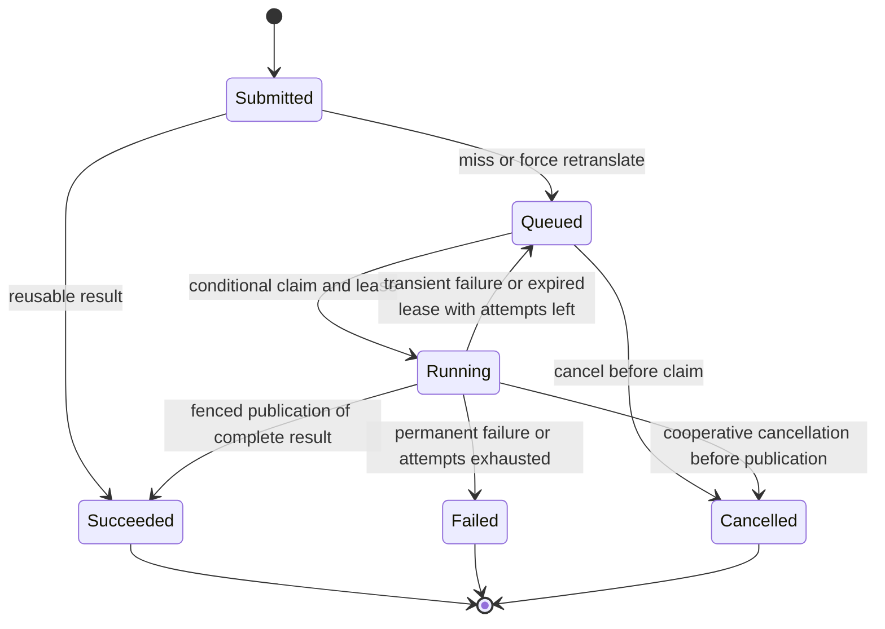

`Submitted` is a conceptual entry point, not an additional persisted status. The accepted job statuses are queued/running/succeeded/failed/cancelled. Attempts are counted at claim time. Workers heartbeat their leases independently of progress reports so a slow model batch cannot accidentally expire a healthy job. Cancellation is cooperative at pipeline batch boundaries; in-flight model requests can finish first. A worker that loses ownership must not publish a result. A process crash leaves unreferenced blobs eligible for cleanup, not a successful partial job.

[ADR-008](decisions/ADR-008-job-execution-model.md) defines these rules, including retries and worker recovery. Exact fence predicates, attempt identity, race handling, intervals and defaults must be finalized in P5; its current worker-ID wording must not be treated as proof that every stale-completion race is resolved.

### Storage and Document Ownership

The database starts as SQLite with SQLAlchemy 2.0 synchronous sessions, WAL, foreign keys and a busy timeout. Alembic manages all schema changes. Application queries go through repositories rather than SQLite-specific SQL. Files use an interchangeable storage interface and immutable content hashes; the laptop implementation uses local disk. Backups must include a consistent database plus its referenced blobs.

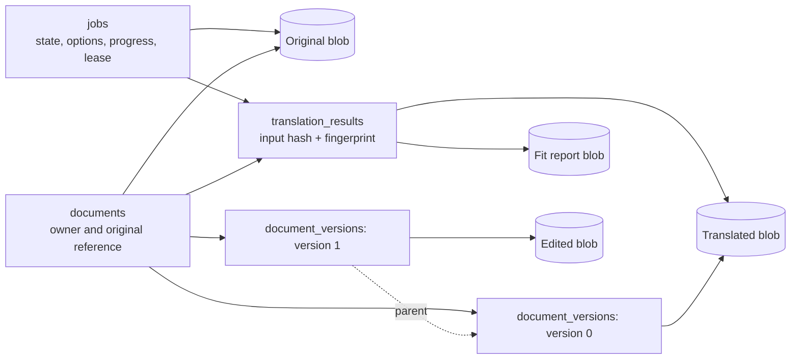

This is a conceptual reference diagram, not a finalized database schema. Cache rows and user documents have independent retention policies. Delete a blob only when no job, result or document version references it. Expiring a cache entry cannot delete a user's translated file. Editing a document writes a new blob/version and never mutates a shared result. Defaults, authentication/ownership schemas and deletion races are P5 design work.

## Core Document Pipeline

### Format Adapter, Not Universal Converter

Select a format package once after validating the input. It retains the original document/package state and maps between file structures and format-neutral text/container descriptions. It exposes separate capabilities for extraction/writeback, layout, rendering and edits. The engine sees only text; it neither understands ZIP parts nor writes the final file.

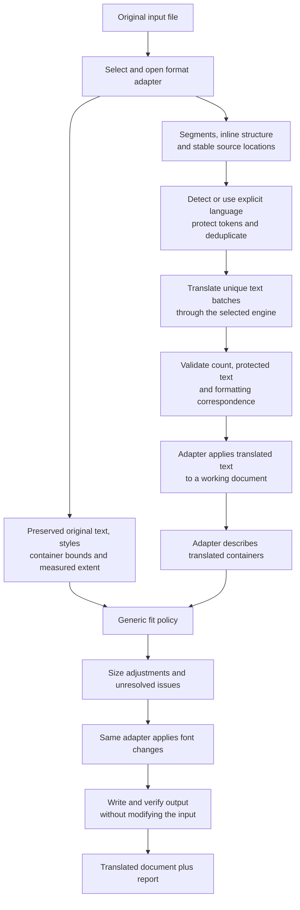

TXT takes the same extraction/translation/writeback path but has no layout capability and bypasses the fit nodes. No post-fit redetection or generic second conversion is necessary. A format may need special serialization or rendering, but that stays inside its capability implementation. For PDF, whether conversion is part of that implementation remains undecided.

The exact neutral document schema, paragraph segmentation, inline-token format, source detector and safe publication API are still proposed in [P2](plans/P2-document-translation-and-cli.md). The accepted requirements are preservation, document-wide reuse, explicit failures and an optional progress callback that can abort by raising. Tags that survive a model response are not sufficient evidence of correct emphasis placement. SMALL-100's current formatting strategy remains an open gate; stripping tags and assigning all output to the first run would violate preservation requirements.

### Fit Check

[ADR-012](decisions/ADR-012-lightweight-fit-policy.md) supersedes the former absolute visual guarantee. Translation accuracy and faithful formatting lead; fit is lightweight best-effort overflow mitigation. Reuse the existing shared estimator/fitter and adapter boundaries. Only changed constrained containers need measurement. Normal reflow, DOCX body and unconstrained content need no fitting.

For supported geometry/fonts, estimate source and translated extents with the same provisioned-font/shaping/wrapping implementation. Allowed extent is the larger of bounds and source extent on each constrained axis. Preserve source overflow. Unknown fonts, glyphs or layout behavior retain original sizes and report unresolved, never a false pass.

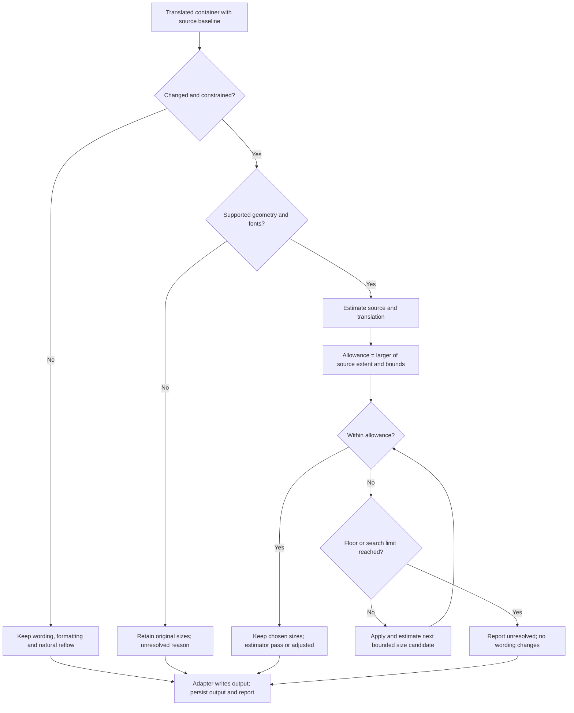

Defaults remain 70% relative and 8pt absolute floors, 2.5% scale steps, half-point quantization and 1pt tolerance. Never enlarge or further shrink a source run at/below the absolute minimum. Bound candidate measurements to 40 per container, stop at first fit/floor/no further size change and reuse duplicate candidates. If the search cap is reached before a reliable floor result, retain original sizes and report search_limit; never invent a pass. Format adapters apply sizes; generic fit never imports format packages.

Do not move objects, change row/column dimensions, force pagination or rephrase/truncate translations. No runtime renderer, vision/model calls or font downloads for fit. PDF should use its selected writer's placement/layout facilities where available rather than add a second independent measurement engine.

Reports identify adjustments and unresolved locations/reasons, original/final sizes and measurable extents. Passed/adjusted mean estimator outcomes, not native-rendered approval. Missing layout capability is unresolved for a required format; not_applicable is reserved for TXT or proven absence of applicable containers. Preserve cache fingerprinting of policy, fonts and implementation identity.

[P3.0](plans/P3.0-fit-design-validation.md) now closes existing research using a fixed small corpus and explicit support limits; it does not require native line-count/pitch parity or continuing font-specific tuning. Native-open/visual spot checks remain acceptance work, not per-job production steps. Optional visual correction remains P7.

## File-Specific Flows

These describe required scope and adapter responsibilities. No format adapter is implemented yet. A named candidate library does not approve its save fidelity; preservation must be demonstrated on fixtures. Per-format diagrams reuse the same translation engines and generic fit policy rather than introduce independent pipelines.

### TXT

Plain text has structure but no font sizes or geometry. Preserve encoding policy, newline sequences, blank lines and whitespace while translating text units. The P2 draft proposes strict UTF-8 by default and non-empty physical lines as the initial segment unit; those details still need approval.

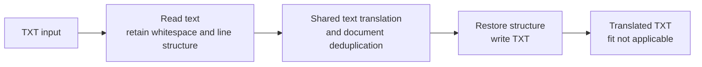

No layout, render or edit capability is required for TXT. Do not claim a visual fit pass merely because no fit work applies. Numbers/URLs/protected text still follow the common translation rules.

### PPTX

Translate paragraphs in text boxes, placeholders, shapes, tables, nested groups and speaker notes. Preserve slide layout, run formatting and relationships. Paragraphs within a text frame are not individual formatting runs; splitting every run into an isolated translation can break sentence meaning. Candidate integration is python-pptx plus shared OOXML helpers where required, with the serializer decision gated on evidence.

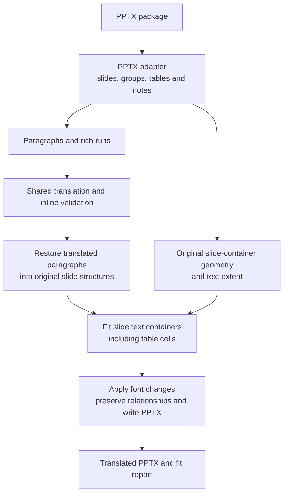

Fit covers the slide's fixed-size text containers; speaker-note translation does not justify inventing slide geometry for notes. Resolve inherited fonts, margins, paragraph spacing, bullets and wrapping before measuring. Group coordinates, table cells and placeholders must map back to stable locations. Rendering slides to images and visual edits arrive in P7; native open and preservation tests are required earlier.

### DOCX

Translate body paragraphs, tables (including nested tables), headers, footers and footnotes. Preserve paragraph styles, runs, numbering, relationships and inline structure. Shared/linked header/footer parts must not be translated repeatedly. Candidate integration is python-docx with OOXML access for content its object model does not expose.

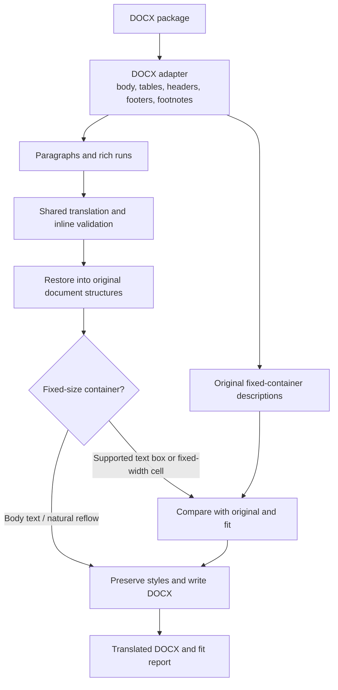

Body text reflows naturally and is not globally shrunk to match the source pagination. The README limits fit to fixed elements such as text boxes and fixed-width table cells. Exact textbox extraction coverage, fields, tracked changes and unsupported text-bearing constructs must be settled in P2.0; they must not be silently lost or counted as translated. Footnote separators and generated fields are structural content, not ordinary prose.

### XLSX

Translate literal cell text while preserving formulas, numbers, dates, styles, relationships and workbook structure. The completed [XLSX experiment](experiments/xlsx-roundtrip/README.md) found that full openpyxl save removed a text-box shape and cleared formula caches in its fixtures. Targeted OOXML writes preserved those features. [ADR-009](decisions/ADR-009-xlsx-preservation.md) proposes the targeted writer; it is not yet accepted.

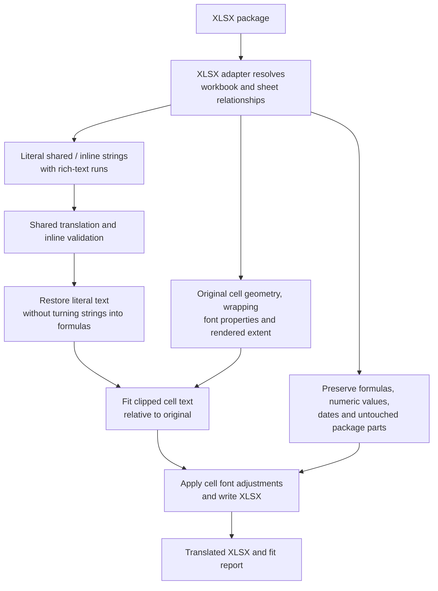

Shared strings may be referenced by many cells; retain their locations and rich formatting. A formula's string cache is not a literal text cell to translate. P3 must interpret row heights, column widths, merged cells, wrap settings and inherited fonts without unintentionally changing other cells that share a style.

**Sheet names are preserved:** the owner explicitly chose cell-text translation with unchanged sheet names for this release. Renaming can break formulas, named ranges, charts and internal links. There is no rename option in this release; the README and ADR-009 record the amended requirement. The targeted writer still requires its native-open/recalculation validation.

**Formula caches are a separate issue:** preserving cache bytes does not prove they remain correct when formulas depend on translated labels. The native recalculation policy still needs a decision. The experiment demonstrates structural preservation, not Excel rendering/recalculation correctness. Do not infer support for pivots, slicers, encrypted/signed workbooks or macros from those fixtures.

### PDF

Produce a translated PDF with page layout preserved as closely as practical. OCR is out of scope: text inside scanned images is not made translatable by this flow. P4 must select between editing text/layout in PDF and an intermediate editable representation followed by re-rendering. No universal converter or round-trip fidelity has been chosen.

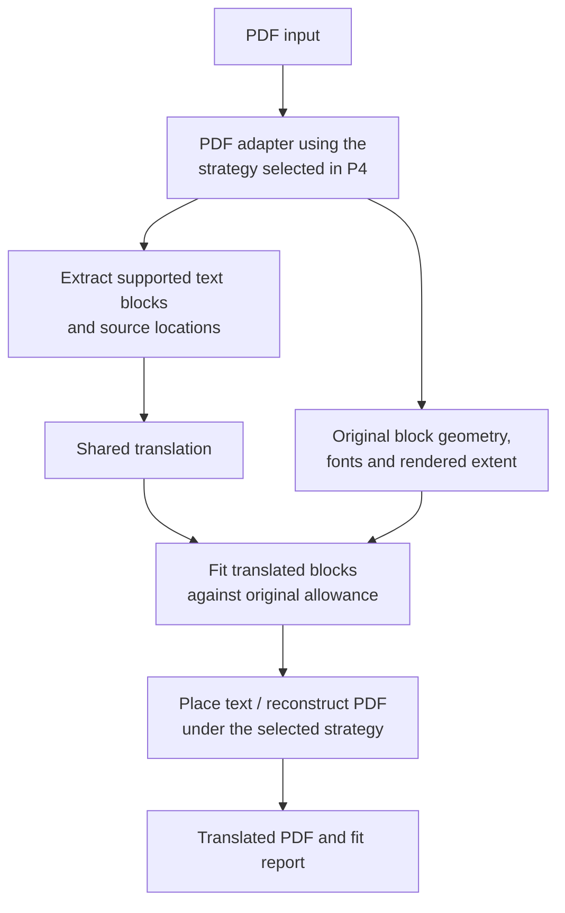

Font embedding, reading order, complex scripts, clipping and reconstruction artifacts are strategy-selection criteria. PyMuPDF is the anticipated format/render dependency within ADR-003's import boundaries, not evidence that the PDF algorithm is implemented. The adapter must distinguish unsupported/no-extractable-text content from an empty successful translation.

## MCP Visual Review

P7 adds an optional second quality layer after core translation. The same server exposes standard Streamable HTTP tools; platform-specific behavior stays outside the server. The platform agent sees rendered pages, prioritizes fit-report findings and requests supported document corrections. The server executes render/edit work as jobs and keeps version history.

```mermaid
sequenceDiagram
    participant A as Agent acting for user
    participant M as MCP over job service
    participant W as Render / edit worker
    participant V as Document versions and blobs
    A->>M: Request rendered pages and fit report
    M->>W: Queue render job for current version
    W->>V: Read document; store rendered page images
    W-->>M: Render result references
    M-->>A: Page images and report
    A->>A: Inspect overflow, overlap and readability
    A->>M: Request edits based on version N
    M->>W: Queue authorized edit job
    W->>V: Write new blob; add version N+1 if N is still current
    W-->>M: New version or conflict
    M-->>A: Edit result
    A->>M: Render again and verify
```

Edits never mutate the cached machine translation. A stale base version causes a conflict. Rendering is server-side so any compatible vision-capable client can inspect the pages. Headless LibreOffice followed by PDF rasterization is an anticipated approach, not an accepted rendering ADR. The MCP file-transfer contract, resource limits, supported edit operations and client-to-server network path must be defined before this flow is implemented.

## External Dependencies and Deployment

- Internal LLM endpoint: OpenAI-compatible chat completions with Bearer authentication and TLS verified through the host trust store. Gemma is the current configured model, not a hard-coded engine dependency.
- Local MT: SMALL-100 converted to CTranslate2 with SentencePiece; no PyTorch or transformers in the runtime. Models are loaded by worker/CLI processes and reused.
- Server: accepted FastAPI, SQLAlchemy, Alembic, SQLite/local blobs initially; PostgreSQL/shared blobs before multiple-host operation.
- Office/PDF: dependencies remain inside the relevant format packages; shared rendering does not import format packages.
- Initial hosting: one developer laptop on the internal network. Availability and worker capacity depend on that machine. `serve --workers N` is the accepted future convenience command, not an implemented entry point.
- Enterprise platforms: require a reachable HTTPS host and decisions about authentication and Microsoft-tenant confidentiality. They cannot simply reach a private laptop because the protocol is MCP.
- Eval-only external downloads: FLORES+ and COMET/model packages; no document content is sent to public translation services.

See [Deployment](Deployment.md) for current local operation and future deployment work. No production service is presently deployed by this repository.

## Cross-Cutting Concerns

| Concern | Contract and ownership |
|---------|------------------------|
| Authentication / authorization | Server authenticates submissions and checks document/version ownership for status, downloads, render and edit; choice is still pending |
| Configuration | Apps read arguments/environment/files/vault; core validates typed values and never reads app configuration itself |
| Confidentiality | Text only reaches the configured internal model or local MT; logs omit source text, request bodies and credentials |
| Observability | Core logs phase timing/counts without configuring handlers; workers persist progress; apps own logging setup |
| Failure | Text errors use the core engine error types; document partial failure must be explicit; only complete output is publishable/cacheable |
| Cancellation | Callback can abort between batches; clean up temporary output, and do not publish after cancellation or loss of job ownership |
| Versioning | Core/model/prompt/output-policy identity governs cache validity; private edits create immutable user versions |
| Verification | Unit/fake-engine tests, real-backend integration tests, native-file preservation checks and visual QA have distinct purposes |

All six repository checks remain required. Unit tests do not need VPN/models. Real-backend tests are explicitly marked and skips do not prove availability. The XLSX experiment's eight passing cases do not establish full Office compatibility. Visual/render acceptance is still required for format and fit work. Changes to prompts/models require the deferred [P1.1 baselines](plans/P1.1-baseline-capture.md) first.

## Architectural Constraints and Known Tradeoffs

1. The core remains independent of all surfaces, database access and app configuration. Apps import only `doctranslator_core` and its public `types`; format/engine internals stay private.
2. Format packages do not import one another; shared OOXML operations are below them. Generic fit/render code does not import formats. Add library containment checks when those imports actually enter production code.
3. The database queue avoids a broker and duplicate job-state systems. It requires correctly implemented claims, leases, recovery and fencing, which must be tested rather than assumed.
4. Whole-document caching is conservative: exact bytes plus behavior fingerprint. It misses near-duplicate documents and allows concurrent duplicate work. Persistent segment reuse is deferred until evidence justifies it.
5. The core release version invalidates reuse broadly. Immutable blobs share bytes efficiently while keeping user ownership and edit history separate.
6. Best-effort geometric fit mitigates overflow but does not guarantee visual quality. Shrinking has a readability floor and does not fix all layout problems; unresolved findings are part of a successful result, not hidden errors.
7. Models translate text, not native document structure. Formatting alignment and safe writeback are first-class requirements, especially for MT and rich text.

## Design Review and Open Decisions

The high-level upload -> lookup -> job -> worker -> adapter -> model -> fit -> write/store -> download flow is consistent with the accepted design. The separate worker and shared core are appropriate boundaries; the same adapter can read, describe layout and write without an extra generic conversion service. The remaining risks are in the contracts below, not a need for more top-level services.

| Decision / gap | Why it matters | Work that resolves it |
|----------------|----------------|----------------------|
| Metadata-only fingerprinting | Cache lookup happens before dispatch; constructing today's MT `Translator` loads the model into the caller. A draft instance method alone is insufficient. Web and worker must agree on identity without web-process model loading. | P2.0/P2 API design, then P5 integration |
| Complete output identity | Same-named model files, mutable remote deployments, detector changes and different fit fonts can change results. `EngineInfo` is not yet a sufficient fingerprint. | P2 identity contract; P3 font/measurement extension |
| Formatting in both modes | Gemma's small tag spike is promising; SMALL-100 lost tags in 10/30 cases. First-run flattening loses required formatting. | P2.0 strategy and correspondence tests |
| XLSX recalculation | Sheet names stay unchanged by owner decision; preserving formula caches is not the same as preserving their meaning after cell translation. | Finish proposed ADR-009 with native tests |
| PPTX/DOCX serialization | Candidate libraries may not preserve unsupported structures; XLSX findings cannot establish their behavior. | P2.0 format-specific experiments |
| Font measurement / shrink policy | Lightweight supported estimates with explicit uncertainty; no native parity guarantee. | ADR-012; bounded P3.0 closure |
| PDF read/write strategy | Reconstructing PDF text while preserving layout has different tradeoffs from Office package edits. | P4 strategy ADR |
| Queue race and cancellation contract | Progress is not a lease heartbeat; stale attempts must never publish. Current ADR-008 needs exact predicates and tests. | P5.0 worker design |
| Identity, retention and limits | Downloads/edits must be owned and uploads bounded before colleagues use the server. Shared-cache timing is an accepted signal that auth design must revisit. | P5.0 |
| MCP transfer / rendering / edits | Logical file submission does not define transport, and vision review requires safely rendered pages and constrained edit operations. | P7, after P4/P5 and network verification |

These are explicit gates, not hidden decisions for coders. The [delivery handoff](plans/P2-P6-delivery-handoff.md), [plan index](plans/README.md) and [roadmap](IMPLEMENTATION_PLAN.md) retain the implementation sequence. The owner's sheet-name and service-CLI decisions are incorporated; technical experiments and future phase implementations are still outstanding.

## Core API Reference

Status: text translation approved 2026-09-26 and implemented in P1. The document API below was accepted 2026-09-28 from the P2.0 evidence ([ADR-011](decisions/ADR-011-document-translation-contract.md), [ADR-009](decisions/ADR-009-xlsx-preservation.md)); the [implementation boundary](#implementation-boundary) says what is built. Fit (P3) and PDF (P4) extend it as specified in their sections. Rendering and edits (P7) remain unspecified.

### Purpose

`doctranslator_core` (`packages/core`) owns everything that determines what a translation looks like. Every surface (CLI, server, eval) calls it through one public API, so the same input and options produce the same output everywhere ([ADR-003](decisions/ADR-003-source-structure.md)).

### Responsibilities

- Translate text between Chinese (Simplified), English, Japanese, and Spanish in all 12 directions.
- Provide two translation modes behind one interface: LLM (internal LLM server) and MT (local machine translation model).
- Guarantee text-level invariants shared by every surface: consistent translation of repeated strings, whitespace preservation, and pass-through of empty text.
- Later phases: document formats (P2), fit check (P3), rendering and edits (P7).

### Boundaries

This component owns:
- Language and mode definitions, engine configuration types and their validation.
- The engine interface and both engine implementations, including prompts and model-specific conventions.
- Retries, batching, and concurrency toward the LLM server; model loading and inference for MT.

This component does NOT own:
- Reading configuration from anywhere (environment, `.env`, files, OS vault, arguments). Apps load values and pass typed config in.
- Logging setup, progress display, or command-line handling.
- Benchmark datasets, scoring, or evaluation (that is `apps/eval`).
- Persistence of any kind.

### Interfaces

#### Public API

Everything below is importable from `doctranslator_core` (the only module apps may import besides `doctranslator_core.types`).

```python
from doctranslator_core import Translator, LlmEngineConfig, MtEngineConfig
from doctranslator_core.types import Language

config = LlmEngineConfig(base_url=..., api_key=..., model="gemma-4-31b-it")
with Translator(config) as translator:
    out: list[str] = translator.translate_texts(
        ["你好，世界"], source=Language.ZH, target=Language.EN
    )
```

`Translator(config: EngineConfig)`
: Creates the engine for `config.mode`. Construction is cheap for LLM mode; for MT mode it loads the model, which can take seconds, so a `Translator` is meant to be created once and reused for many calls. It is a context manager; `close()` releases the HTTP client or model. Not thread-safe; use one `Translator` per thread.

`Translator.translate_texts(texts: Sequence[str], *, source: Language, target: Language) -> list[str]`
: Returns one translation per input, in input order. Guarantees:
  - `len(result) == len(texts)`.
  - Inputs that are empty or whitespace-only are returned unchanged and never sent to the engine.
  - Leading and trailing whitespace of each input is removed before translation and re-applied to its output unchanged.
  - Identical inputs (after stripping) are translated once and receive identical outputs within a call.
  - `source == target` raises `ValueError`.
  - Any failure raises a `TranslationError` subclass; partial results are never returned.

`Translator.engine_info -> EngineInfo`
: Identifies what produced the translations, for recording alongside results: mode, model identifier, prompt version (LLM) or model family and compute settings (MT).

#### Types (`doctranslator_core.types`)

| Type | Definition |
|------|------------|
| `Language` | `StrEnum`: `ZH = "zh"` (Simplified Chinese), `EN = "en"`, `JA = "ja"`, `ES = "es"`. |
| `TranslationMode` | `StrEnum`: `LLM = "llm"`, `MT = "mt"`. |
| `EngineInfo` | Frozen Pydantic model: `mode: TranslationMode`, `model: str`, `details: dict[str, str]` (e.g. `prompt_version`, `model_family`, `device`, `compute_type`). |
| `TranslationError` | Base exception for all translation failures. |
| `EngineUnavailableError(TranslationError)` | The engine cannot be reached or loaded: connection failure, DNS failure, timeout after retries, model directory missing. |
| `EngineAuthenticationError(TranslationError)` | The LLM server rejected the credentials (HTTP 401/403). Never retried. |
| `EngineResponseError(TranslationError)` | The engine answered but the answer is unusable: malformed output that still fails after the recovery strategy, or a non-retryable HTTP error. |

Error messages never include API keys or full request bodies.

#### Configuration (`doctranslator_core.config`, re-exported from `doctranslator_core`)

Frozen Pydantic models. Apps construct them from their own configuration sources. `EngineConfig = LlmEngineConfig | MtEngineConfig`, discriminated by `mode`.

`LlmEngineConfig`

| Field | Type | Default | Meaning |
|-------|------|---------|---------|
| `mode` | `Literal[TranslationMode.LLM]` | `LLM` | Discriminator. |
| `base_url` | `HttpUrl` | required | OpenAI-compatible API root, e.g. `https://host:port/v1`. |
| `api_key` | `SecretStr` | required | Bearer token. Never logged or included in errors. |
| `model` | `str` | required | Model name on the server. |
| `timeout_s` | `float` | `120.0` | Per-request timeout. |
| `max_retries` | `int` | `3` | Retries for retryable failures (see Error Handling). |
| `batch_size` | `int` | `16` | Segments per request. |
| `max_concurrency` | `int` | `4` | Concurrent requests per `translate_texts` call. |
| `temperature` | `float` | `0.0` | Sampling temperature; `0.0` for reproducible output. |
| `json_mode` | `bool` | `True` | Send `response_format: {"type": "json_object"}`. Disable for servers that reject it. The internal server accepts it (verified 2026-09-27). |

`MtEngineConfig`

| Field | Type | Default | Meaning |
|-------|------|---------|---------|
| `mode` | `Literal[TranslationMode.MT]` | `MT` | Discriminator. |
| `model_dir` | `Path` | required | Directory of a CTranslate2-converted model, including its tokenizer files. |
| `model_family` | `Literal["small100"]` | required | Selects tokenizer and language-token conventions (see MT engine). The only family is SMALL-100 ([ADR-006](decisions/ADR-006-mt-model-selection.md)); another model is added as a new family. |
| `device` | `Literal["cpu", "cuda", "auto"]` | `"auto"` | `auto` uses CUDA when available. |
| `compute_type` | `str` | `"default"` | CTranslate2 compute type (e.g. `int8`, `int8_float16`); `default` keeps the converted precision. |
| `beam_size` | `int` | `4` | Beam search width. Decoding is deterministic. |
| `max_batch_size` | `int` | `32` | Segments per inference batch. |
| `cpu_threads` | `int` | `0` | CPU threads; `0` lets CTranslate2 decide. |

`LlmEngineConfig.deployment_revision: str = ""` is the operator's declared revision of the model served under `model`; change it when the server's model changes under an unchanged name. It is part of the output identity, never sent to the server.

`DocumentLimits` (frozen, re-exported): `max_package_bytes` 1 GiB (uncompressed Office package), `max_entry_bytes` 128 MiB, `max_entries` 20,000, `max_compression_ratio` 1,000, `max_text_bytes` 100 MiB (TXT and PDF input size), `max_segments` 200,000. Exceeding one raises `DocumentLimitError` before any engine call.

#### Document API

Accepted 2026-09-28 ([ADR-011](decisions/ADR-011-document-translation-contract.md)). All names are importable from `doctranslator_core` (functions, `Translator`, configuration) and `doctranslator_core.types` (types, errors).

```python
from doctranslator_core import Translator, prepare_identity, output_fingerprint, inspect_document
from doctranslator_core.types import DocumentTranslationOptions, Language

identity = prepare_identity(config)                 # no model load, no network
options = DocumentTranslationOptions(source="auto", target=Language.EN)
fingerprint = output_fingerprint(identity, options, fonts)   # server cache key part
fmt = inspect_document(path)                          # sniff + validate without translating

with Translator(config, fonts=fonts) as translator:
    if translator.identity != identity:
        raise IdentityMismatchError(...)              # worker check (ADR-011 section 6)
    result = translator.translate_document(path, out_path, options=options, on_progress=callback)
```

`Translator(config, *, fonts: FontManifest | None = None)`
: `fonts` is the provisioned font manifest used by fit measurement (P3). Without it, applicable containers are reported unresolved (`font_unavailable`).

`Translator.identity -> TranslationIdentity`
: The loaded engine's output identity; equal to `prepare_identity(config)` for the same configuration.

`Translator.translate_document(input_path: Path, output_path: Path, *, options: DocumentTranslationOptions, on_progress: Callable[[TranslationProgress], None] | None = None) -> DocumentTranslationResult`
: Translates one file into a new file of the same format. Guarantees:
  - The input is never modified. `output_path` must not exist, must not be the input (also via links) and its directory must exist; otherwise `OutputPathError` before any work.
  - The whole document is extracted before translation; each unique engine input (ADR-011 section 1) reaches the engine once, however the work is batched (64 unique inputs per progress step).
  - `on_progress` is called after extraction, after every translation batch, before fitting and before writing. If it raises, the run stops, temporary files are removed and the exception propagates unchanged; nothing is published.
  - Output is written to a temporary file beside `output_path`, reopened and structurally verified, then published atomically without overwriting. A failure never leaves a partial output.
  - Failures raise `TranslationError` subclasses: engine errors unchanged, `DocumentError` subclasses for the document (`UnsupportedDocumentError`, `InvalidDocumentError`, `DocumentLimitError`, `SourceLanguageAmbiguousError`, `NoExtractableTextError`, `OutputPathError`). Messages contain no document text.
  - A document without translatable text, or whose detected source equals the target, is copied unchanged with a `no_translatable_text` / `already_target_language` diagnostic.

`prepare_identity(config: EngineConfig) -> TranslationIdentity`
: Metadata-only identity. LLM details: `base_url`, `deployment_revision`, `prompt_version`, `temperature`, `json_mode`, `batch_size`. MT details: `model_family`, `artifact_sha256` (SHA-256 over the sorted names and contents of every regular file in `model_dir`), resolved `device`, `compute_type`, `beam_size`, `max_batch_size`. Hashing the MT model takes about a second; callers prepare an identity once per configuration, not per request. Raises `EngineUnavailableError` if the MT model directory is missing.

`output_fingerprint(identity: TranslationIdentity, options: DocumentTranslationOptions, fonts: FontManifest | None = None) -> str`
: SHA-256 hex of canonical JSON (sorted keys, schema 1): `core_version` (the `doctranslator-core` distribution version), `strategies` (inline, detection, protection, each format writer, fit policy and measurement versions), `identity`, `options` (source, target, protected terms, TXT encoding, fit options) and `font_manifest` (digest or `null`). Never contains credentials, paths or callbacks.

`inspect_document(path: Path, *, limits: DocumentLimits | None = None) -> DocumentFormat`
: Identifies the format from content and extension (they must agree) and applies the package/size limits and protection checks, without parsing text. Raises the same `DocumentError` subclasses as translation. Used by the server to reject files at submission.

Document types (`doctranslator_core.types`, all frozen Pydantic models):

| Type | Fields |
|------|--------|
| `DocumentFormat` | `txt`, `pptx`, `docx`, `xlsx`, `pdf` |
| `DocumentTranslationOptions` | `source: Language \| "auto"` (default `auto`), `target: Language`, `protected_terms: tuple[str, ...]`, `txt_encoding: str \| None`, `fit: FitOptions` |
| `FitOptions` | `min_scale` 0.7 (0.3-1.0), `min_size_pt` 8.0 (1-72) |
| `TranslationProgress` | `phase: extract \| translate \| fit \| write`, `done`, `total` |
| `DocumentDiagnostic` | `code`, `severity: info \| warning`, `message`, `location`, `count` |
| `SegmentCounts` | `segments`, `passed_through`, `unique_inputs`, `formatting_fallbacks` |
| `DocumentTranslationResult` | `output_path`, `format`, `source_requested`, `source_resolved`, `target`, `engine: EngineInfo`, `fingerprint`, `counts`, `diagnostics`, `fit_report: FitReport`; property `fit_status` |
| `TranslationIdentity` | `mode`, `model`, `details: dict[str, str]`; property `digest` |
| `FitReport`, `FitEntry`, `FitStatus`, `Extent` | See [Fit Check](#fit-check); `fit_status` is `not_applicable` for TXT and for documents without applicable containers |

Stable locations are strings built from part and structure, never Python object identities: `slide 3 / shape "Title 1" (id 2) / paragraph 1`, `document body / table 1 / row 2 / cell 1 / paragraph 1`, `sheet "数据" / A1`, `line 12`. Sheet names appear as they are (they are preserved, not translated).

#### Document pipeline internals

| Module | Role |
|--------|------|
| `inline.py` | `Text`/`Keep`/`Obj`/`Wrap` nodes, `encode`, `validate`, `decode`, whitespace normalization, `project`, `segmented_pieces`/`join_segmented` (ADR-011 sections 1-2) |
| `protect.py` | URL/email/path/protected-term/tag-like `Keep` spans and segment pass-through rules (ADR-011 section 3) |
| `detect.py` | Source detection `detect-v1` with lingua 2.2.0 (ADR-011 section 4) |
| `identity.py` | `prepare_identity`, `output_fingerprint`, strategy version constants |
| `document.py` | `Paragraph(id, location, nodes)` and the layout container types used by fit (P3) |
| `pipeline.py` | Extract, detect, protect/encode, deduplicate, translate in batches with validation/projection/fallback, apply, fit, write-verify-publish |
| `formats/base.py` | `DocumentAdapter` ABC: `paragraphs()`, `apply(paragraph_id, nodes, target)`, `save(path)`, `diagnostics`, `close()`; `LayoutSupport` ABC (P3) |
| `formats/__init__.py` | `detect_format(path)`, `open_adapter(format, path, limits)` |
| `formats/_ooxml/` | Safe ZIP reading with limits, secure lxml parsing, relationship resolution, targeted part writer |
| `formats/<format>/` | Format adapters (TXT, PPTX, DOCX, XLSX; PDF in P4) |

An adapter reads the file once and keeps its own parsed state. `paragraphs()` returns every translatable paragraph in document order with inline nodes whose style ids and object keys only the adapter interprets. `apply` replaces a paragraph's content: the adapter writes one run per `Text`/`Keep` with the style's saved properties, re-inserts the original object elements by identity and rebuilds wrappers. `save` writes the package, changing only parts that were modified.

### Dependencies

Depends on:
- `pydantic` (types and config), `httpx` (LLM client), `truststore` (OS certificate store, so the internal CA is trusted without disabling verification).
- Optional extra `[mt]`: `ctranslate2`, `sentencepiece`. No `transformers` or PyTorch at runtime.

Used by: `doctranslator_cli`, `doctranslator_server` (`jobs`, `settings`), `doctranslator_eval`.

### Internal Architecture

| Module | Role |
|--------|------|
| `__init__.py` | Public API: re-exports `Translator`, config types. |
| `types.py` | Public types above. |
| `config.py` | Config models above. |
| `translator.py` | `Translator`: text-level invariants (whitespace, dedupe, pass-through, ordering), delegates to an engine. |
| `engines/base.py` | `TranslationEngine` abstract base class. |
| `engines/__init__.py` | `create_engine(config) -> TranslationEngine`, mapping `TranslationMode` to an engine class. |
| `engines/llm.py` | `LlmEngine`. |
| `engines/llm_prompts.py` | Versioned prompt templates. |
| `engines/mt.py` | `MtEngine`, the SMALL-100 conventions, and `MtRuntime` (the loaded model and tokenizer, injectable for tests). |

#### Engine interface

```python
class TranslationEngine(ABC):
    @property
    @abstractmethod
    def info(self) -> EngineInfo: ...

    @abstractmethod
    def translate_batch(
        self, texts: Sequence[str], source: Language, target: Language
    ) -> list[str]:
        """Translate non-empty, stripped, unique texts. Same length and order as input."""

    def close(self) -> None:
        """Release resources. Default: nothing to release."""
```

`Translator` guarantees engines only ever receive non-empty, stripped, deduplicated text, so engines don't re-implement those rules.

#### LLM engine

- One `httpx.Client` per engine, with `verify=truststore.SSLContext(ssl.PROTOCOL_TLS_CLIENT)` and `Authorization: Bearer <key>`.
- Splits input into chunks of `batch_size` and sends up to `max_concurrency` chunks at a time (thread pool), reassembling in order.
- Each chunk is one `POST {base_url}/chat/completions` with a system prompt and a user message containing `{"segments": [...]}`; the model must answer `{"translations": [...]}` with the same count.
- Response parsing tolerates Markdown code fences around the JSON. If the JSON is invalid or the count differs, the chunk is split in half and each half retried, recursively, down to single segments. A single segment that still fails raises `EngineResponseError`.
- `PROMPT_VERSION` in `llm_prompts.py` identifies the prompt. Any change to prompt wording or structure bumps it, because translation quality baselines are tied to it (ADR-005).

#### MT engine

- Loads a `ctranslate2.Translator` from `model_dir` (`model.bin`) and a `sentencepiece.SentencePieceProcessor` from `model_dir/sentencepiece.bpe.model`. SMALL-100's SentencePiece model is identical to M2M100's, so no model-specific tokenizer code is needed, and no code shipped with a model is ever executed ([ADR-006](decisions/ADR-006-mt-model-selection.md)).
- SMALL-100 conditions on the target language only. Each source is `__<target>__`, then the SentencePiece pieces, then `</s>`; there is no target prefix. Language tokens use the `Language` values (`zh`, `en`, `ja`, `es`).
- Output pieces are decoded with SentencePiece after dropping special tokens (`<s>`, `</s>`, `<pad>`, `<unk>`) and language tokens.
- Translates in batches of `max_batch_size` with the configured beam size. `device = "auto"` resolves to `cuda` when CTranslate2 sees a CUDA device, else `cpu`.
- Neither library ships complete type information: the engine declares `Protocol`s for exactly the calls it makes and casts once at load time.

### Error Handling

| Condition | Behavior |
|-----------|----------|
| Connection error, DNS failure, timeout | Retry with exponential backoff (1 s, 2 s, 4 s; ±25% jitter) up to `max_retries`, then `EngineUnavailableError`. |
| HTTP 429, 500, 502, 503, 504 | Retry as above; honor `Retry-After` when present (capped at 30 s). Then `EngineResponseError`. |
| HTTP 401, 403 | `EngineAuthenticationError` immediately. |
| Other HTTP 4xx | `EngineResponseError` immediately (includes status code, not body). |
| Unusable model output | Split-and-retry as described above, then `EngineResponseError`. |
| MT model directory missing or unloadable | `EngineUnavailableError` at `Translator` construction. |
| `[mt]` extra not installed | `EngineUnavailableError` at `Translator` construction, naming the extra to install. |

### Security Considerations

- API keys are `SecretStr` and never appear in logs, exceptions, `EngineInfo`, or reprs.
- TLS verification is always on; trust comes from the OS certificate store.
- The core sends document text only to the configured LLM server.

### Observability

Loggers are named after modules (`doctranslator_core.engines.llm`, ...). The core logs at `DEBUG` per request (chunk size, duration, retry attempts) and at `WARNING` for retries and split-and-retry recoveries. It never logs segment text or credentials. Apps configure handlers and levels.

### Testing Strategy

- `Translator` invariants: tested with a fake engine.
- LLM engine: tested against `httpx.MockTransport` (success, retries, `Retry-After`, auth failure, malformed JSON, count mismatch and splitting, code-fenced JSON). No test contacts a real server.
- MT engine: SMALL-100 conventions tested with a fake CTranslate2 translator and tokenizer injected through `MtRuntime`. Tests that load real models are marked `integration` and skipped by default.

### Known Limitations

- Source language auto-detection is not part of the text API; it arrives with documents in P2.
- LLM output determinism depends on the server honoring `temperature = 0`.
- Deduplication is scoped to one `translate_texts` call. It is not yet document-wide (ADR-007).
- `EngineInfo` is descriptive metadata, not yet a complete cache fingerprint. LLM endpoint/batching and MT artifact identity need explicit treatment before P2 exposes a fingerprint.
- Formatting tags are not structurally validated by the text API. A saved exploratory run kept all tags in 30/30 Gemma cases and 20/30 SMALL-100 cases; this is feasibility evidence, not a fidelity guarantee. See the [P2 draft](plans/P2-document-translation-and-cli.md).
- Document geometry, format capabilities, diagnostics and progress callbacks have no implemented public API yet. Placeholder files do not provide these capabilities.

## Evaluation Reference

Status: implemented in P1 (2026-09-27). Full baselines have not been committed. The owner deferred them until before the first prompt or model change; [P1.1](plans/P1.1-baseline-capture.md) describes that work.

### Purpose

`doctranslator_eval` (`apps/eval`) measures translation quality: it translates a fixed set of parallel sentences through the core's public API and scores the output with COMET and chrF against reference translations ([ADR-005](decisions/ADR-005-translation-quality-evaluation.md)). It is a development tool, not a user-facing surface.

### Responsibilities

- Download FLORES+ at a pinned revision and load domain sets.
- Run a benchmark for one engine configuration over any subset of the 12 directions, recording everything needed to reproduce and interpret it.
- Score runs: COMET per segment and chrF per direction.
- Compare two runs or baselines with a paired bootstrap, and flag a zh-en regression.
- Write committed baselines that contain scores and segment ids, never text.

### Boundaries

This component owns:
- Benchmark datasets, run directories, scoring, comparison, and baselines.
- Its own configuration loading (environment, `.env`, OS vault).

This component does NOT own:
- Translation. It calls `Translator` from the core's public API only (ADR-003 rule 2).
- COMET itself, which runs in an isolated environment (below).

### Interfaces

#### Command line

`uv run doctranslator-eval <command>`, from the repository root (paths and `.env` resolve from there).

| Command | Behavior |
|---------|----------|
| `download-flores` | Download FLORES+ devtest for the four languages at the pinned revision; skip files already present. |
| `run --mode llm\|mt [--dataset flores\|domain:<path>] [--directions all\|zh-en,...] [--limit N]` | Run a benchmark and print a summary. MT mode also takes `--mt-model-dir PATH` (required), `--mt-family small100`, `--device`, `--compute-type`, `--beam-size`, `--cpu-threads`. |
| `score <run_dir>` | Score a translated run again, e.g. after a COMET failure, without translating again. |
| `compare <a> <b>` | Compare `b` against `a`; each is a run directory or a baseline file. Exit code 1 on a zh-en regression. |
| `baseline set <run_dir> [--baselines-dir DIR]` | Write `apps/eval/baselines/<mode>.json` from a complete run made from a clean working tree without `--limit`. |

Expected failures (missing settings or data, COMET failure, unsuitable baseline run, engine errors) print one `error:` line and exit with code 2.

#### Configuration

`EvalSettings` (pydantic-settings), prefix `DOCTRANSLATOR_`, reading the environment and then `.env`; empty values count as unset.

| Variable | Use |
|----------|-----|
| `DOCTRANSLATOR_LLM_BASE_URL`, `DOCTRANSLATOR_LLM_MODEL` | LLM mode. |
| `DOCTRANSLATOR_LLM_API_KEY` | LLM mode. Falls back to the OS vault: service `doctranslator`, username `DOCTRANSLATOR_LLM_API_KEY`. |
| `DOCTRANSLATOR_DATA_DIR` | Data directory (default `data`). |
| `HF_TOKEN` | Downloading FLORES+ (gated dataset). |

### Data Model

#### Datasets

- FLORES+ `devtest` at revision `5fec6c13f9e5a4db2f745d4ec0d7c9721ddc4f06`, in `<data_dir>/benchmarks/flores_plus/<revision>/devtest/<code>.jsonl` (`cmn_Hans`, `eng_Latn`, `jpn_Jpan`, `spa_Latn`). Rows are joined across languages by `id`; ids must match exactly.
- Domain sets: JSONL rows `{"id", "source_lang", "target_lang", "source", "reference"}`, filtered by direction; duplicate ids are rejected. Identified in manifests by the file's sha256.

#### Run directory

`<data_dir>/eval/runs/<run_id>/`, with `run_id = <UTC yyyymmddTHHMMSSZ>-<mode>-<model slug>`:

| File | Content |
|------|---------|
| `manifest.json` | Run id, time, status, error, git commit and dirty flag, dataset and revision, `EngineInfo`, engine configuration (never the API key), hardware, directions, limit, COMET settings, chrF signature. |
| `translations/<direction>.jsonl` | `id`, `source`, `reference`, `hypothesis` per segment. |
| `timing.json` | Per direction: seconds, segments, segments per second, peak resident memory (MB). |
| `scores.json` | Per direction: `n`, mean COMET, corpus chrF. |
| `segment_scores/<direction>.json` | `{segment id: COMET}`. |

Status moves `running` -> `translated` -> `complete`. A translation failure sets `failed` and keeps completed directions. A scoring failure leaves the run `translated` with the error recorded; `score` retries it.

#### Baselines

`apps/eval/baselines/<mode>.json` (committed): run id, time, dataset, `EngineInfo`, engine configuration, hardware, COMET settings, chrF signature, per-direction `n`/COMET/chrF, and per-segment COMET keyed by segment id. No source, reference, or hypothesis text (tested).

### Internal Architecture

| Module | Role |
|--------|------|
| `cli.py` | Typer commands; `main()` sets UTF-8 console output and logging, then runs the app. |
| `settings.py` | `EvalSettings` and the vault fallback. |
| `datasets.py` | `Direction`, `ALL_DIRECTIONS` (zh-en first), `Segment`, FLORES+ download and loading, domain sets. |
| `runs.py` | Run directory models and file I/O, run ids, git state. |
| `hardware.py` | `HardwareInfo` (OS, CPU name, cores, RAM, engine device) and `PeakMemory`. |
| `runner.py` | `run_benchmark` (one `Translator` for the whole run), `score_run`, summary table. |
| `scoring.py` | chrF (sacrebleu defaults) and the COMET adapter. |
| `compare.py` | Paired bootstrap comparison and its table. |
| `baselines.py` | Baseline creation, validation, and loading. |

#### COMET isolation

COMET (`unbabel-comet` 2.2.7, model `Unbabel/wmt22-comet-da`) needs PyTorch and an older Python, so it never enters the workspace. `scoring.comet` writes sources, references, and hypotheses to a temporary directory, one segment per line with line breaks inside segments replaced by spaces, and runs `uv tool run --python 3.11 --from unbabel-comet==2.2.7 --with "setuptools<81" comet-score ... --gpus 0 --quiet --only_system --to_json` (COMET 2.2.7's torchmetrics imports `pkg_resources`, which setuptools 81 removed; its pinned `jsonargparse` 3.13.1 calls a private argparse method whose signature changed in recent Python 3.12 patch releases, so it runs on 3.11). All directions of a run are scored in one call, so the model loads once. A count mismatch in the output is an error. The first call downloads PyTorch and the model (about 2.5 GB) into the uv and Hugging Face caches.

#### Comparison

For each direction present in both inputs, over the segment ids they share: `delta = mean(b) - mean(a)` of per-segment COMET, with a 95% percentile interval from 1,000 paired bootstrap resamples (`random.Random(0)`). The verdict is `better` if the interval is above zero, `worse` if below, otherwise no significant difference. chrF deltas are reported without a test. A regression is a `worse` zh-en.

### Dependencies

Depends on:
- `doctranslator-core[mt]` (public API only), `pydantic-settings`, `keyring`, `huggingface-hub`, `sacrebleu`, `psutil`, `typer`.
- `uv` on PATH for COMET; network access for the first COMET run and for FLORES+.

Used by: developers, and the deferred P1 step 11 baseline work tracked by P1.1.

### Security Considerations

- The LLM API key is never written to a run directory or baseline (tested); the manifest stores the engine configuration without it.
- Baselines are committed and contain no dataset text. Run directories contain text and stay in the gitignored data directory, since domain sets may be confidential.

### Observability

Commands log at `INFO` to stderr: run start, and per direction the segment count and time. HTTP request logging from `httpx` is limited to warnings.

### Testing Strategy

All tests run without network, models, or COMET: the runner uses a fake `Translator` and a stubbed COMET, the COMET adapter uses a fake `comet-score` that writes the verified output shape, and settings tests isolate the environment, `.env`, and the OS vault.

## Optional specialized translation profiles (P1.2)

The owner requested additive TranslateGemma and HY-MT2 integration on 2026-09-28.
The generic LLM profile and SMALL-100 defaults remain unchanged. See
[implementation scope](plans/P1.2-specialized-translation-models.md) and
[local experiment and operation guide](experiments/translation-profiles/README.md).

`LlmEngineConfig.translation_profile` selects `generic` (default), `translategemma`
or `hy-mt2`. The specialized profiles use the existing HTTP/TLS engine with one
segment per request and bounded concurrent requests. HY-MT2 uses its translation
instruction through `/chat/completions`. TranslateGemma uses `/completions`, with
Gemma control tokens and the exact text branch of Google's pinned template;
pre-rendering avoids losing source/target language fields in server chat adapters.
Only complete, nonblank plain text with `finish_reason=stop` is accepted. Context
or output limits must fail explicitly, never silently truncate a document.

Specialized configuration adds `server_backend` (`openai` or `llamacpp`),
`max_output_tokens` (2048), `top_p` (1), `top_k` (0), `repetition_penalty` (1), and
`seed` (0). Existing `temperature` (0) and `max_concurrency` (4) also apply.
`server_backend=llamacpp` maps the repetition setting to `repeat_penalty` and
explicitly disables min-p filtering; other servers receive `repetition_penalty`.
These are server extensions and require a compatible deployment, not an arbitrary
public OpenAI endpoint. Every specialized deployment requires a nonblank
`deployment_revision` identifying model artifacts, quantization, runtime and
server settings. Core never downloads model code or weights.

Specialized output identities contain the profile, backend, prompt version,
decoding settings, effective batch size 1, JSON mode false and concurrency.
Concurrency belongs in this identity because GPU batching can change even greedy
outputs. Generic request construction and identity remain byte-for-byte compatible
with the previous implementation. Both apps expose these settings using the
`DOCTRANSLATOR_LLM_` prefix; core never reads the environment.

The local Windows launcher binds only to loopback, creates a local API credential,
defaults to CPU with one 8192-token slot and vendor sampling for HY-MT2, and
disables context shifting. TranslateGemma currently uses a one-slot CPU fallback
because GPU runtime validation failed on this host. HY-MT2 GPU offload is experimental after a broader run also crashed. AngelSlim variants require their separately pinned CPU runtimes. It verifies model hashes and starts no public inference service.
TranslateGemma's unused chat parser is disabled; its actual translation request
still contains the official rendered template. Native model inference is a
separate process, outside the workspace Python dependency lock.

The P1.1 full current-model baselines remain required before promoting a new
model or changing existing default behavior. Subset chrF/timing measurements are
exploratory evidence, not COMET baselines or proof of superiority.
