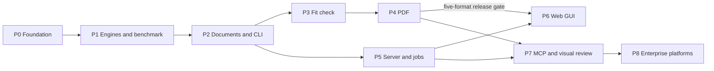

# Implementation Plan

> Accepted storage/identity revision (2026-09-29): [ADR-014](decisions/ADR-014-storage-ownership-and-retranslation.md) and [the storage transition plan](plans/P5-D2-storage-and-ownership.md) supersede earlier shared-cache/version-history and desktop-library requirements. Local runs always export fresh to a chosen path; hosted saved mode keeps owner-scoped current results; internal apps can use temporary results. Implementation and migration are pending; no phase completion is implied.

<!--
This is the roadmap / dependency graph for the project, not the detailed how-to for any one phase - that level of detail goes in docs/plans/. Give every phase an ID (P0, P1, P2, ...) and subphases as needed (P2.1, P2.2). Those IDs are used to name files in docs/plans/, e.g. docs/plans/P2.1-authentication.md.
-->

Phases build the system from the inside out: the workspace, then the translation engines and the benchmark that measures them, then documents and the CLI, then the server surfaces. The README's delivery phases map onto these as follows: CLI is P0-P4, Web GUI and job service is P5-P6, MCP server is P7, enterprise platform integration is P8.

## Additional Deployment Tracks

Owner-approved [ADR-013](decisions/ADR-013-deployment-profiles.md) adds installer-based desktop delivery and internal-app integration. See [D0-D2/I1](plans/Desktop-and-internal-app-delivery.md). Existing P0-P8 IDs and P2-P6 scope stay unchanged. These proposed delivery tracks have no board IDs yet; this documentation does not claim board synchronization or implementation completion.

| Track | Dependency and outcome |
|---|---|
| D0 desktop design/packaging proof | Existing core for prototype; choose and validate installer, packaged runtime, model setup and local-host authentication. |
| D1 installer/model setup | D0; end-user installation, selected compatible model download, verification/recovery, upgrade/uninstall. |
| D2 desktop files/folders | D1 and complete P2-P5 backend; real drag/drop batches, progress/history/results and local offline operation. Reuse P6 UI where useful. |
| I1 internal-app integration | P5 contract, P2-P4 format/fit coverage; independent REST client, credentials/ownership and integration guide. |

D2/I1 do not require P7 MCP or P8 enterprise cloud access. Right-click translation is a later consideration, not a D2 criterion. Lenovo fleet/OEM integration follows a proven installer app and separate hardware/licensing/distribution validation.

## Board Tracking

Each phase is one **Feature** on the Azure DevOps board (organization `chintand`, project `AI Projects`, tag `Document Translator`), under the Epic [**Document Translator** (#9007)](https://chintand.visualstudio.com/AI%20Projects/_workitems/edit/9007). The board item ID is listed under each phase heading.

Keep phase status and the board in sync:

| Phase status here | Board state | When |
|-------------------|-------------|------|
| Not started | New | Default |
| In progress | Active | The phase's first plan in `docs/plans/` is approved |
| Done | Closed | Every completion criterion below is met and verified |

Updating a phase here (goal, deliverables, completion criteria, status) and updating its board item happen in the same change.

## Dependency Graph

P5 can start once P2 is done, in parallel with P3 and P4. P6's mock audit may start earlier, but integration acceptance requires the complete P2-P5 backend, including P4 PDF and P3 fit.

## P2-P6 Delivery Contract

The owner requests a complete five-format service followed by integration of the existing mock web UI. Start at [the delivery handoff](plans/P2-P6-delivery-handoff.md). CLI and API use one persistent service (ADR-010); users own batches, jobs and documents; XLSX sheet names are preserved. Long batches use bounded per-file submissions with explicit backpressure. The backend milestone requires P2/P3/P4/P5 together, then P6 audits and integrates the mock with real data. P7/P8 are outside this handoff.

Product scope is approved; technical design gates require evidence and exact contracts before implementation. Documentation preparation alone does not mark phases Active or complete.

## Next Plans and Approval Gates

The following documents define the execution path. Evidence-dependent choices are proposals until architect review under the delivery handoff. The owner-approved product changes are reflected in README/ADR-010; no unrun experiment or future feature is marked complete.

| Work | Plan | Trigger / purpose |
|------|------|-------------------|
| Deferred baselines | [P1.1](plans/P1.1-baseline-capture.md) | Run before changing any prompt or model; remains outside P1 closure criteria |
| Document design validation | [P2.0](plans/P2.0-document-design-validation.md) | Resolve formatting, writer fidelity, XLSX references/recalculation and detection before coders start |
| Documents and CLI | [P2](plans/P2-document-translation-and-cli.md) | Draft contract and staged implementation after design approval |
| Fit/font design and implementation | [P3.0](plans/P3.0-fit-design-validation.md), [P3](plans/P3-fit-check.md) | Close bounded experiment, integrate best-effort fit under ADR-012 |
| PDF | [P4](plans/P4-pdf-support.md) | Strategy experiment/ADR, then PDF adapter and fit |
| Server/auth/operations | [P5.0](plans/P5.0-server-design-validation.md), [P5](plans/P5-server-and-service-cli.md) | Users, ownership, batch API, jobs/cache/storage and service CLI |
| Existing web UI integration | [P6](plans/P6-web-ui-integration.md) | Audit artifacts, preserve/rework features, replace mocks with authenticated backend data |

P4 requires a PDF-strategy ADR informed by P3. P6 requires P5's API/auth contract. P7 requires P4/P5 plus client-to-server reachability and a rendering ADR. P8 remains gated on reachable hosting and enterprise confidentiality/authentication decisions. Do not turn those unresolved choices into speculative implementation tasks.

The [completed XLSX experiment](experiments/xlsx-roundtrip/README.md) supports targeted OOXML writes. [ADR-009](decisions/ADR-009-xlsx-preservation.md) proposes the writer/calculation contract; the owner has now chosen preserved sheet names.

---

## P0 - Project Foundation

Board: [Feature #9008](https://chintand.visualstudio.com/AI%20Projects/_workitems/edit/9008) | Status: Done | Plan: [P0-project-foundation.md](plans/P0-project-foundation.md)

### Goal

An empty but fully working workspace in the layout of [ADR-003](decisions/ADR-003-source-structure.md), with every check enforced in CI, so all later code lands inside enforced boundaries from its first commit.

### Dependencies

None.

### Deliverables

- `uv` workspace root with pinned Python version, and skeleton distributions for `packages/core`, `apps/cli`, `apps/server`, and `apps/eval`, each importable with an empty public API. (`apps/web` is created in P6.)
- Shared tooling configured at the root: formatter and linter, static type checker, test runner.
- Import-linter contracts for all dependency rules in ADR-003.
- Azure Pipelines CI running format check, lint, type check, import contracts, and tests on `main`, and on pull requests through a build validation branch policy.
- `.env.example` documenting configuration variables, with no secret values.
- Scaffold root `src/` removed; `docs/Structure.md` describes the real layout.

### Completion Criteria

- A fresh clone installs with one `uv sync` and all checks pass locally and in CI.
- A deliberately forbidden import (e.g. core importing FastAPI) fails the import contract check, verified once and reverted.
- `docs/Structure.md` matches the repository.

---

## P1 - Translation Engines and Benchmark

Board: [Feature #9009](https://chintand.visualstudio.com/AI%20Projects/_workitems/edit/9009) | Status: In progress | Plan: [P1-translation-engines-and-benchmark.md](plans/P1-translation-engines-and-benchmark.md) (approved 2026-09-27)

Verification on 2026-09-27: board state is **Active**, not Closed. The implementation is on `p1-engines-eval` at `14b813d`; no CI runs were returned for that branch. The most recent successful run inspected was #198 on `main` at `a75bb05`, which is not evidence for this P1 head. Local tests passed (87 passed, 2 integration tests deselected); real-backend results in the P1 plan are historical evidence and were not rerun during the documentation review. Finish reviewed-commit CI verification and board/document closure together. The prior handoff's statement that P1 was closed is not supported by the board or repository.

### Goal

Translate plain text in both LLM and MT modes across all 12 language directions, and measure the quality of each with the benchmark from [ADR-005](decisions/ADR-005-translation-quality-evaluation.md).

### Dependencies

- P0

### Deliverables

- Core architecture section (`docs/Architecture.md#core-api-reference`) with the `TranslationEngine` interface and public text translation API.
- Core `types.py` and `config.py`: languages, modes, options, engine configuration.
- `engines/llm.py`: internal LLM server client (OpenAI-compatible, API key, internal CA trust), batching, retries, versioned prompts, deterministic settings for evaluation.
- `engines/mt.py`: local MT model engine, runtime imported lazily behind the `[mt]` extra, model selectable by configuration.
- Public text-level translation function in the core API.
- `apps/eval`: FLORES+ download script, benchmark runner, COMET and chrF scoring, paired bootstrap comparison, run recording.
- ADR selecting the MT model ([ADR-006](decisions/ADR-006-mt-model-selection.md): SMALL-100).

### Completion Criteria

- Both modes translate all 12 directions through the public API.
- LLM engine is tested against a fake HTTP server (errors, retries, auth failures); no test needs the real server.
- The MT model ADR is accepted.

### Deferred

The owner moved the benchmark baselines out of P1 on 2026-09-27, since SMALL-100 and Gemma are settled for now. A full benchmark run for both modes and committed baselines (P1 plan step 11) must be done **before the first change to the LLM prompt, the LLM model, or the MT model**: that is when a regression check first matters. The eval app that produces them is complete.

Execution details: [P1.1 baseline capture](plans/P1.1-baseline-capture.md). This is still deferred, not completed.

---

## P2 - Document Translation and CLI

Board: [Feature #9010](https://chintand.visualstudio.com/AI%20Projects/_workitems/edit/9010) | Status: In progress | Plan: [P2](plans/P2-document-translation-and-cli.md) (approved 2026-09-28)

[P2.0](plans/P2.0-document-design-validation.md) is complete: ADR-011 and ADR-009 are accepted and the contract is in the [Document API](Architecture.md#document-api). Board set Active 2026-09-28. Implementation is under way on `release/p2-p6`.

### Goal

Translate TXT, PPTX, DOCX, and XLSX files end to end from the command line, preserving formatting and structure as specified in the README format table.

### Dependencies

- P1

### Deliverables

- Core architecture section extended with `document.py` (the format-neutral representation) and the format capability interfaces.
- `document.py`, `formats/base.py`, the format registry, and `formats/_ooxml/`.
- `DocumentAdapter` implementations for TXT, PPTX, DOCX, and XLSX.
- `pipeline.py`: extract, translate in batches, write back. Every unique segment of a document is translated once, however the pipeline batches work, so repeated strings translate identically ([ADR-007](decisions/ADR-007-translation-reuse-and-document-storage.md) layer 1).
- Public API additions for the server: a deterministic output fingerprint of the options and engine that determine a translation (ADR-007 layer 2), and an optional pipeline progress callback that can abort the run by raising ([ADR-008](decisions/ADR-008-job-execution-model.md) rule 8).
- Pass-through of non-translatable text (numbers, code, URLs, email addresses); source language auto-detection.
- `apps/cli`: input, output, source and target language, mode; configuration from environment and files; progress output; meaningful exit codes.
- Sample documents for each format in `tests/fixtures/`.

### Completion Criteria

- Every requirement in the README format table for TXT, PPTX, DOCX, and XLSX is covered by a passing test against fixtures.
- Outputs reopen cleanly with their format library; the input file is never modified.
- Numbers, URLs, and Excel formulas, numbers, and dates are unchanged in output (tested).
- A partial failure is reported and never silently drops content (tested).
- A repeated segment reaches the engine once per document and receives identical translations everywhere, including across pipeline batches (tested).
- The output fingerprint changes when any option or engine setting that affects output changes, and is stable otherwise (tested).
- The CLI translates every fixture in both modes.

---

## P3 - Fit Check

Board: [Feature #9011](https://chintand.visualstudio.com/AI%20Projects/_workitems/edit/9011) | Status: Not started

Planning revised 2026-09-28: [ADR-012](decisions/ADR-012-lightweight-fit-policy.md) accepts lightweight best-effort fitting. [P3.0](plans/P3.0-fit-design-validation.md) closes existing research; [P3](plans/P3-fit-check.md) integrates and validates the bounded policy. Existing production code does not by itself establish phase completion.

### Goal

Prioritize translation accuracy and preserved formatting; mitigate obvious measured overflow in changed constrained PPTX/DOCX/XLSX containers with bounded shrinking and truthful technical outcomes. Under the ADR-012 owner amendment, users see Checking layout with Skip layout check; they do not need per-section fit details or warning badges. No native layout parity guarantee.

### Dependencies

- P2

### Deliverables

- ADR-012 lightweight policy and a short closure report for existing font/measurement experiments.
- `fit/`: text measurement, font lookup, allowed-space and shrink algorithm, with a configurable floor and decided defaults.
- `LayoutSupport` implementations for PPTX, DOCX, and XLSX, reporting containers per the README fit scope table.
- Fit report in the translation result; the CLI prints a summary and writes it as JSON.

### Completion Criteria

- Small fixed corpus shows supported overflow receives bounded adjustment, source overflow remains unchanged and uncertain/floor-limited cases are unresolved. No wording changes or production rendering. Record obvious false passes, unnecessary shrink and fit timing.
- Per-format fit scope matches the README table (e.g. DOCX body text is never resized).

---

## P4 - PDF Support

Board: [Feature #9012](https://chintand.visualstudio.com/AI%20Projects/_workitems/edit/9012) | Status: Implemented on `release/p2-p6` (2026-09-29); closure needs reviewed-commit CI and service acceptance with PDF

Plan: [P4 strategy and implementation](plans/P4-pdf-support.md). Required before the combined backend release gate.

### Goal

Translate PDF files with layout preserved as closely as practical, including the fit check.

### Dependencies

- P3

### Deliverables

- ADR for the PDF strategy (translating in place versus converting through an editable format).
- `formats/pdf/`: `DocumentAdapter` and `PlacementFit` (the writer fits text itself; ADR-018 amends the earlier `LayoutSupport` expectation).
- PDF fixtures, including Chinese source documents.

### Completion Criteria

- PDF fixtures translate in both modes, and outputs open cleanly with text in the target language at the original positions.
- The fit check runs on PDF text blocks and its report is correct on fixtures.
- The CLI supports all five formats: the README delivery phase 1 (CLI) is complete.

---

## P5 - Server and Job Service

Board: [Feature #9013](https://chintand.visualstudio.com/AI%20Projects/_workitems/edit/9013) | Status: Implemented on `release/p2-p6` (2026-09-29); closure needs R02, R14 and reviewed-commit CI

Planning: [P5.0 server design draft](plans/P5.0-server-design-validation.md). The [detailed P5 contract](plans/P5-server-and-service-cli.md) supplies user flow, recommended auth/defaults, API/batch/CLI behavior and race tests for that review; ADR-007/008/010 settle reuse, worker execution and shared-service CLI.

### Goal

Run user-owned translations as persistent asynchronous jobs behind a REST API and service CLI, hosted internally and reachable by coworkers. Submit one or many mixed-format files, recover interrupted clients, return real fit-checked results and share one cache/storage implementation.

### Dependencies

- P2

### Deliverables

- ADR for authentication of REST and MCP (documents have owners; also weighs the cross-user cache signal recorded in ADR-007).
- Server architecture section (`docs/Architecture.md#server`), stable users/credentials, per-user ownership for batches/jobs/documents, and tested user lifecycle.
- Versioned per-file/batch REST contract, resumable submission IDs, pagination, partial failures, quotas/backpressure and safe downloads/reports.
- Service CLI HTTP commands for submission, history/status, cancellation and downloads; local synchronous `translate` remains explicit and separate.
- `apps/server`: FastAPI app, settings, `cli.py` (`serve`, `worker`), `db/` (SQLAlchemy models, repositories), initial Alembic migration, `jobs/`, `auth/`, `api/` with OpenAPI schema.
- Job execution per [ADR-008](decisions/ADR-008-job-execution-model.md): the jobs table as the queue, worker processes with leases, retries, recovery, progress, and cancellation; `serve --workers N` on the laptop.
- Storage and reuse per [ADR-007](decisions/ADR-007-translation-reuse-and-document-storage.md): content-addressed blob storage behind a storage interface (local disk implementation), owned source/current-translation and immutable job-result records under ADR-014, owner-scoped current-result reuse with `force_retranslate`, and cache hit/miss logging.
- Retention per ADR-014: saved originals/current results persist within quota until deletion; temporary/superseded job results and metadata expire on advertised bounds. Delete blobs only when unreferenced and unpinned.
- `docs/Deployment.md` for laptop hosting: running the server, binding to the network, firewall, configuration and secrets, backup.

### Completion Criteria

- A job submitted over REST survives a server restart and completes.
- Killing a worker process mid-job leads to another worker completing the job; a document that crashes workers fails after the maximum number of attempts with a clear reason (tested).
- The API stays responsive while workers translate.
- Submitting a byte-identical document with the same options completes from the cache without translating; changing an option, the engine, or passing `force_retranslate` translates again (tested).
- Cache expiry never deletes a file that a user document version still references (tested).
- A coworker's machine can submit a job and download the result over the laptop's IP.
- Service CLI and independent REST client share the same authenticated job/cache/persistence path; equivalent local-core requests preserve equivalent document content.
- All five formats and both engines pass the handoff R01-R14 release matrix with P3/P4 fit; P2-only `not_run` outputs do not satisfy release acceptance.
- Mixed batches, retry after lost response, two-user isolation, cancelled/deleted access and restart/restore behavior are verified.
- Migrations build the database from empty; the server never creates tables outside migrations.

---

## P6 - Web GUI

Board: [Feature #9014](https://chintand.visualstudio.com/AI%20Projects/_workitems/edit/9014) | Status: Not started

Plan: [P6 existing UI audit and integration](plans/P6-web-ui-integration.md). Locate the runnable mock artifact and preserve a baseline before editing.

Progress detail: [P5-P6 document progress proposal](plans/P5-P6-document-progress.md). Implement persistent latest-job snapshots and truthful stage/count displays as part of P5/P6, without a separate event system or overall-percentage estimator.

### Goal

Non-technical coworkers use the existing mock UI, audited and integrated with the real backend, to translate documents in a browser. Preserve useful features and deliberately rework/drop/add features to match actual backend behavior and the user-owned workflow.

### Dependencies

- P5

### Deliverables

- `apps/web`: React + TypeScript SPA with an API client generated from the server's OpenAPI schema.
- Feature disposition audit of the existing artifact, including all screens/controls and mock-data dependencies.
- Real browser authentication/session flow on the same stable users as CLI/API.
- Mixed-file upload, language/mode selection, real job progress, owned history, download and a stage-specific Skip layout check control, including failure/recovery states. Follow the progress plan for cooperative stopping, saving and cache exclusion; no required fit-report view or unresolved-section UI.
- Production mocks/simulated completion removed; unsupported previews/fix actions reworked or removed rather than implying P7 functionality.
- Built SPA served by the server; web build, lint, and tests in CI.

### Completion Criteria

- A coworker completes upload, translate, and download in a browser against the laptop, for every format.
- The SPA uses only REST with generated contract types and real owned data; no hardcoded users/history or fake success.
- P6 W01-W08 browser acceptance, accessibility/visual QA, frontend checks and CI pass.
- Artifact source, feature dispositions and final screenshots are recorded; backend R01-R14 remains passing.

---

## P7 - MCP Server and Visual Review

Board: [Feature #9015](https://chintand.visualstudio.com/AI%20Projects/_workitems/edit/9015) | Status: Not started

### Goal

Agents on LLM platforms translate documents, then inspect rendered pages and fix visual problems: README delivery phase 3, validated against Open WebUI.

### Dependencies

- P4
- P5

### Deliverables

- Verified network path from the Open WebUI host to the laptop (checked first; blocks the rest).
- ADR for rendering (expected: headless LibreOffice to PDF, then PyMuPDF to images).
- MCP tool contract in the server section of `docs/Architecture.md`, including how files move between the platform and the server.
- `render/`, plus `RenderSupport` and `EditSupport` for PPTX, DOCX, XLSX, and PDF.
- `mcp/`: Streamable HTTP tools for submitting jobs, checking status, fetching results and fit reports, fetching page images, and applying edits.
- Edit and render jobs on the ADR-008 queue. Each edit adds a document version and never changes cached output (ADR-007); an edit based on a stale version fails with a conflict.

### Completion Criteria

- In Open WebUI, a user uploads a document and the agent completes the full loop: translate, review page images, apply a fix, and confirm it on a re-rendered page.
- The tools work unchanged from a second, non-Open WebUI MCP client (e.g. MCP Inspector), showing they are platform-neutral.

---

## P8 - Enterprise Platform Integration

Board: [Feature #9016](https://chintand.visualstudio.com/AI%20Projects/_workitems/edit/9016) | Status: Not started

### Goal

Make the MCP server available to enterprise platforms such as Microsoft Copilot.

### Dependencies

- P7
- Blocked until: the server runs on a host with a stable HTTPS endpoint reachable by the platform; a decision on whether documents passing through the company's Microsoft 365 tenant satisfies the confidentiality requirement; platform authentication (e.g. OAuth) is designed.

### Deliverables

To be planned when the blockers are resolved.

### Completion Criteria

To be planned when the blockers are resolved.
