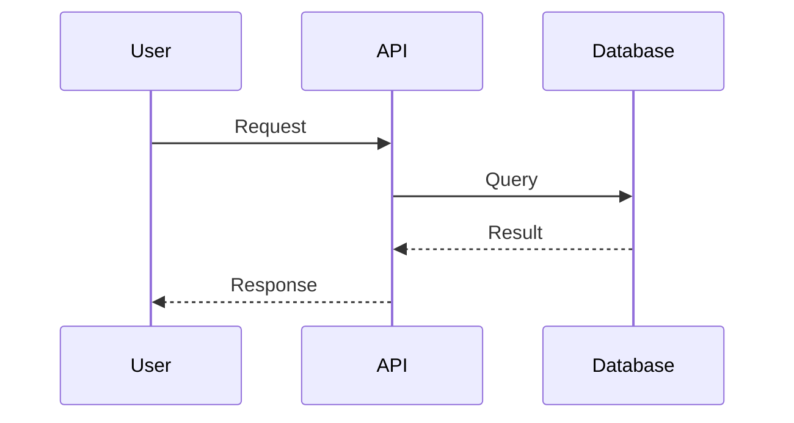

# Data Flow Diagram

<!-- How data moves through the system for the most important operations. Add one diagram per significant flow if a single graph gets crowded. -->

```mermaid
sequenceDiagram
    participant U as User
    participant A as API
    participant D as Database

    U->>A: Request
    A->>D: Query
    D-->>A: Result
    A-->>U: Response
```
