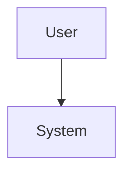

# System Context Diagram

<!-- Who/what talks to the system: users, external systems, other services. Update this whenever a new actor or external integration is added. -->

```mermaid
graph TD
    User[User] --> System[System]
```
