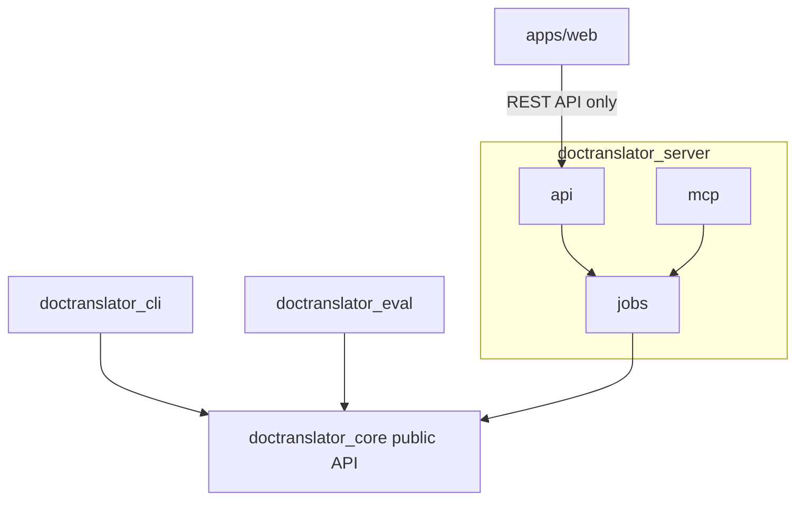

# ADR-003: Source Structure and Core Separation

## Status

Accepted (2026-09-26)

## Context

Three surfaces use the translation system: the CLI, the REST API, and the MCP endpoint (the latter two served by one backend process, per [ADR-001](ADR-001-mcp-server-deployment.md)). A web GUI uses the REST API. All of them must translate a document identically, so the translation logic must live in exactly one place, and every change to translation behavior must be made there and nowhere else.

The risk this ADR addresses is logic leaking into the surfaces: a CLI flag that tweaks translation, an API route that post-processes output, an MCP tool that fixes layout in its own way. Each leak makes the surfaces drift apart. Convention alone does not stop this, especially with AI agents writing code, so the separation must be enforced mechanically.

The core also has heavy optional dependencies (the local MT model runtime), and the surfaces have dependencies the core must never need (FastAPI, the MCP SDK, a CLI framework).

## Options Considered

### A. One Python package with subpackages, separated by convention

Pros:
- Simplest layout and packaging.

Cons:
- Nothing stops a surface from importing core internals, or the core from importing the web framework.
- One dependency set for everything: installing the CLI pulls in FastAPI and the MCP SDK.

### B. One Python package with subpackages, plus import-linter contracts

Pros:
- Import boundaries enforced in CI.

Cons:
- Still one dependency set; the core's dependency list isn't an explicit, reviewable contract.

### C. Workspace of separate Python distributions, plus import-linter contracts

A `uv` workspace in one repository: the core is its own distribution, and each app is a distribution depending on it.

Pros:
- Each distribution declares only its own dependencies. The core's `pyproject.toml` is an explicit contract: adding FastAPI to it is a visible, reviewable change.
- The core can be built, installed, and tested alone.
- Import-linter contracts enforce the boundaries inside the shared development environment, where packaging alone cannot.
- Stays in one repository, so a core change and its surface updates land in one commit.

Cons:
- More `pyproject.toml` files, and a dependency on `uv` workspaces.

### D. Separate repositories for core and apps

Pros:
- Strongest isolation.

Cons:
- Every core change needs a release and coordinated updates across repositories. Contradicts the README constraint that everything lives in one repository.

## Decision

Option C.

### Layout

```text
pyproject.toml                # workspace root: members, shared dev tooling and lint config
uv.lock
packages/
  core/                       # distribution: doctranslator-core
    pyproject.toml            #   extras: [mt] for the local MT model runtime
    src/doctranslator_core/
    tests/
apps/
  cli/                        # distribution: doctranslator-cli (depends on core)
    pyproject.toml
    src/doctranslator_cli/
    tests/
  server/                     # distribution: doctranslator-server (depends on core)
    pyproject.toml
    src/doctranslator_server/
    tests/
  eval/                       # distribution: doctranslator-eval (depends on core); translation quality benchmark (ADR-005)
    pyproject.toml
    src/doctranslator_eval/
    baselines/                #   committed aggregate scores; no content
    tests/
  web/                        # React + TypeScript SPA (ADR-002); not a Python package
    package.json
    src/
tests/
  e2e/                        # end-to-end tests across surfaces
  fixtures/                   # sample documents shared by all test suites
scripts/
docs/
```

`packages/` holds reusable libraries; `apps/` holds deployable surfaces. The root `src/` directory from the scaffold is not used.

### Core (`doctranslator_core`)

The core owns everything that determines what a translated document looks like:

| Module | Responsibility |
|--------|----------------|
| `__init__.py` | The public API. The only module apps may import from. |
| `types.py` | Public data types as Pydantic models and enums: `Language`, `TranslationMode`, translation request and options, result, fit report, errors. Part of the public API. |
| `config.py` | Configuration types (Pydantic models, e.g. LLM endpoint, MT model path, fit floor) and their validation. Takes plain values; never reads the environment. |
| `document.py` | The format-neutral internal representation passed between formats, engines, and fit: text segments, text containers (geometry, font, size), and stable locations. Internal. |
| `translator.py` | `Translator`: text-level translation over an engine; part of the public API via `__init__.py`. |
| `pipeline.py` | Orchestrates one translation: extract, translate, write back, fit check. |
| `engines/` | `base.py` defines the `TranslationEngine` abstract base class; one module per translation mode implements it (`llm.py`, `mt.py`); `__init__.py` maps `TranslationMode` values to engines. |
| `formats/` | All file-type-specific code, one package per format. See [Format packages](#format-packages). |
| `fit/` | The format-neutral fit algorithm: text measurement from font metrics and line wrapping (`measure.py`), font lookup (`fonts.py`), and the allowed-space and shrink logic (`fitter.py`). Works only on `document.py` containers. |
| `render/` | Shared rendering infrastructure used by format packages (e.g. converting a document to PDF and rasterizing pages). No format-specific logic. |

### Format packages

Everything specific to one file type lives in that type's package, organized by format rather than by capability. Adding or changing PowerPoint support means working in `formats/pptx/` and nowhere else.

The alternative, organizing by capability (`fit/pptx.py`, `render/pptx.py`, `edit/pptx.py`, ...), was rejected: it scatters one format across four directories, and PowerPoint-specific knowledge (how shapes, placeholders, and autofit work) would be duplicated or cross-imported between them.

```text
formats/
  __init__.py         # registry: file type -> format package
  base.py             # capability abstract base classes (below)
  _ooxml/             # shared low-level helpers for the OOXML formats (PPTX, DOCX, XLSX): runs, XML namespaces, direct XML edits
  pptx/
    __init__.py       # declares the format and which capabilities it implements
    adapter.py        # read document, extract text segments, write translations back
    layout.py         # describe text containers for the fit check; apply font size changes
    render.py         # render slides to images
    edit.py           # apply visual review edit operations
  docx/               # same modules as pptx
  xlsx/               # same modules as pptx
  pdf/                # same modules as pptx
  txt/
    __init__.py
    adapter.py        # read/write only; no layout, render, or edit
```

`base.py` defines one abstract base class per capability, so each format implements only what applies to it:

| Capability | Abstract base class | Module | Required |
|------------|---------------------|--------|----------|
| Read, extract, write back | `DocumentAdapter` | `adapter.py` | Every format |
| Container geometry and font size changes for the fit check | `LayoutSupport` | `layout.py` | Formats with fixed-size text containers (PPTX, DOCX, XLSX, PDF) |
| Page rendering | `RenderSupport` | `render.py` | Formats with a visual layout (PPTX, DOCX, XLSX, PDF) |
| Visual review edits | `EditSupport` | `edit.py` | Formats with a visual layout (PPTX, DOCX, XLSX, PDF) |

The division between format packages and the generic modules:

- A format package translates between its file type and `document.py`: it says where text is, what container holds it, and how big the container is, and applies changes it is told to make. It contains no fit policy.
- `fit/` decides what fits and what to shrink, using only `document.py` containers. It never imports a format package.
- `render/` provides shared conversion tooling. Format packages call it; it never calls them.
- Per-format fit scope (e.g. DOCX checks only fixed-size elements) is expressed by which containers `layout.py` reports, not by format checks inside `fit/`.

Each format's third-party library is imported only inside that format's package: `python-pptx` only in `formats/pptx/`, `python-docx` only in `formats/docx/`, `openpyxl` only in `formats/xlsx/`. PyMuPDF is imported only in `formats/pdf/` and `render/`.

Tests mirror this layout (`packages/core/tests/formats/pptx/`, ...), with sample documents in `tests/fixtures/<format>/`.

### Core internal rules

- `formats/` and `engines/` never import each other; `pipeline.py` composes them through their interfaces. Adding a mode means adding one engine module; adding a format means adding one format package. Neither requires changes to other formats, modes, or apps.
- Format packages never import each other. Shared OOXML code goes in `formats/_ooxml/`.
- `fit/` and `render/` never import `formats/`.
- The core never reads environment variables, config files, or command-line arguments. Apps load configuration from their own sources and pass it in; `config.py` only parses and validates.
- The core logs through the standard `logging` module and never configures handlers. Apps configure logging.
- The MT runtime is imported lazily inside `engines/mt`, so an install without the `[mt]` extra works in LLM mode.
- `TranslationEngine` and the format capability classes are abstract base classes (`abc.ABC`), not Protocols: implementations subclass them explicitly, so a missing method fails at instantiation and every implementation is discoverable by its base class.
- The abstract base classes and their implementations are internal. Apps choose a mode through `TranslationMode` and a format through the input file; they never import or instantiate an engine or format class.
- The core has no database and no persistence beyond the files it is asked to read and write.

The method signatures of the abstract base classes and the fields of `document.py` are designed in the core section of `docs/Architecture.md`, not here.

### CLI (`doctranslator_cli`)

Local `translate` parses arguments, loads configuration, calls the core's public API synchronously, and prints progress and the fit report. ADR-010 adds service commands that call REST over HTTP for shared jobs/cache/persistence, without importing server modules. Neither path contains translation, layout or format logic.

### Server (`doctranslator_server`)

| Module | Responsibility |
|--------|----------------|
| `app.py` | Composition root: builds the FastAPI app, mounts REST routes, the MCP endpoint, and the built web GUI. |
| `cli.py` | The `doctranslator-server` command with `serve` and `worker` subcommands ([ADR-008](ADR-008-job-execution-model.md)). Builds settings and delegates to `app` and `jobs`; imports neither `db` nor the core. |
| `settings.py` | Loads server configuration from the environment (Pydantic settings) and builds core config objects from it. |
| `db/` | Persistence: `session.py` (engine and sessions), `models.py` (ORM classes, e.g. job records), `repositories/` (queries). |
| `auth/` | Authentication for REST and MCP. |
| `jobs/` | Job service: submit, status, results, and the worker processes that run jobs ([ADR-008](ADR-008-job-execution-model.md)). `schemas.py` holds the job data types (Pydantic) it returns. The only server module that calls the core's pipeline. |
| `api/` | REST routes. `schemas.py` holds REST request/response models. Calls `jobs` only. |
| `mcp/` | MCP tools, with their input/output models alongside the tools. Calls `jobs` only. |

Database migrations live in `apps/server/migrations/`, outside the Python package.

`api/` and `mcp/` are thin adapters over `jobs/` and never import each other. ORM classes never leave `db/`, `jobs/`, and `auth/`: repositories return ORM objects to `jobs` and `auth`, which convert them to their Pydantic schemas before anything reaches `api` or `mcp`.

### Where each kind of code goes

| Kind of code | Location |
|--------------|----------|
| Abstract base class for translation engines | `packages/core/src/doctranslator_core/engines/base.py` |
| An engine implementation (LLM, MT) | `packages/core/src/doctranslator_core/engines/<mode>.py` |
| Abstract base classes for format capabilities | `packages/core/src/doctranslator_core/formats/base.py` |
| Anything specific to one file type (reading, writing, containers, rendering, edits) | `packages/core/src/doctranslator_core/formats/<format>/` |
| Code shared by PPTX, DOCX, and XLSX | `packages/core/src/doctranslator_core/formats/_ooxml/` |
| Fit policy and text measurement | `packages/core/src/doctranslator_core/fit/` |
| Shared rendering tooling | `packages/core/src/doctranslator_core/render/` |
| Domain types: languages, modes, options, fit report | `packages/core/src/doctranslator_core/types.py` (Pydantic) |
| Core configuration types | `packages/core/src/doctranslator_core/config.py` (Pydantic) |
| Loading configuration from environment or files | each app's `settings.py` (Pydantic settings) |
| ORM classes | `apps/server/src/doctranslator_server/db/models.py` |
| Database queries | `apps/server/src/doctranslator_server/db/repositories/` |
| Database migrations | `apps/server/migrations/` |
| Job data types | `apps/server/src/doctranslator_server/jobs/schemas.py` (Pydantic) |
| REST request/response models | `apps/server/src/doctranslator_server/api/schemas.py` (Pydantic) |
| MCP tool input/output models | `apps/server/src/doctranslator_server/mcp/` (Pydantic) |
| Frontend API types | `apps/web/src/`, generated from the server's OpenAPI schema |

Three families of Pydantic models exist on purpose, and are not merged:

- **Core types** describe translation itself and are shared by every surface.
- **Job schemas** describe what the server knows beyond a translation: job ID, status, timestamps, file locations.
- **REST and MCP models** are wire contracts for external clients. They reuse core enums and value types (`Language`, `TranslationMode`) directly, but define their own models rather than exposing core or job types wholesale. A refactor of core internals must not silently change what the web GUI or an agent platform receives.

### Web (`apps/web`)

Talks to the backend only through the REST API.

### Dependency rules



Enforced by import-linter contracts in CI:

1. `doctranslator_core` imports neither app, nor FastAPI, the MCP SDK, or the CLI framework.
2. Apps import only from `doctranslator_core` and `doctranslator_core.types` (the public API), never from other core submodules. Anything else apps need, such as configuration types from `config.py`, is re-exported from `doctranslator_core`.
3. `doctranslator_cli`, `doctranslator_server`, and `doctranslator_eval` do not import each other.
4. Within the server, `api` and `mcp` import only `doctranslator_core.types` from the core (for shared enums and value types); only `jobs` and `settings` import `doctranslator_core` itself. `api` and `mcp` do not import each other.
5. Within the server, only `jobs`, `auth`, and the composition root `app.py` (which wires up the database session) import `db`.
6. Within the core, `formats` and `engines` do not import each other; format packages do not import each other; `fit` and `render` do not import `formats`.
7. Each format library (`pptx`, `docx`, `openpyxl`) is imported only by its format package; `fitz` (PyMuPDF) only by `formats.pdf` and `render`. These are import-linter `protected` contracts, which require the protected module to be present in the import graph, so each one is added in the change that first imports its library, not before.

## Consequences

- Any change to translation, formatting, fit, rendering, or edit behavior is made in `packages/core` and reaches all surfaces at once.
- If a surface needs something the core's public API doesn't offer, the public API is extended; the surface does not reach into core internals.
- Contract violations fail CI. A violation is resolved by moving the code, not by adding an import-linter exception, unless an ADR says otherwise.
- The CLI runs translations in-process and has no dependency on the server or job service.
- `tests/e2e/` should include checks that the same document and options produce identical output through the CLI and the REST API, since that equivalence is the purpose of this structure.
- Creating this layout and its lint contracts is part of the first implementation phase.
- The database engine, ORM library, and migration tool are decided in [ADR-004](ADR-004-job-storage.md).
- How `render/` turns office documents into images is not decided here. The expected approach is headless LibreOffice (office document to PDF), then PyMuPDF (PDF to images). Rendering is needed only for the MCP visual review, so it is scheduled late, and its ADR is written when that work is planned.
